# DokumentAktør Junction Table

The `DokumentAktør` junction table models the many-to-many relationships between documents (Dokument) and actors (Aktør) in the Danish Parliament API. This role-based junction table captures the complex communication patterns and document workflows that drive parliamentary democracy, providing semantic context for every document-actor relationship.

## Overview

- **Entity Name**: `DokumentAktør`
- **Endpoint**: `https://oda.ft.dk/api/DokumentAktør`
- **Purpose**: Links documents to actors with specific semantic roles
- **Pattern**: Role-based junction table (Pattern 2)
- **Role System**: 25 distinct role types via DokumentAktørRolle
- **Coverage**: Extensive coverage of all parliamentary documents

## Architecture

### Junction Table Pattern


The DokumentAktør table doesn't just link documents to actorsit provides rich semantic context through the `rolleid` field that references the DokumentAktørRolle entity, creating a three-dimensional relationship model that captures:

1. **Which document** is related to **which actor**
2. **How they are related** (through role semantics)  
3. **When the relationship** was established or updated

## Field Reference

### Core Fields

| Field | Type | Description | Example |
|-------|------|-------------|---------|
| `id` | Int32 | Primary key, unique relationship identifier | `123456` |
| `dokumentid` | Int32 | Foreign key to Dokument entity | `12345` |
| `aktørid` | Int32 | Foreign key to Aktør entity | `6789` |
| `rolleid` | Int32 | Foreign key to DokumentAktørRolle entity | `1` |
| `opdateringsdato` | DateTime | Last update timestamp | `"2025-09-09T14:30:22.407"` |

### Relationship Structure

- **dokumentid** ’ Links to [Dokument entity](../documents/dokument.md)
- **aktørid** ’ Links to [Aktør entity](../core/aktor.md) 
- **rolleid** ’ Links to [DokumentAktørRolle](../../data-model/role-systems/document-actor-roles.md)

## Role System Overview

The DokumentAktørRolle system defines 25 distinct role types that capture every aspect of parliamentary document workflows:

### Key Role Categories

#### Communication Roles
- **Afsender** (ID: 1) - Document sender/originator
- **Til** (ID: 8) - Primary recipient
- **Adressat** (ID: 10) - Formal addressee
- **Modtager** (ID: 11) - General recipient
- **Kopi til** (ID: 2) - Copy recipient

#### Submission Roles  
- **Stiller** (ID: 12) - Document submitter
- **Forslagsstiller** (ID: 21) - Proposal author
- **Afgivet af** (ID: 16) - Formal submitter

#### Response Roles
- **Spørger** (ID: 6) - Questioner in parliamentary inquiries
- **Medspørger** (ID: 7) - Co-questioner
- **Besvaret af** (ID: 4) - Official responder

#### Administrative Roles
- **Minister** (ID: 5) - Government minister associated
- **Ministerområde** (ID: 9) - Ministry area responsibility
- **Behandles i** (ID: 20) - Processing committee/body

#### Representation Roles
- **Ordfører** (ID: 24) - Spokesperson
- **Taler** (ID: 25) - Document presenter/speaker

*For complete role definitions, see [Document-Actor Roles Reference](../../data-model/role-systems/document-actor-roles.md)*

## Common Query Examples

### Basic Queries

```bash
# Get latest 10 document-actor relationships
curl "https://oda.ft.dk/api/DokumentAktør?%24top=10&%24orderby=opdateringsdato%20desc"

# Get specific relationship by ID
curl "https://oda.ft.dk/api/DokumentAktør(123456)"

# Count total relationships
curl "https://oda.ft.dk/api/DokumentAktør?%24inlinecount=allpages&%24top=1"
```

### Document-Centric Queries

```bash
# Get all actors for a specific document
curl "https://oda.ft.dk/api/DokumentAktør?%24filter=dokumentid%20eq%2012345&%24expand=Aktør,DokumentAktørRolle"

# Find who sent a document
curl "https://oda.ft.dk/api/DokumentAktør?%24filter=dokumentid%20eq%2012345%20and%20rolleid%20eq%201&%24expand=Aktør"

# Find document recipients
curl "https://oda.ft.dk/api/DokumentAktør?%24filter=dokumentid%20eq%2012345%20and%20rolleid%20eq%208&%24expand=Aktør"
```

### Actor-Centric Queries

```bash
# Get all documents for a specific actor
curl "https://oda.ft.dk/api/DokumentAktør?%24filter=aktørid%20eq%206789&%24expand=Dokument,DokumentAktørRolle"

# Find documents sent by an actor
curl "https://oda.ft.dk/api/DokumentAktør?%24filter=aktørid%20eq%206789%20and%20rolleid%20eq%201&%24expand=Dokument"

# Find documents where actor is minister
curl "https://oda.ft.dk/api/DokumentAktør?%24filter=aktørid%20eq%206789%20and%20rolleid%20eq%205&%24expand=Dokument"
```

### Role-Based Analysis

```bash
# Find all senders across all documents
curl "https://oda.ft.dk/api/DokumentAktør?%24filter=rolleid%20eq%201&%24expand=Aktør,Dokument&%24top=50"

# Parliamentary questions and answers
curl "https://oda.ft.dk/api/DokumentAktør?%24filter=rolleid%20eq%206%20or%20rolleid%20eq%204&%24expand=Aktør,DokumentAktørRolle&%24top=20"

# Minister involvement in documents  
curl "https://oda.ft.dk/api/DokumentAktør?%24filter=rolleid%20eq%205&%24expand=Aktør,Dokument&%24top=20"
```

### Time-Based Queries

```bash
# Recent document-actor relationships
curl "https://oda.ft.dk/api/DokumentAktør?%24filter=opdateringsdato%20gt%20datetime'2025-09-01T00:00:00'&%24expand=DokumentAktørRolle&%24top=20"

# Document relationships from specific date
curl "https://oda.ft.dk/api/DokumentAktør?%24filter=opdateringsdato%20ge%20datetime'2025-09-09T00:00:00'&%24orderby=opdateringsdato&%24top=10"
```

## Advanced Relationship Analysis

### Document Workflow Tracking

```bash
# Complete document workflow - all actors involved
curl "https://oda.ft.dk/api/DokumentAktør?%24filter=dokumentid%20eq%2012345&%24expand=Aktør,DokumentAktørRolle&%24orderby=rolleid"

# Question-answer chains
curl "https://oda.ft.dk/api/DokumentAktør?%24filter=(rolleid%20eq%206%20or%20rolleid%20eq%204)&%24expand=Dokument,Aktør,DokumentAktørRolle&%24top=10"
```

### Communication Pattern Analysis

```bash
# Most active document senders
curl "https://oda.ft.dk/api/DokumentAktør?%24filter=rolleid%20eq%201&%24expand=Aktør&%24orderby=aktørid&%24top=100"

# Ministry communication patterns
curl "https://oda.ft.dk/api/DokumentAktør?%24filter=rolleid%20eq%209&%24expand=Aktør,Dokument&%24top=50"
```

### Multi-Role Analysis

```bash
# Actors with multiple roles in same document
curl "https://oda.ft.dk/api/DokumentAktør?%24expand=Aktør,DokumentAktørRolle&%24orderby=dokumentid,aktørid&%24top=50"

# Parliamentary question submitters vs answerers
curl "https://oda.ft.dk/api/DokumentAktør?%24filter=rolleid%20eq%206%20or%20rolleid%20eq%204&%24expand=Aktør,Dokument&%24orderby=rolleid&%24top=30"
```

## Performance Optimization

### Efficient Querying Strategies

```bash
# Good: Specific document with needed fields only
curl "https://oda.ft.dk/api/DokumentAktør?%24filter=dokumentid%20eq%2012345&%24select=id,aktørid,rolleid&%24expand=Aktør(%24select=navn),DokumentAktørRolle(%24select=rolle)"

# Good: Filter by role first, then expand
curl "https://oda.ft.dk/api/DokumentAktør?%24filter=rolleid%20eq%201&%24expand=Aktør(%24select=navn)&%24top=20"

# Avoid: Large unfiltered expansions
# curl "https://oda.ft.dk/api/DokumentAktør?%24expand=Dokument,Aktør&%24top=100"  # Can be very slow
```

### Pagination for Large Result Sets

```bash
# Paginate through document relationships
curl "https://oda.ft.dk/api/DokumentAktør?%24filter=rolleid%20eq%201&%24skip=0&%24top=100&%24orderby=opdateringsdato%20desc"
curl "https://oda.ft.dk/api/DokumentAktør?%24filter=rolleid%20eq%201&%24skip=100&%24top=100&%24orderby=opdateringsdato%20desc"
```

## Use Case Examples

### 1. Document Authorship Analysis

```python
def get_document_authors(document_id):
    """Find all authors/senders of a document"""
    # Role ID 1 = Afsender (Sender), Role ID 21 = Forslagsstiller (Proposer)
    filter_query = f"dokumentid eq {document_id} and (rolleid eq 1 or rolleid eq 21)"
    expand = "Aktør($select=navn),DokumentAktørRolle($select=rolle)"
    return get_document_actors(filter_query=filter_query, expand=expand)
```

### 2. Parliamentary Question Tracking

```python
def get_question_answer_pairs():
    """Track parliamentary questions and their answers"""
    # Role ID 6 = Spørger (Questioner), Role ID 4 = Besvaret af (Answered by)
    filter_query = "rolleid eq 6 or rolleid eq 4"
    expand = "Dokument($select=titel,dato),Aktør($select=navn),DokumentAktørRolle($select=rolle)"
    return get_document_actors(filter_query=filter_query, expand=expand, orderby="dokumentid,rolleid")
```

### 3. Ministry Communication Analysis

```python
def get_minister_documents(actor_id):
    """Get all documents where an actor serves as minister"""
    # Role ID 5 = Minister
    filter_query = f"aktørid eq {actor_id} and rolleid eq 5"
    expand = "Dokument($select=titel,dato,dokumenttypeid)"
    return get_document_actors(filter_query=filter_query, expand=expand)
```

### 4. Document Distribution Analysis

```python
def get_document_recipients(document_id):
    """Find all recipients of a document"""
    # Role IDs: 8=Til, 2=Kopi til, 10=Adressat, 11=Modtager
    recipient_roles = "8,2,10,11"
    filter_query = f"dokumentid eq {document_id} and rolleid in ({recipient_roles})"
    expand = "Aktør($select=navn,typeid),DokumentAktørRolle($select=rolle)"
    return get_document_actors(filter_query=filter_query, expand=expand)
```

## Data Model Integration

### Relationship Network

The DokumentAktør junction table connects to the broader API ecosystem:

```mermaid
graph TD
    subgraph "Document Workflow"
        D[Dokument] <--> DA[DokumentAktør]
        DA <--> A[Aktør]
        DA -.-> DAR[DokumentAktørRolle]
    end
    
    subgraph "Extended Relationships"
        D <--> SD[SagDokument] <--> S[Sag]
        S <--> SA[SagAktør] <--> A
        D <--> ED[EmneordDokument] <--> E[Emneord]
        D <--> DD[DagsordenspunktDokument] <--> DP[Dagsordenspunkt]
    end
    
    subgraph "Classifications"
        D -.-> DT[Dokumenttype]
        D -.-> DK[Dokumentkategori]
        A -.-> AT[Aktørtype]
        DAR -.-> RC[Role Categories]
    end
    
    style DA fill:#fff3e0
    style SA fill:#fff3e0
    style DAR fill:#e1f5fe
```



### Cross-Entity Analysis

```bash
# Documents and their case relationships via actors
curl "https://oda.ft.dk/api/DokumentAktør?%24expand=Dokument/SagDokument/Sag,Aktør&%24filter=rolleid%20eq%201&%24top=10"

# Actor roles across documents and cases
curl "https://oda.ft.dk/api/Aktør?%24expand=DokumentAktør/DokumentAktørRolle,SagAktør/SagAktørRolle&%24filter=id%20eq%2012345"
```

## Important Implementation Notes

### Data Volume Considerations

- **Large Result Sets**: Junction tables can contain millions of relationships
- **Always use filtering**: Unfiltered queries can timeout or return truncated results  
- **Pagination Required**: Maximum 100 records per request
- **Expansion Impact**: Each expansion multiplies response size

### Role System Complexity

- **25 Different Roles**: Each with specific semantic meaning
- **Duplicate Role IDs**: Some roles appear with different IDs (e.g., Afsender: 1 and 14)
- **Context Matters**: Same role ID may have different meanings in different contexts
- **Historical Consistency**: Role definitions maintained across decades

### URL Encoding Requirements

  **Critical**: Always use `%24` instead of `$` in OData parameters:

```bash
# Correct
curl "https://oda.ft.dk/api/DokumentAktør?%24filter=rolleid%20eq%201&%24top=10"

# Incorrect  
curl "https://oda.ft.dk/api/DokumentAktør?$filter=rolleid eq 1&$top=10"
```

## Example API Responses

### Basic Document-Actor Relationship

```json
{
  "odata.metadata": "https://oda.ft.dk/api/$metadata#DokumentAktør",
  "value": [
    {
      "id": 123456,
      "dokumentid": 12345,
      "aktørid": 6789,
      "rolleid": 1,
      "opdateringsdato": "2025-09-09T14:30:22.407"
    }
  ]
}
```

### Expanded Relationship with Role and Actor

```json
{
  "odata.metadata": "https://oda.ft.dk/api/$metadata#DokumentAktør",
  "value": [
    {
      "id": 123456,
      "dokumentid": 12345,
      "aktørid": 6789,
      "rolleid": 1,
      "opdateringsdato": "2025-09-09T14:30:22.407",
      "Aktør": {
        "id": 6789,
        "navn": "Nicolai Wammen",
        "typeid": 5
      },
      "DokumentAktørRolle": {
        "id": 1,
        "rolle": "Afsender",
        "rolletype": "Communication"
      }
    }
  ]
}
```

## Related Documentation

- [Aktør Entity Reference](../core/aktor.md) - Actor entities and types
- [Dokument Entity Reference](../documents/dokument.md) - Document entities and classifications  
- [DokumentAktørRolle Complete Reference](../../data-model/role-systems/document-actor-roles.md) - All 25 role types
- [Junction Tables Overview](index.md) - Complete junction table system
- [Parliamentary Document Workflows](../../data-model/parliamentary-process/index.md) - Process context

## Conclusion

The DokumentAktør junction table represents one of the most sophisticated document-actor relationship systems in any parliamentary API. With its 25-role semantic system, it captures the complete spectrum of parliamentary communicationfrom formal legislative proposals to informal information sharing.

This rich relationship data enables comprehensive analysis of:
- **Document authorship and attribution**
- **Parliamentary communication patterns**  
- **Question-answer tracking and accountability**
- **Ministry and committee workflow analysis**
- **Cross-party collaboration patterns**
- **Historical evolution of parliamentary communication**

The role-based architecture ensures that every document-actor relationship is captured with precise semantic meaning, making the Danish Parliament API invaluable for researchers, journalists, and civic technologists studying democratic processes and government transparency.