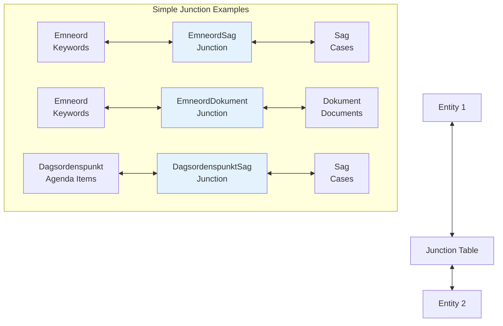

# Junction Tables

Junction tables in the Danish Parliament API model the complex many-to-many relationships that exist throughout the parliamentary system. These tables don't just link entitiesthey provide rich semantic context through role-based relationships that capture the precise nature of each connection.

## Overview

The Danish Parliament API uses sophisticated junction table patterns that go beyond simple many-to-many relationships. Most junction tables include role identifiers that link to separate role definition tables, creating a three-dimensional relationship model that captures:

1. **Which entities** are related
2. **How they are related** (through role semantics)
3. **When the relationship** was established or updated

## Junction Table Architecture

### Pattern 1: Simple Junction Tables
Direct many-to-many relationships without additional semantic context.

**Structure:** `Entity1Id` �� `Junction Table` �� `Entity2Id`

Examples:
- **EmneordSag** - Keywords to Cases
- **EmneordDokument** - Keywords to Documents  
- **DagsordenspunktSag** - Agenda Items to Cases
- **DagsordenspunktDokument** - Agenda Items to Documents

### Pattern 2: Role-Based Junction Tables
Many-to-many relationships with semantic roles defining the nature of the relationship.

**Structure:** `Entity1Id` �� `Junction Table` �� `Entity2Id`
                                    �
                               `Role Table`

Examples:
- **SagAkt�r** � **SagAkt�rRolle** (23 role types)
- **DokumentAkt�r** � **DokumentAkt�rRolle** (25 role types)
- **SagstrinAkt�r** � **SagstrinAkt�rRolle**
- **Akt�rAkt�r** � **Akt�rAkt�rRolle**

### Pattern 3: Multi-Dimensional Junction Tables
Complex relationships with multiple classification dimensions.

**Structure:** Multiple classification tables provide context for junction relationships.

Examples:
- **SagDokument** � **SagDokumentRolle**
- **SagstrinDokument** (with case step context)

## Junction Table Pattern Visualizations

### Pattern 1 Visualization: Simple Junction Tables



### Pattern 2 Visualization: Role-Based Junction Tables

```mermaid
graph TD
    subgraph "Role-Based Junction Pattern"
        A[Entity 1] <--> B[Junction Table<br/>with Role ID]
        B <--> C[Entity 2]
        B -.-> D[Role Definition<br/>Table]
        
        D --> E[Role 1<br/>Semantic Meaning]
        D --> F[Role 2<br/>Semantic Meaning]
        D --> G[Role N<br/>Semantic Meaning]
    end
    
    subgraph "SagAktør Example - 23 Roles"
        H[Sag<br/>Cases] <--> I[SagAktør<br/>Junction + rolleid]
        I <--> J[Aktør<br/>Actors]
        I -.-> K[SagAktørRolle<br/>23 Role Types]
        
        K --> L[Minister<br/>ID: 14]
        K --> M[Forslagsstiller<br/>Proposer ID: 19]
        K --> N[Spørger<br/>Questioner ID: 10]
        K --> O[... 20 more roles]
    end
    
    subgraph "DokumentAktør Example - 25 Roles"
        P[Dokument<br/>Documents] <--> Q[DokumentAktør<br/>Junction + rolleid]
        Q <--> R[Aktør<br/>Actors]
        Q -.-> S[DokumentAktørRolle<br/>25 Role Types]
        
        S --> T[Afsender<br/>Sender ID: 1]
        S --> U[Til<br/>To ID: 8]
        S --> V[Minister<br/>Minister ID: 5]
        S --> W[Besvaret af<br/>Answered by ID: 4]
        S --> X[... 21 more roles]
    end
    
    style I fill:#fff3e0
    style Q fill:#fff3e0
    style K fill:#e1f5fe
    style S fill:#e1f5fe
```



### Complete Junction Table Network

```mermaid
flowchart TD
    %% Core Entities
    subgraph "Core Entities"
        Sag[📄 Sag<br/>Cases]
        Aktør[👤 Aktør<br/>Actors]
        Dokument[📋 Dokument<br/>Documents]
        Møde[🏛️ Møde<br/>Meetings]
        Sagstrin[⚖️ Sagstrin<br/>Case Steps]
        Emneord[🏷️ Emneord<br/>Keywords]
        Dagsordenspunkt[📋 Dagsordenspunkt<br/>Agenda Items]
    end
    
    %% Junction Tables
    subgraph "Junction Tables with Roles"
        SagAktør[🔗 SagAktør<br/>Case-Actor<br/>23 Roles]
        DokumentAktør[🔗 DokumentAktør<br/>Doc-Actor<br/>25 Roles]
        SagstrinAktør[🔗 SagstrinAktør<br/>Step-Actor<br/>Process Roles]
        MødeAktør[🔗 MødeAktør<br/>Meeting-Actor<br/>Participation Roles]
        AktørAktør[🔗 AktørAktør<br/>Actor-Actor<br/>Relationship Roles]
    end
    
    subgraph "Junction Tables without Roles"
        SagDokument[🔗 SagDokument<br/>Case-Document]
        SagstrinDokument[🔗 SagstrinDokument<br/>Step-Document]
        EmneordSag[🔗 EmneordSag<br/>Keyword-Case]
        EmneordDokument[🔗 EmneordDokument<br/>Keyword-Document]
        DagsordenspunktSag[🔗 DagsordenspunktSag<br/>Agenda-Case]
        DagsordenspunktDokument[🔗 DagsordenspunktDokument<br/>Agenda-Document]
    end
    
    %% Role Tables
    subgraph "Role Definition Tables"
        SagAktørRolle[📊 SagAktørRolle<br/>Case-Actor Roles]
        DokumentAktørRolle[📊 DokumentAktørRolle<br/>Doc-Actor Roles]
        SagstrinAktørRolle[📊 SagstrinAktørRolle<br/>Step-Actor Roles]
        SagDokumentRolle[📊 SagDokumentRolle<br/>Case-Doc Roles]
        AktørAktørRolle[📊 AktørAktørRolle<br/>Actor-Actor Roles]
    end
    
    %% Core Entity Connections
    Sag <--> SagAktør <--> Aktør
    Dokument <--> DokumentAktør <--> Aktør
    Sagstrin <--> SagstrinAktør <--> Aktør
    Møde <--> MødeAktør <--> Aktør
    Aktør <--> AktørAktør <--> Aktør
    
    Sag <--> SagDokument <--> Dokument
    Sagstrin <--> SagstrinDokument <--> Dokument
    
    Emneord <--> EmneordSag <--> Sag
    Emneord <--> EmneordDokument <--> Dokument
    
    Dagsordenspunkt <--> DagsordenspunktSag <--> Sag
    Dagsordenspunkt <--> DagsordenspunktDokument <--> Dokument
    
    %% Role Connections
    SagAktør -.-> SagAktørRolle
    DokumentAktør -.-> DokumentAktørRolle
    SagstrinAktør -.-> SagstrinAktørRolle
    SagDokument -.-> SagDokumentRolle
    AktørAktør -.-> AktørAktørRolle
    
    %% Styling
    style SagAktør fill:#fff3e0
    style DokumentAktør fill:#fff3e0
    style SagstrinAktør fill:#fff3e0
    style MødeAktør fill:#fff3e0
    style AktørAktør fill:#fff3e0
    
    style SagDokument fill:#e3f2fd
    style SagstrinDokument fill:#e3f2fd
    style EmneordSag fill:#e3f2fd
    style EmneordDokument fill:#e3f2fd
    style DagsordenspunktSag fill:#e3f2fd
    style DagsordenspunktDokument fill:#e3f2fd
    
    style SagAktørRolle fill:#e1f5fe
    style DokumentAktørRolle fill:#e1f5fe
    style SagstrinAktørRolle fill:#e1f5fe
    style SagDokumentRolle fill:#e1f5fe
    style AktørAktørRolle fill:#e1f5fe
```

## Key Junction Tables

### 1. SagAkt�r (Case-Actor Relationships)

**Purpose:** Links cases to participating actors with semantic roles  
**Scale:** Millions of relationships across parliamentary history  
**Role System:** 23 distinct role types via SagAkt�rRolle

**Key Fields:**
- `id` - Unique relationship identifier
- `sagid` - References Sag entity
- `akt�rid` - References Akt�r entity
- `rolleid` - References SagAkt�rRolle entity
- `opdateringsdato` - Last update timestamp

**Common Roles:**
- Minister (ID 14) - Government minister responsible
- Forslagsstiller (ID 19) - Proposer of legislation
- Sp�rger (ID 10) - Questioner in parliamentary inquiries
- Henvist til (ID 11) - Committee or body referred to

**Query Example:**
```bash
# Find all actors involved in a specific case
curl "https://oda.ft.dk/api/SagAkt�r?%24filter=sagid%20eq%20102903&%24expand=Akt�r,SagAkt�rRolle"
```

### 2. DokumentAkt�r (Document-Actor Relationships)

**Purpose:** Links documents to participating actors with communication roles  
**Scale:** Extensive coverage of all parliamentary documents  
**Role System:** 25 distinct role types via DokumentAkt�rRolle

**Key Fields:**
- `id` - Unique relationship identifier
- `dokumentid` - References Dokument entity
- `akt�rid` - References Akt�r entity
- `rolleid` - References DokumentAkt�rRolle entity
- `opdateringsdato` - Last update timestamp

**Common Roles:**
- Afsender (ID 1) - Document sender
- Til (ID 8) - Primary recipient
- Minister (ID 5) - Government minister involved
- Besvaret af (ID 4) - Who provided the answer
- Kopi til (ID 2) - Copy recipient

**Query Example:**
```bash
# Find all documents by a specific actor
curl "https://oda.ft.dk/api/DokumentAkt�r?%24filter=akt�rid%20eq%2012345&%24expand=Dokument,DokumentAkt�rRolle"
```

### 3. SagDokument (Case-Document Relationships)

**Purpose:** Links cases to their associated documents  
**Scale:** Multiple documents per case across legislative process  
**Role System:** SagDokumentRolle provides document function context

**Key Fields:**
- `id` - Unique relationship identifier
- `sagid` - References Sag entity
- `dokumentid` - References Dokument entity
- `rolleid` - References SagDokumentRolle entity
- `opdateringsdato` - Last update timestamp

**Query Example:**
```bash
# Find all documents for a specific case
curl "https://oda.ft.dk/api/SagDokument?%24filter=sagid%20eq%20102903&%24expand=Dokument,SagDokumentRolle"
```

## Performance Considerations

### Indexing Strategy
- Junction tables are well-indexed on foreign key relationships
- Role-based queries are optimized for common role types
- Compound indexes support multi-field filtering

### Query Optimization Tips
1. **Use specific filters** - Junction tables can be very large
2. **Limit expansions** - Avoid expanding large related entities unnecessarily
3. **Use pagination** - All junction queries subject to 100-record limit
4. **Filter by role** - Role-based filtering is well-optimized

## Conclusion

The junction table system in the Danish Parliament API represents one of the most sophisticated relationship modeling systems in any government API. The combination of simple junction tables for basic relationships and role-based junction tables for complex semantic relationships enables:

- **Precise relationship semantics** through role-based modeling
- **Complete process transparency** via comprehensive relationship tracking  
- **Flexible querying** supporting both simple and complex analytical needs
- **Historical preservation** maintaining relationship integrity across decades
- **Real-time currency** with immediate updates as parliamentary work progresses

This junction table architecture makes the Danish Parliament API invaluable for researchers studying democratic processes, network analysis of political relationships, and detailed tracking of legislative workflows.