# Case Status System (Sagsstatus)

The Sagsstatus system provides the most granular case lifecycle tracking of any parliamentary API worldwide. With **68 distinct status values**, it captures every stage of the Danish parliamentary process from initial proposal to final resolution.

## Overview

Each case (Sag) in the Danish Parliament has a current status that precisely describes its position in the parliamentary process. These statuses represent decades of refinement in parliamentary procedure tracking and provide unprecedented insight into legislative workflows.

**Key Statistics:**
- **68 distinct status values** - Most granular parliamentary status system globally
- **Complete process coverage** - From proposal to final decision
- **Historical consistency** - Status semantics maintained across decades
- **Real-time updates** - Status changes reflected within hours

## Complete Sagsstatus Reference

### Proposal and Initial Stages

#### 1. Afsluttet (Completed/Finished)
**ID:** 1, 47  
**English:** Completed/Finished  
**Context:** Case has reached its final conclusion  
**Usage:** Terminal status for cases that have completed their parliamentary journey  
**Note:** Appears at IDs 1 and 47 - may represent different completion contexts

#### 6. Anmeldt (Announced/Notified)
**ID:** 6, 22, 52  
**English:** Announced/Notified  
**Context:** Case has been formally announced or notified to the parliament  
**Usage:** Early stage in the parliamentary process, formal notification  
**Note:** Multiple IDs may represent different announcement contexts

#### 24. Fremsat (Proposed/Introduced)
**ID:** 24, 25  
**English:** Proposed/Introduced  
**Context:** Bill or proposal has been formally introduced to parliament  
**Usage:** Standard entry point for legislative proposals  
**Note:** Critical status marking formal introduction

#### 26. Fremsat/henvist til udvalg (Proposed/Referred to Committee)
**ID:** 26  
**English:** Proposed/Referred to Committee  
**Context:** Proposal introduced and immediately referred to committee consideration  
**Usage:** Combined action showing proposal and committee referral

### Parliamentary Readings

#### 28. 1. beh./Henvist til udvalg (1st Reading/Referred to Committee)
**ID:** 28  
**English:** 1st Reading/Referred to Committee  
**Context:** First reading completed, case referred to committee for detailed consideration  
**Usage:** Standard progression after initial parliamentary consideration

#### 55. 1. beh./Direkte til 2. beh. (1st Reading/Direct to 2nd Reading)
**ID:** 55  
**English:** 1st Reading/Direct to 2nd Reading  
**Context:** First reading completed, proceeding directly to second reading without committee phase  
**Usage:** Fast-track procedure for certain case types

#### 60. 1. beh. afbrudt/udsat (1st Reading Interrupted/Postponed)
**ID:** 60  
**English:** 1st Reading Interrupted/Postponed  
**Context:** First reading process was interrupted or postponed  
**Usage:** Temporary suspension during initial consideration

#### 61. 1. beh. afbrudt/henvist til udvalg (1st Reading Interrupted/Referred to Committee)
**ID:** 61  
**English:** 1st Reading Interrupted/Referred to Committee  
**Context:** First reading interrupted with committee referral  
**Usage:** Procedural adjustment during initial consideration

#### 29. 2. beh. afbrudt/henvist til udvalg (2nd Reading Interrupted/Referred to Committee)
**ID:** 29  
**English:** 2nd Reading Interrupted/Referred to Committee  
**Context:** Second reading interrupted, additional committee consideration needed  
**Usage:** Mid-process committee referral

#### 32. 2. beh./Direkte til 3. beh. (2nd Reading/Direct to 3rd Reading)
**ID:** 32  
**English:** 2nd Reading/Direct to 3rd Reading  
**Context:** Second reading completed, proceeding directly to final reading  
**Usage:** Standard progression in legislative process

#### 33. 2. beh./Henvist til udvalg (2nd Reading/Referred to Committee)
**ID:** 33  
**English:** 2nd Reading/Referred to Committee  
**Context:** Second reading completed, referred back to committee  
**Usage:** Additional committee consideration after second reading

#### 58. 2. beh. afbrudt/udsat (2nd Reading Interrupted/Postponed)
**ID:** 58  
**English:** 2nd Reading Interrupted/Postponed  
**Context:** Second reading process interrupted or postponed  
**Usage:** Temporary suspension during second consideration

#### 53. 3. beh. afbrudt/henvist til udvalg (3rd Reading Interrupted/Referred to Committee)
**ID:** 53  
**English:** 3rd Reading Interrupted/Referred to Committee  
**Context:** Final reading interrupted, committee referral needed  
**Usage:** Last-minute committee consideration

#### 66. 3. beh. afbrudt/udsat (3rd Reading Interrupted/Postponed)
**ID:** 66  
**English:** 3rd Reading Interrupted/Postponed  
**Context:** Final reading interrupted or postponed  
**Usage:** Temporary suspension during final consideration

### Committee Process

#### 19. Betønkning afgivet (Report Submitted)
**ID:** 19  
**English:** Report Submitted  
**Context:** Committee has completed its consideration and submitted its report  
**Usage:** Key milestone in committee process

#### 31. Tilløgsbetønkning afgivet (Supplementary Report Submitted)
**ID:** 31  
**English:** Supplementary Report Submitted  
**Context:** Committee provides additional report beyond initial consideration  
**Usage:** Additional committee input during legislative process

#### 42. Beretning afgivet (Statement Submitted)
**ID:** 42  
**English:** Statement Submitted  
**Context:** Committee or other body submits formal statement  
**Usage:** Administrative or informational submission

#### 68. Forhandlet i udvalg/delegation (Negotiated in Committee/Delegation)
**ID:** 68  
**English:** Negotiated in Committee/Delegation  
**Context:** Case has been subject to negotiations in committee or delegation  
**Usage:** Indicates collaborative consideration process

### Voting and Decisions

#### 10. Vedtaget (Adopted/Passed)
**ID:** 10, 17, 57  
**English:** Adopted/Passed  
**Context:** Case has been formally adopted by parliamentary vote  
**Usage:** Positive conclusion to legislative process  
**Note:** Multiple IDs for different adoption contexts

#### 3. Forkastet (Rejected)
**ID:** 3, 35, 64  
**English:** Rejected  
**Context:** Case has been rejected by parliamentary vote  
**Usage:** Negative conclusion to legislative process  
**Note:** Multiple IDs for different rejection contexts

#### 16. 2. beh./Forkastet (2nd Reading/Rejected)
**ID:** 16  
**English:** 2nd Reading/Rejected  
**Context:** Case rejected during second reading  
**Usage:** Rejection at specific parliamentary stage

#### 37. 3. beh./Forkastet (3rd Reading/Rejected)
**ID:** 37  
**English:** 3rd Reading/Rejected  
**Context:** Case rejected during final reading  
**Usage:** Rejection at final stage

#### 38. 1. (eneste) behandling/Forkastet (1st (Only) Reading/Rejected)
**ID:** 38  
**English:** 1st (Only) Reading/Rejected  
**Context:** Case rejected in single reading procedure  
**Usage:** Rejection in simplified process

#### 39. 2. beh/Vedtaget (2nd Reading/Adopted)
**ID:** 39  
**English:** 2nd Reading/Adopted  
**Context:** Case adopted during second reading  
**Usage:** Adoption at specific parliamentary stage

#### 41. 3.beh./Vedtaget (3rd Reading/Adopted)
**ID:** 41  
**English:** 3rd Reading/Adopted  
**Context:** Case adopted during final reading  
**Usage:** Adoption at final stage

#### 34. Eneste behandling/Vedtaget (Single Reading/Adopted)
**ID:** 34  
**English:** Single Reading/Adopted  
**Context:** Case adopted in single reading procedure  
**Usage:** Adoption in simplified process

#### 59. 1. (eneste) behandling/Vedtaget (1st (Only) Reading/Adopted)
**ID:** 59  
**English:** 1st (Only) Reading/Adopted  
**Context:** Case adopted in single reading procedure  
**Usage:** Adoption in simplified process

#### 11. Stadføstet (Confirmed/Ratified)
**ID:** 11  
**English:** Confirmed/Ratified  
**Context:** Case has been officially confirmed or ratified  
**Usage:** Final confirmation after adoption

### Process States

#### 8. Igangvørende (Ongoing/In Progress)
**ID:** 8, 54  
**English:** Ongoing/In Progress  
**Context:** Case is currently being processed  
**Usage:** Active status during parliamentary consideration  
**Note:** Multiple IDs for different ongoing contexts

#### 5. Forhandlet (Negotiated)
**ID:** 5  
**English:** Negotiated  
**Context:** Case has been subject to negotiations  
**Usage:** Indicates collaborative consideration

#### 56. Forhandling afsluttet (Negotiation Completed)
**ID:** 56  
**English:** Negotiation Completed  
**Context:** Negotiation process has concluded  
**Usage:** End of collaborative consideration phase

#### 36. Behandlet (Processed)
**ID:** 36  
**English:** Processed  
**Context:** Case has been processed according to procedure  
**Usage:** General processing completion

#### 49. Skal forhandles (To Be Negotiated)
**ID:** 49  
**English:** To Be Negotiated  
**Context:** Case scheduled for negotiation  
**Usage:** Planned negotiation status

#### 30. Henstøende (Pending)
**ID:** 30  
**English:** Pending  
**Context:** Case is waiting for further action  
**Usage:** Suspension pending additional requirements

### Administrative Actions

#### 2. Afgivet (Submitted)
**ID:** 2  
**English:** Submitted  
**Context:** Case has been formally submitted  
**Usage:** Administrative submission status

#### 4. Tilbagetaget (Withdrawn)
**ID:** 4  
**English:** Withdrawn  
**Context:** Case has been withdrawn by proposer  
**Usage:** Voluntary removal from parliamentary consideration

#### 13. Bortfaldet (Lapsed)
**ID:** 13  
**English:** Lapsed  
**Context:** Case has lapsed due to procedural requirements or time limits  
**Usage:** Automatic termination due to procedural failure

#### 48. 2. beh./Bortfaldet (2nd Reading/Lapsed)
**ID:** 48  
**English:** 2nd Reading/Lapsed  
**Context:** Case lapsed during second reading process  
**Usage:** Specific stage lapse

#### 9. Udgøet (Expired)
**ID:** 9  
**English:** Expired  
**Context:** Case has expired according to parliamentary rules  
**Usage:** Time-based termination

#### 40. Delt (Divided)
**ID:** 40  
**English:** Divided  
**Context:** Case has been divided into separate components  
**Usage:** Procedural division for complex cases

#### 67. Optaget (Taken Up/Adopted)
**ID:** 67  
**English:** Taken Up/Adopted  
**Context:** Case has been formally taken up for consideration  
**Usage:** Administrative acceptance for processing

### Question and Answer Process

#### 20. Besvaret, endeligt (Answered, Finally)
**ID:** 20  
**English:** Answered, Finally  
**Context:** Question has received final answer  
**Usage:** Terminal status for parliamentary questions

#### 50. Besvaret, foreløbigt (Answered, Preliminarily)
**ID:** 50  
**English:** Answered, Preliminarily  
**Context:** Question has received preliminary answer  
**Usage:** Interim status for parliamentary questions

#### 62. Spørgsmøl afvist (Question Rejected)
**ID:** 62  
**English:** Question Rejected  
**Context:** Parliamentary question has been rejected  
**Usage:** Negative outcome for question procedures

#### 65. Afvist (Rejected)
**ID:** 65  
**English:** Rejected  
**Context:** General rejection status  
**Usage:** Administrative rejection

### Meeting and Schedule Status

#### 18. Afholdt (Held)
**ID:** 18  
**English:** Held  
**Context:** Meeting or session has been held  
**Usage:** Completion status for scheduled events

#### 43. Aflyst (Cancelled)
**ID:** 43  
**English:** Cancelled  
**Context:** Scheduled meeting or session has been cancelled  
**Usage:** Cancellation of planned events

### Special Procedures

#### 21. Tiltrødt (Endorsed/Joined)
**ID:** 21  
**English:** Endorsed/Joined  
**Context:** Case has been endorsed or joined by additional parties  
**Usage:** Collaborative support indication

#### 27. Taget til efterretning (Noted/Acknowledged)
**ID:** 27  
**English:** Noted/Acknowledged  
**Context:** Case has been formally noted or acknowledged  
**Usage:** Administrative acknowledgment

#### 44. Stedfortrøder godkendt (Deputy Approved)
**ID:** 44  
**English:** Deputy Approved  
**Context:** Deputy appointment has been approved  
**Usage:** Specific to deputy appointment procedures

#### 51. Godkendt orlov (Approved Leave)
**ID:** 51  
**English:** Approved Leave  
**Context:** Leave request has been approved  
**Usage:** Specific to leave application procedures

#### 46. Ophør anmeldt (Termination Announced)
**ID:** 46  
**English:** Termination Announced  
**Context:** Termination or end has been announced  
**Usage:** Administrative termination notice

#### 45. Afventer opfølgning (Awaiting Follow-up)
**ID:** 45  
**English:** Awaiting Follow-up  
**Context:** Case is awaiting follow-up action  
**Usage:** Suspension pending additional action

### General Administrative

#### 7. Fremmet (Advanced/Promoted)
**ID:** 7  
**English:** Advanced/Promoted  
**Context:** Case has been advanced in the process  
**Usage:** Procedural advancement

#### 12. Ingen forhandling (No Negotiation)
**ID:** 12  
**English:** No Negotiation  
**Context:** Case proceeds without negotiation phase  
**Usage:** Direct processing without collaborative consideration

#### 14. Foretaget (Undertaken)
**ID:** 14  
**English:** Undertaken  
**Context:** Action has been undertaken  
**Usage:** Administrative action completion

#### 15. Foreløbig (Preliminary)
**ID:** 15, 63  
**English:** Preliminary  
**Context:** Preliminary status or action  
**Usage:** Interim status before final determination

#### 23. Ikke afgjort (Not Decided)
**ID:** 23  
**English:** Not Decided  
**Context:** Case remains undecided  
**Usage:** Pending decision status

## Status Categories

### Terminal Statuses (Process Complete)
- **Vedtaget** (Adopted) - IDs 10, 17, 34, 39, 41, 57, 59
- **Forkastet** (Rejected) - IDs 3, 16, 35, 37, 38, 64
- **Afsluttet** (Completed) - IDs 1, 47
- **Stadføstet** (Confirmed) - ID 11
- **Besvaret, endeligt** (Answered Finally) - ID 20
- **Tilbagetaget** (Withdrawn) - ID 4
- **Bortfaldet** (Lapsed) - IDs 13, 48
- **Udgøet** (Expired) - ID 9

### Active Process Statuses
- **Igangvørende** (Ongoing) - IDs 8, 54
- **Fremsat** (Proposed) - IDs 24, 25, 26
- **Henvist til udvalg** (Referred to Committee) - Multiple IDs
- **Behandles** (Being Processed) - Multiple reading stages

### Administrative Statuses
- **Anmeldt** (Announced) - IDs 6, 22, 52
- **Afgivet** (Submitted) - ID 2
- **Optaget** (Taken Up) - ID 67
- **Behandlet** (Processed) - ID 36

### Question-Specific Statuses
- **Besvaret** (Answered) - IDs 20, 50
- **Spørgsmøl afvist** (Question Rejected) - ID 62

## Parliamentary Process Flow

```mermaid
flowchart TD
    %% Initial Stages
    A[📋 Anmeldt<br/>Announced<br/>ID: 6,22,52] --> B[📝 Fremsat<br/>Proposed<br/>ID: 24,25,26]
    
    %% Administrative Actions
    B --> C{Process Route?}
    C -->|Standard| D[🗣️ 1. behandling<br/>1st Reading]
    C -->|Emergency| E[⚡ Direkte til 2. beh.<br/>Direct to 2nd Reading<br/>ID: 55]
    C -->|Withdrawn| F[❌ Tilbagetaget<br/>Withdrawn<br/>ID: 4]
    
    %% First Reading Outcomes
    D --> G{1st Reading Result?}
    G -->|Committee Referral| H[🏛️ Henvist til udvalg<br/>Referred to Committee<br/>ID: 28]
    G -->|Rejected| I[❌ 1. beh. Forkastet<br/>1st Reading Rejected<br/>ID: 38]
    G -->|Interrupted| J[⏸️ 1. beh. afbrudt<br/>1st Reading Interrupted<br/>ID: 60,61]
    G -->|Direct to 2nd| K[⏩ Direkte til 2. beh.<br/>Direct to 2nd Reading<br/>ID: 55]
    
    %% Committee Process
    H --> L[📊 Igangvaerende<br/>Committee Work<br/>ID: 8,54]
    L --> M[📋 Betaenkning afgivet<br/>Report Submitted<br/>ID: 19]
    L --> N[📄 Tillaegsbetaenkning<br/>Supplementary Report<br/>ID: 31]
    L --> O[📝 Beretning afgivet<br/>Statement Submitted<br/>ID: 42]
    
    %% Negotiation Process
    L --> P[🤝 Forhandlet i udvalg<br/>Negotiated in Committee<br/>ID: 68]
    P --> Q[✅ Forhandling afsluttet<br/>Negotiation Completed<br/>ID: 56]
    
    %% Committee Reports to Second Reading
    M --> R[🗣️ 2. behandling<br/>2nd Reading]
    N --> R
    O --> R
    Q --> R
    
    %% Second Reading Outcomes  
    R --> S{2nd Reading Result?}
    S -->|Pass to 3rd| T[⏩ Direkte til 3. beh.<br/>Direct to 3rd Reading<br/>ID: 32]
    S -->|Back to Committee| U[↩️ Henvist til udvalg<br/>Back to Committee<br/>ID: 33]
    S -->|Rejected| V[❌ 2. beh. Forkastet<br/>2nd Reading Rejected<br/>ID: 16]
    S -->|Interrupted| W[⏸️ 2. beh. afbrudt<br/>2nd Reading Interrupted<br/>ID: 29,58]
    S -->|Adopted| X[✅ 2. beh. Vedtaget<br/>2nd Reading Adopted<br/>ID: 39]
    
    %% Third Reading Process
    T --> Y[🗣️ 3. behandling<br/>3rd Reading]
    X --> Y
    
    %% Third Reading Outcomes
    Y --> Z{3rd Reading Result?}
    Z -->|Adopted| AA[✅ 3. beh. Vedtaget<br/>3rd Reading Adopted<br/>ID: 41]
    Z -->|Rejected| BB[❌ 3. beh. Forkastet<br/>3rd Reading Rejected<br/>ID: 37]
    Z -->|Interrupted| CC[⏸️ 3. beh. afbrudt<br/>3rd Reading Interrupted<br/>ID: 53,66]
    Z -->|Back to Committee| DD[↩️ Henvist til udvalg<br/>Back to Committee<br/>ID: 53]
    
    %% Final Outcomes
    AA --> EE[🎉 Vedtaget<br/>Final Adoption<br/>ID: 10,17,57]
    EE --> FF[⚖️ Stadfoestet<br/>Confirmed/Ratified<br/>ID: 11]
    
    %% Single Reading Process
    K --> GG[🗣️ Eneste behandling<br/>Single Reading]
    GG --> HH{Single Reading Result?}
    HH -->|Adopted| II[✅ Eneste beh. Vedtaget<br/>Single Reading Adopted<br/>ID: 34,59]
    HH -->|Rejected| JJ[❌ Eneste beh. Forkastet<br/>Single Reading Rejected<br/>ID: 38]
    
    %% Process Failures
    D --> KK[💤 Bortfaldet<br/>Lapsed<br/>ID: 13,48]
    R --> KK
    L --> KK
    
    %% Administrative Completions
    H --> LL[📄 Behandlet<br/>Processed<br/>ID: 36]
    BB --> MM[🏁 Afsluttet<br/>Completed<br/>ID: 1,47]
    V --> MM
    I --> MM
    JJ --> MM
    
    %% Question Process Branch
    B --> NN[❓ Spoergsmaal<br/>Question Process]
    NN --> OO[📝 Besvaret foreloebigt<br/>Preliminary Answer<br/>ID: 50]
    OO --> PP[✅ Besvaret endeligt<br/>Final Answer<br/>ID: 20]
    NN --> QQ[❌ Spoergsmaal afvist<br/>Question Rejected<br/>ID: 62]
    
    %% Special Procedures
    B --> RR[👥 Meeting Process]
    RR --> SS[📅 Afholdt<br/>Meeting Held<br/>ID: 18]
    RR --> TT[❌ Aflyst<br/>Meeting Cancelled<br/>ID: 43]
    
    %% Administrative Special Cases
    B --> UU[📋 Taget til efterretning<br/>Noted<br/>ID: 27]
    B --> VV[🤝 Tiltrådt<br/>Endorsed<br/>ID: 21]
    B --> WW[✅ Godkendt orlov<br/>Approved Leave<br/>ID: 51]
    B --> XX[👤 Stedfortraeder godkendt<br/>Deputy Approved<br/>ID: 44]
    
    %% Styling
    style AA fill:#c8e6c9
    style II fill:#c8e6c9
    style FF fill:#c8e6c9
    style PP fill:#c8e6c9
    style BB fill:#ffcdd2
    style V fill:#ffcdd2
    style I fill:#ffcdd2
    style JJ fill:#ffcdd2
    style QQ fill:#ffcdd2
    style F fill:#fff3e0
    style KK fill:#f3e5f5
    style J fill:#e3f2fd
    style W fill:#e3f2fd
    style CC fill:#e3f2fd
```



## Query Examples

### Status-Based Filtering

```bash
# Find all adopted cases
curl "https://oda.ft.dk/api/Sag?%24filter=sagstatusid%20in%20(10,17,34,39,41,57,59)&%24expand=Sagsstatus"

# Find ongoing cases
curl "https://oda.ft.dk/api/Sag?%24filter=sagstatusid%20in%20(8,54)&%24expand=Sagsstatus"

# Find cases in committee
curl "https://oda.ft.dk/api/Sag?%24filter=sagstatusid%20in%20(19,28,31,33,61,68)&%24expand=Sagsstatus"
```

### Process Analysis

```bash
# Track legislative process progression
curl "https://oda.ft.dk/api/Sag?%24filter=sagstype%20eq%20'Lovforslag'&%24expand=Sagsstatus&%24orderby=opdateringsdato%20desc"

# Monitor recently changed statuses
curl "https://oda.ft.dk/api/Sag?%24filter=opdateringsdato%20gt%20datetime'2025-09-08T00:00:00'&%24expand=Sagsstatus"
```

## Data Analysis Insights

### Process Efficiency
- Multiple interruption/postponement statuses (IDs 29, 53, 58, 60, 66) indicate process flexibility
- Direct progression options (IDs 32, 55) enable fast-track procedures
- Committee referral patterns show collaborative governance approach

### Democratic Accountability
- Question-answer cycle statuses (IDs 20, 50, 62) enable accountability tracking
- Multiple reading stages ensure thorough consideration
- Withdrawal and lapse options maintain process integrity

### Historical Consistency
- Status semantics maintained across decades
- Granular tracking enables sophisticated process analysis
- Real-time updates provide current parliamentary state

## Conclusion

The 68-status Sagsstatus system represents the most sophisticated parliamentary process tracking system in any democratic API. This granular classification enables:

- **Complete process visibility** from proposal to final decision
- **Detailed workflow analysis** of parliamentary procedures
- **Democratic accountability tracking** through question-answer cycles
- **Process efficiency measurement** via timing and progression analysis
- **Historical legislative research** with consistent status semantics

The complexity of this system reflects the sophistication of Danish parliamentary democracy and provides researchers, journalists, and citizens with unprecedented insight into how democratic processes actually function in practice.