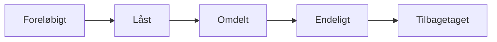

# Document Types Classification System

The Danish Parliamentary OData API employs a comprehensive document type classification system with 28 distinct categories that represent the full spectrum of parliamentary documentation. This classification system enables precise categorization and retrieval of legislative documents across all stages of the parliamentary process.

## Overview

Document types in the Danish Parliament API serve as the primary classification mechanism for organizing the vast collection of parliamentary documents. Each document type represents a specific category of parliamentary communication, legislative process documentation, or administrative record.

**Key Statistics:**
- **28 distinct document types** covering all parliamentary activities
- **5 document status levels** tracking document lifecycle
- **Perfect referential integrity** linking documents to cases, actors, and processes
- **Multilingual support** with proper UTF-8 encoding for Danish characters

## Complete Document Type Enumeration

The following table provides a complete reference of all 28 document types available in the Danish Parliamentary system:

| ID | Danish Name | English Translation | Category | Description |
|----|-------------|-------------------|----------|-------------|
| 1 | Redegørelse | Report/Statement | Executive | Formal government reports and statements |
| 2 | Stedfortræderbrev | Deputy Letter | Administrative | Letters designating parliamentary substitutes |
| 3 | Ministerredegørelse | Ministerial Statement | Executive | Official statements from government ministers |
| 4 | Aktstykke | State Document | Financial | Financial appropriation and budget documents |
| 5 | Forespørgsel | Inquiry | Legislative | Formal parliamentary inquiries |
| 6 | EU-note | EU Note | EU Affairs | European Union related documentation |
| 7 | Fremsættelsestale | Presentation Speech | Legislative | Speeches introducing legislative proposals |
| 8 | Referat | Minutes | Administrative | Meeting minutes and proceedings |
| 9 | Formandsmeddelelse | Speaker's Message | Administrative | Communications from the Parliamentary Speaker |
| 10 | Notat | Note | Administrative | General notes and memoranda |
| 11 | Statsrevisorbemærkning | Auditor General Remark | Oversight | Comments from the National Audit Office |
| 12 | Bilag | Appendix | Supporting | Supporting documents and appendices |
| 13 | Spørgsmål | Question | Parliamentary Control | Parliamentary questions to government |
| 14 | Indstilling til EB | Recommendation to EB | Committee | European Affairs Committee recommendations |
| 15 | Beretning | Report | Committee | Committee reports and findings |
| 16 | § 20-spørgsmål | Section 20 Question | Parliamentary Control | Urgent parliamentary questions under Section 20 |
| 17 | Svar | Answer | Parliamentary Control | Government responses to parliamentary questions |
| 18 | Kommissionsforslag | Commission Proposal | EU Affairs | European Commission legislative proposals |
| 19 | Grundnotat | Basic Note | Administrative | Foundational notes and background documents |
| 20 | Rådsmødedokument | Council Meeting Document | EU Affairs | Documents from EU Council meetings |
| 21 | Forslagstekst | Proposal Text | Legislative | Text of legislative proposals |
| 22 | Dagsorden | Agenda | Administrative | Meeting agendas and schedules |
| 23 | Tekstdel | Text Section | Legislative | Sections or parts of larger legislative texts |
| 24 | Orlovsansøgning | Leave Application | Administrative | Applications for parliamentary leave of absence |
| 25 | Ugeplan | Weekly Schedule | Administrative | Weekly parliamentary schedules |
| 26 | Andet | Other | Miscellaneous | Documents not fitting other categories |
| 27 | Info-note | Information Note | Administrative | Informational notes and briefings |
| 28 | Godkendelsesindstilling | Approval Recommendation | Committee | Committee recommendations for approval |

## Document Type Categories

The 28 document types can be organized into seven functional categories:

### Legislative Documents (7 types)
Documents directly involved in the legislative process:
- **Forespørgsel** (Inquiry) - Formal parliamentary inquiries
- **Fremsættelsestale** (Presentation Speech) - Legislative proposal presentations
- **Forslagstekst** (Proposal Text) - Actual legislative proposal text
- **Tekstdel** (Text Section) - Parts of legislative documents
- **Bilag** (Appendix) - Supporting legislative materials
- **Kommissionsforslag** (Commission Proposal) - EU legislative proposals
- **Godkendelsesindstilling** (Approval Recommendation) - Committee approvals

### Parliamentary Control (3 types)
Documents used for government oversight:
- **Spørgsmål** (Question) - Standard parliamentary questions
- **§ 20-spørgsmål** (Section 20 Question) - Urgent questions
- **Svar** (Answer) - Government responses

### Executive Communications (2 types)
Official government communications:
- **Redegørelse** (Report/Statement) - Government reports
- **Ministerredegørelse** (Ministerial Statement) - Minister statements

### Committee Work (3 types)
Documents produced by parliamentary committees:
- **Beretning** (Report) - Committee reports
- **Indstilling til EB** (Recommendation to EB) - European Affairs recommendations
- **Godkendelsesindstilling** (Approval Recommendation) - Committee approvals

### EU Affairs (3 types)
European Union related documentation:
- **EU-note** (EU Note) - EU related notes
- **Kommissionsforslag** (Commission Proposal) - EU Commission proposals
- **Rådsmødedokument** (Council Meeting Document) - EU Council documents

### Administrative Documents (8 types)
Parliamentary administration and procedures:
- **Stedfortræderbrev** (Deputy Letter) - Substitute designations
- **Referat** (Minutes) - Meeting minutes
- **Formandsmeddelelse** (Speaker's Message) - Speaker communications
- **Notat** (Note) - General notes
- **Grundnotat** (Basic Note) - Background documents
- **Dagsorden** (Agenda) - Meeting agendas
- **Orlovsansøgning** (Leave Application) - Leave requests
- **Ugeplan** (Weekly Schedule) - Weekly schedules
- **Info-note** (Information Note) - Information briefings

### Oversight and Control (2 types)
External oversight documents:
- **Statsrevisorbemærkning** (Auditor General Remark) - Audit comments
- **Aktstykke** (State Document) - Financial documents

## Document Status Classifications

Documents progress through a five-stage status system:

| ID | Status | Danish Name | Description |
|----|--------|-------------|-------------|
| 1 | Final | Endeligt | Document is final and published |
| 2 | Locked | Låst | Document is locked for editing |
| 3 | Distributed | Omdelt | Document has been distributed |
| 4 | Withdrawn | Tilbagetaget | Document has been withdrawn |
| 5 | Provisional | Foreløbigt | Document is in draft/preliminary state |

## Document Lifecycle and Type Transitions

### Standard Document Flow


### Legislative Document Lifecycle
1. **Forslagstekst** (Proposal Text) - Initial legislative proposal
2. **Fremsættelsestale** (Presentation Speech) - Formal presentation
3. **Beretning** (Report) - Committee examination
4. **Bilag** (Appendix) - Supporting materials during process
5. **Godkendelsesindstilling** (Approval Recommendation) - Final committee recommendation

### Parliamentary Question Process
1. **Spørgsmål** (Question) or **§ 20-spørgsmål** (Urgent Question) - Initial question
2. **Svar** (Answer) - Government response
3. **Bilag** (Appendix) - Additional supporting materials if needed

## Legislative Document Hierarchy

The Danish Parliament maintains a sophisticated document hierarchy that reflects the legislative process:

### Primary Legislative Documents
- **Forslagstekst** - The core legislative proposal
- **Fremsættelsestale** - Official presentation of the proposal
- **Beretning** - Committee examination and recommendations

### Supporting Documents
- **Bilag** - Appendices and supporting materials
- **Notat** - Explanatory notes and briefings
- **Grundnotat** - Background analysis

### Procedural Documents
- **Dagsorden** - Scheduling and procedure
- **Referat** - Official proceedings record
- **Formandsmeddelelse** - Procedural guidance

## Publication Patterns by Document Type

### High-Volume Document Types
**Daily Publications:**
- **Spørgsmål** (Questions) - 50-100 per day during active periods
- **Svar** (Answers) - 30-80 per day
- **Bilag** (Appendices) - 20-50 per day

**Weekly Publications:**
- **Beretning** (Reports) - 5-15 per week
- **Dagsorden** (Agendas) - 3-8 per week
- **Referat** (Minutes) - 2-5 per week

### Seasonal Document Patterns
**High Activity Periods** (September-December, January-June):
- Legislative proposals and reports peak
- Committee activity increases
- Parliamentary questions surge

**Low Activity Periods** (July-August):
- Minimal legislative activity
- Reduced committee work
- Administrative documents continue

## Historical Document Type Evolution

### Pre-Digital Era (1995-2005)
- Limited document types
- Basic categorization system
- Manual classification processes

### Digital Transition (2005-2015)
- Expanded document type system
- Introduction of EU-specific categories
- Enhanced classification granularity

### Modern System (2015-Present)
- Current 28-type system established
- Full digital integration
- Real-time classification and publishing

## API Querying Strategies for Document Types

### Basic Document Type Queries

```bash
# Get all document types
curl "https://oda.ft.dk/api/Dokumenttype"

# Get documents of specific type (Questions)
curl "https://oda.ft.dk/api/Dokument?\%24filter=typeid%20eq%2013"

# Get document with type information
curl "https://oda.ft.dk/api/Dokument?\%24expand=Dokumenttype&\%24top=5"
```

### Advanced Document Analysis Queries

```javascript
// JavaScript example: Analyze document type distribution
async function analyzeDocumentTypes() {
    // Get all document types
    const typesResponse = await fetch('https://oda.ft.dk/api/Dokumenttype');
    const types = await typesResponse.json();
    
    const analysis = [];
    
    for (const type of types.value) {
        // Count documents of each type
        const countResponse = await fetch(
            `https://oda.ft.dk/api/Dokument?$filter=typeid eq ${type.id}&$inlinecount=allpages&$top=1`
        );
        const countData = await countResponse.json();
        
        analysis.push({
            id: type.id,
            name: type.type,
            count: countData['odata.count']
        });
    }
    
    return analysis.sort((a, b) => b.count - a.count);
}
```

### Document Flow Analysis

```python
# Python example: Track document lifecycle
import requests
import json
from datetime import datetime, timedelta

class DocumentFlowAnalyzer:
    def __init__(self):
        self.base_url = "https://oda.ft.dk/api"
    
    def get_document_by_case(self, case_id):
        """Get all documents related to a specific case"""
        url = f"{self.base_url}/Dokument"
        params = {
            '$filter': f'sagid eq {case_id}',
            '$expand': 'Dokumenttype,Dokumentstatus',
            '$orderby': 'dato'
        }
        response = requests.get(url, params=params)
        return response.json()
    
    def analyze_document_progression(self, case_id):
        """Analyze how documents progress through a case"""
        documents = self.get_document_by_case(case_id)
        
        progression = []
        for doc in documents['value']:
            progression.append({
                'date': doc['dato'],
                'type': doc['Dokumenttype']['type'],
                'status': doc['Dokumentstatus']['status'],
                'title': doc['titel']
            })
        
        return progression
    
    def get_legislative_document_flow(self):
        """Get typical flow of legislative documents"""
        legislative_types = [21, 7, 15, 28]  # Forslagstekst, Fremsættelsestale, Beretning, Godkendelsesindstilling
        
        flows = {}
        for type_id in legislative_types:
            url = f"{self.base_url}/Dokument"
            params = {
                '$filter': f'typeid eq {type_id}',
                '$expand': 'Dokumenttype',
                '$top': 100,
                '$orderby': 'dato desc'
            }
            response = requests.get(url, params=params)
            flows[type_id] = response.json()
        
        return flows

# Usage example
analyzer = DocumentFlowAnalyzer()
case_flow = analyzer.analyze_document_progression(150000)
legislative_flow = analyzer.get_legislative_document_flow()
```

### Document Type Statistical Analysis

```bash
# Get document count by type (requires multiple queries)
for i in {1..28}; do
  count=$(curl -s "https://oda.ft.dk/api/Dokument?\%24filter=typeid%20eq%20$i&\%24inlinecount=allpages&\%24top=1" | jq -r '."odata.count"')
  type_name=$(curl -s "https://oda.ft.dk/api/Dokumenttype($i)" | jq -r '.type')
  echo "$i,$type_name,$count"
done
```

## Cross-References with Parliamentary Entities

### Document-Case Relationships
Documents are linked to legislative cases through multiple relationship types:

```bash
# Get case documents with roles
curl "https://oda.ft.dk/api/SagDokument?\%24expand=Dokument/Dokumenttype,SagDokumentRolle&\%24top=10"
```

**Key Document-Case Roles:**
- **Hoveddokument** (Main Document) - Primary case document
- **Bilagsdokument** (Appendix Document) - Supporting materials
- **Ændringsdokument** (Amendment Document) - Modifications to proposals

### Document-Actor Relationships
Documents connect to political actors through the DokumentAktør entity:

```bash
# Get document authors and recipients
curl "https://oda.ft.dk/api/DokumentAktør?\%24expand=Dokument/Dokumenttype,Aktør,DokumentAktørRolle&\%24top=10"
```

**Key Document-Actor Roles:**
- **Afsender** (Sender) - Document originator
- **Modtager** (Recipient) - Document addressee
- **Forslagsstiller** (Proposer) - Legislative proposal author
- **Minister** - Government minister involved

### Document-Meeting Integration
Documents are connected to parliamentary meetings and agenda items:

```bash
# Get meeting documents
curl "https://oda.ft.dk/api/DagsordenspunktDokument?\%24expand=Dokument/Dokumenttype,Dagsordenspunkt&\%24top=10"
```

## Document Analysis and Categorization Applications

### Content Analysis by Document Type

Different document types require different analytical approaches:

#### Legislative Documents Analysis
- **Forslagstekst** - Text analysis for policy content
- **Beretning** - Committee recommendation patterns
- **Bilag** - Supporting evidence and data

#### Parliamentary Control Analysis  
- **Spørgsmål/Svar** - Question-answer pair analysis
- **§ 20-spørgsmål** - Urgent issue identification
- **Statsrevisorbemærkning** - Financial oversight patterns

#### Administrative Pattern Analysis
- **Dagsorden** - Meeting schedule and topic trends
- **Referat** - Procedural and discussion analysis
- **Formandsmeddelelse** - Parliamentary management decisions

### Document Network Analysis

```python
# Example: Document relationship network analysis
import networkx as nx
import requests

def build_document_network(case_id):
    """Build network graph of documents in a case"""
    G = nx.Graph()
    
    # Get case documents
    response = requests.get(
        f"https://oda.ft.dk/api/SagDokument",
        params={
            '$filter': f'sagid eq {case_id}',
            '$expand': 'Dokument/Dokumenttype,SagDokumentRolle'
        }
    )
    
    documents = response.json()['value']
    
    for doc_rel in documents:
        doc_id = doc_rel['Dokument']['id']
        doc_type = doc_rel['Dokument']['Dokumenttype']['type']
        role = doc_rel['SagDokumentRolle']['rolle']
        
        G.add_node(doc_id, type=doc_type, role=role)
    
    return G
```

### Document Timeline Analysis

```python
def analyze_document_timeline(case_id):
    """Analyze temporal patterns in document publication"""
    response = requests.get(
        f"https://oda.ft.dk/api/Dokument",
        params={
            '$filter': f'sagid eq {case_id}',
            '$expand': 'Dokumenttype',
            '$orderby': 'dato'
        }
    )
    
    documents = response.json()['value']
    timeline = []
    
    for doc in documents:
        timeline.append({
            'date': doc['dato'],
            'type': doc['Dokumenttype']['type'],
            'title': doc['titel'],
            'days_since_start': 0  # Calculate based on first document
        })
    
    # Calculate time differences
    if timeline:
        start_date = datetime.fromisoformat(timeline[0]['date'])
        for item in timeline:
            doc_date = datetime.fromisoformat(item['date'])
            item['days_since_start'] = (doc_date - start_date).days
    
    return timeline
```

## Best Practices for Document Classification

### Query Optimization
1. **Use specific type filters** to reduce result sets
2. **Expand related entities** in single requests when possible
3. **Order by date** for temporal analysis
4. **Use inlinecount** for statistical analysis

### Document Type Selection Strategy
1. **Identify your use case** - Legislative tracking, oversight analysis, administrative monitoring
2. **Choose appropriate types** - Focus on 3-5 relevant types rather than all 28
3. **Consider relationships** - Include supporting document types (Bilag, Notat)
4. **Account for workflow** - Track document progression through types

### Performance Considerations
- **High-volume types** (Spørgsmål, Svar, Bilag) require pagination
- **Historical queries** may have large result sets
- **Multi-type analysis** requires multiple API calls
- **Real-time monitoring** should focus on recent dates

## Conclusion

The Danish Parliamentary document type classification system provides a comprehensive framework for organizing and accessing parliamentary documentation. With 28 distinct types covering all aspects of parliamentary work, from legislative proposals to administrative communications, this system enables sophisticated analysis and monitoring of democratic processes.

Understanding document types is essential for:
- **Efficient API querying** and data retrieval
- **Accurate legislative process tracking**
- **Comprehensive parliamentary oversight analysis**
- **Historical trend identification and analysis**
- **Cross-reference analysis** between documents, cases, and actors

The classification system's granularity and consistency make it one of the most sophisticated parliamentary document taxonomies available through a public API, supporting both simple document retrieval and complex analytical applications.