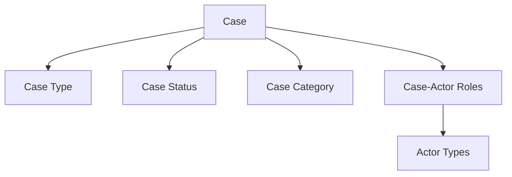

# Classification Systems Overview

The Danish Parliamentary Open Data API employs a sophisticated multi-layered classification system that captures the complexity and nuance of parliamentary procedures. This system represents decades of refinement in parliamentary data management and provides unprecedented granularity for legislative process analysis.

## System Architecture

The classification framework operates across four hierarchical layers:

### 1. Type Layer (Entity Classification)
Defines the fundamental nature of entities - what kind of thing they are:
- **Aktørtype** (13 values) - Institutional hierarchy from individuals to organizations
- **Sagstype** - Case type classifications
- **Dokumenttype** (28 values) - Complete document taxonomy
- **Stemmetype** (4 values) - Individual voting choices
- **Mødetype** - Meeting type classifications
- **Emneordstype** - Keyword category types

### 2. Status Layer (Lifecycle Tracking)
Captures the current state and process position of entities:
- **Sagsstatus** (68 values) - Most granular parliamentary status system globally
- **Dokumentstatus** - Document processing states
- **Mødestatus** - Meeting lifecycle stages
- **Sagstrinsstatus** - Case step processing states

### 3. Category Layer (Functional Grouping)
Provides semantic grouping for analysis and organization:
- **Sagskategori** - Functional case categories
- **Dokumentkategori** - Document purpose classifications

### 4. Role Layer (Relationship Semantics)
Defines the nature of relationships between entities:
- **SagAktørRolle** (23 values) - Case-actor relationship types
- **DokumentAktørRolle** (25+ values) - Document-actor relationship types
- **SagDokumentRolle** - Case-document relationship types

## Classification Systems by Domain

### Actor Classifications
The actor classification system recognizes the institutional complexity of Danish parliamentary democracy:

- **13 distinct actor types** spanning from individual persons to institutional entities
- **Hierarchical structure** distinguishing official roles (Person) from private individuals (Privatperson)
- **Comprehensive coverage** including ministers, committees, parties, commissions, and external organizations

[Learn more about Actor Types ’](actor-types.md)

### Case Classifications
Parliamentary cases are classified through multiple overlapping systems:

- **Case types** defining the nature of legislative proposals
- **68 granular status values** providing the world's most detailed parliamentary process tracking
- **Status categories** organizing the complex legislative workflow from proposal to resolution

Key process stages include:
- **Proposal Stage**: Fremsat (Proposed), Anmeldt (Announced)
- **Committee Process**: Henvist til udvalg (Referred to committee), Betænkning afgivet (Report submitted)
- **Parliamentary Readings**: 1. beh. (1st reading), 2. beh. (2nd reading), 3. beh. (3rd reading)
- **Final Outcomes**: Vedtaget (Adopted), Forkastet (Rejected), Stadfæstet (Confirmed)

[Learn more about Case Types ’](case-types.md) | [Detailed Case Status Reference ’](case-status.md)

### Document Classifications
The document taxonomy reflects the comprehensive nature of parliamentary communication:

- **28 document types** covering the complete document lifecycle
- **Procedural documents**: Redegørelse (Report), Aktstykke (Bill), Forespørgsel (Question)
- **Administrative documents**: Stedfortræderbrev (Deputy letter), Ministerredegørelse (Ministry report)
- **Correspondence tracking** through document-actor roles

[Learn more about Document Types ’](document-types.md)

### Voting Classifications
The voting system captures both collective and individual democratic participation:

- **4 vote types** for individual choices: For (Yes), Imod (No), Fravær (Absent), Hverken for eller imod (Abstain)
- **Voting session types** for different parliamentary procedures
- **Clear distinction** between absence (Fravær) and abstention (Hverken for eller imod)

[Learn more about Vote Types ’](vote-types.md)

## Historical Evolution

The classification systems have evolved to reflect changes in parliamentary procedure:

### Complexity Growth
The current 68-status system for cases reflects the increasing sophistication of Danish parliamentary procedures over time. This granularity enables:

- **Precise workflow tracking** for legislative analytics
- **Process optimization** through bottleneck identification
- **Democratic transparency** with detailed public access to legislative progress

### International Comparison
The Danish Parliamentary API's classification depth exceeds most international parliamentary data systems:

- **Status granularity**: 68 case statuses vs typical 5-10 in other systems
- **Role complexity**: 25+ document-actor roles vs typical binary relationships
- **Process completeness**: Every procedural step captured and classified

## Cross-Reference and Mapping

### Hierarchical Relationships
Classification systems are interconnected through referential integrity:



### Semantic Mapping
Role classifications provide semantic context for relationships:

- **SagAktørRolle** connects cases to actors with precise relationship semantics
- **DokumentAktørRolle** tracks communication patterns and document ownership
- **Junction tables** maintain referential integrity across all classification layers

## Working with Classifications

### Query Optimization Strategies

1. **Type-based filtering**: Use classification filters to narrow result sets efficiently
2. **Status progression**: Leverage the 68-status granularity for workflow analysis
3. **Role-based queries**: Utilize relationship classifications for complex data retrieval

### Best Practices

#### For Data Analysis
- **Group related statuses** for user-friendly displays (e.g., combine reading stages)
- **Map status sequences** to understand parliamentary workflows
- **Utilize role hierarchies** for relationship analysis

#### for User Interfaces
- **Progressive disclosure**: Present simplified classifications with drill-down options
- **Status grouping**: Organize the 68 case statuses into logical categories
- **Multi-language support**: All classifications are in Danish - consider translation layers

#### For Integration
- **Reference data caching**: Classification values are relatively stable
- **Enumeration validation**: Use classification endpoints for data validation
- **Relationship integrity**: Leverage role classifications for data consistency

### Common Patterns

```http
# Get all case statuses
GET https://oda.ft.dk/api/Sagsstatus

# Filter cases by status
GET https://oda.ft.dk/api/Sag?%24filter=sagsstatus eq 'Vedtaget'

# Find all committee-type actors
GET https://oda.ft.dk/api/Aktør?%24filter=aktørtype eq 'Udvalg'
```

## Technical Implementation

### API Endpoints
Each classification system is accessible through dedicated endpoints:

- `/api/Aktørtype` - Actor type classifications
- `/api/Sagsstatus` - Case status classifications  
- `/api/Dokumenttype` - Document type classifications
- `/api/Stemmetype` - Vote type classifications

### Data Integrity
- **Complete enumeration**: All classification values are documented and stable
- **Referential integrity**: Foreign key relationships maintain data consistency
- **Audit trails**: Classification changes include timestamp information

### Performance Considerations
- **Small datasets**: Classification entities typically contain 4-68 records
- **Stable data**: Classification systems change infrequently
- **Cache-friendly**: Ideal for client-side caching strategies

## Language and Localization

### Danish Language Foundation
All classification values are in Danish, reflecting the system's origin and primary use case:

- **Native terminology**: Parliamentary terms use official Danish procedural language
- **Cultural context**: Classifications reflect Danish democratic traditions and procedures
- **Semantic precision**: Danish terms often lack direct English equivalents

### Translation Considerations
When building multilingual applications:

- **Maintain Danish keys**: Use Danish classification values as primary keys
- **External mapping**: Create separate translation layers
- **Cultural adaptation**: Some parliamentary concepts may need explanation rather than translation

## Future Evolution

### Anticipated Changes
The classification system continues to evolve with parliamentary procedure:

- **New document types** may emerge with digital transformation
- **Status refinements** may add granularity to existing workflows
- **Role expansions** may capture new forms of parliamentary participation

### Backward Compatibility
The API maintains classification stability:

- **Additive changes**: New classifications are added rather than modified
- **Deprecation processes**: Obsolete classifications are marked but maintained
- **Version documentation**: Changes are tracked in the API changelog

## Related Documentation

- [Entity Relationships](../entity-relationships.md) - How classifications connect entities
- [Role Systems](../role-systems/index.md) - Detailed role-based classifications
- [Parliamentary Process](../parliamentary-process/index.md) - How classifications reflect procedure

## Classification System Details

Explore the detailed documentation for each classification domain:

- **[Actor Types](actor-types.md)** - Complete institutional hierarchy (13 types)
- **[Case Types](case-types.md)** - Legislative proposal classifications  
- **[Case Status](case-status.md)** - World's most granular parliamentary tracking (68 statuses)
- **[Document Types](document-types.md)** - Comprehensive document taxonomy (28 types)
- **[Vote Types](vote-types.md)** - Individual voting choice classifications (4 types)

---

*The classification systems represent one of the most sophisticated parliamentary data models globally, providing unprecedented insight into democratic processes and legislative workflows.*