# Legislative Flow

This document visualizes the complete Danish parliamentary legislative process using Mermaid diagrams, showing how cases (Sag) progress through the system from initial proposal to final decision.

## Overview

The Danish Parliament (Folketinget) uses a complex multi-stage process for handling legislative cases. The API tracks this entire process through entities like Sag (cases), Sagstrin (case steps), Sagsstatus (case status), and related actors and documents.

## Complete Legislative Process Flow

```mermaid
flowchart TD
    %% Initial Proposal Stage
    A[=Ý Initial Proposal] --> B{Proposal Type?}
    B -->|Government Bill| C[<Û Government Proposal<br/>Minister Introduces]
    B -->|Private Member Bill| D[=d Member Proposal<br/>MP Introduces]
    B -->|Committee Motion| E[<Û Committee Motion<br/>Committee Introduces]
    
    %% First Reading Preparation
    C --> F[=Ë Case Created<br/>Sag Entity]
    D --> F
    E --> F
    
    F --> G[=Ä Initial Document<br/>Dokument Created]
    G --> H[= SagDokument<br/>Case-Document Link]
    
    %% Parliamentary Processing
    H --> I[=Å First Reading Scheduled<br/>Dagsordenspunkt]
    I --> J[=ã First Reading Debate<br/>Møde]
    
    %% Decision Points
    J --> K{First Reading Result?}
    K -->|Referred to Committee| L[<Û Committee Review<br/>SagstrinAktør]
    K -->|Rejected| M[L Case Rejected<br/>Final Status]
    K -->|Emergency Bill| N[¡ Emergency Process<br/>Fast Track]
    
    %% Committee Stage
    L --> O[=Ý Committee Work<br/>Multiple Sagstrin]
    O --> P[=Ë Committee Report<br/>New Dokument]
    P --> Q[=Å Second Reading<br/>Scheduled]
    
    %% Second Reading
    Q --> R[=ã Second Reading Debate]
    R --> S{Voting Required?}
    S -->|Yes| T[=ó Voting Session<br/>Afstemning]
    S -->|No| U[=Ä Further Committee Work]
    
    %% Voting Process
    T --> V[ Individual Votes<br/>Stemme Records]
    V --> W{Vote Result?}
    W -->|Passed| X[ Second Reading Passed]
    W -->|Failed| Y[L Bill Failed]
    W -->|Amendments| Z[=Ý Amendments Proposed]
    
    %% Third Reading
    X --> AA[=Å Third Reading<br/>Final Debate]
    Z --> AA
    AA --> BB[=ó Final Voting<br/>Afstemning]
    BB --> CC[ Final Votes<br/>Stemme Records]
    
    %% Final Outcomes
    CC --> DD{Final Result?}
    DD -->|Passed| EE[ Law Adopted<br/>lovnummer assigned]
    DD -->|Failed| FF[L Bill Rejected]
    
    %% Status Updates
    F -.-> GG[=Ê Status: Under Behandling]
    L -.-> HH[=Ê Status: I Udvalg]
    EE -.-> II[=Ê Status: Vedtaget]
    FF -.-> JJ[=Ê Status: Forkastet]
    
    %% Actor Participation
    subgraph "Actor Participation Throughout"
        Ministers[=T Ministers<br/>SagAktør Roles]
        MPs[=d MPs<br/>SagAktør Roles]
        Committees[<Û Committees<br/>SagAktør Roles]
        Experts[=h
<“ Expert Witnesses<br/>SagAktør Roles]
    end
    
    style A fill:#e1f5fe
    style EE fill:#c8e6c9
    style FF fill:#ffcdd2
    style M fill:#ffcdd2
    style Y fill:#ffcdd2
```



## Case Step Progression (Sagstrin)

```mermaid
sequenceDiagram
    participant Initiator as =Ý Proposal Initiator
    participant Parliament as <Û Parliament
    participant Committee as =e Committee
    participant Members as =d MPs
    participant System as =¾ API System
    
    Note over System: Sag entity created with initial status
    
    Initiator->>Parliament: Submit Proposal
    Parliament->>System: Create Sag record
    System->>System: Assign initial Sagsstatus
    
    Parliament->>Committee: Refer to Committee
    System->>System: Create Sagstrin (Committee Review)
    System->>System: Update SagstrinAktør relationships
    
    Committee->>Committee: Review and Analysis
    Committee->>System: Create committee documents
    System->>System: Link via SagstrinDokument
    
    Committee->>Parliament: Submit Report
    Parliament->>Members: Schedule Reading
    System->>System: Create Møde and Dagsordenspunkt
    
    Members->>Parliament: Debate
    Parliament->>Members: Call Vote
    System->>System: Create Afstemning record
    
    Members->>System: Cast Votes
    System->>System: Record individual Stemme
    System->>System: Calculate Afstemning result
    
    alt Bill Passes
        Parliament->>System: Update Sagsstatus to "Vedtaget"
        System->>System: Assign lovnummer if applicable
    else Bill Fails
        Parliament->>System: Update Sagsstatus to "Forkastet"
    end
    
    System->>System: Update opdateringsdato
    System-->>All: Real-time data available via API
```



## Status Progression Chart

```mermaid
stateDiagram-v2
    [*] --> Modtaget: Initial Proposal
    
    Modtaget --> UnderBehandling: Case Accepted
    Modtaget --> Bortfaldet: Case Withdrawn
    
    UnderBehandling --> IUdvalg: Sent to Committee
    UnderBehandling --> TilFørstelæsning: Direct to First Reading
    
    IUdvalg --> UdvalgsBetænkning: Committee Report Ready
    UdvalgsBetænkning --> TilAndenlæsning: Second Reading Scheduled
    
    TilFørstelæsning --> EfterFørstelæsning: First Reading Complete
    EfterFørstelæsning --> IUdvalg: Referred to Committee
    EfterFørstelæsning --> Forkastet: Rejected at First Reading
    
    TilAndenlæsning --> EfterAndenlæsning: Second Reading Complete
    EfterAndenlæsning --> TilTredjelæsning: Third Reading Scheduled
    EfterAndenlæsning --> IUdvalg: Back to Committee
    
    TilTredjelæsning --> Vedtaget: Bill Passed
    TilTredjelæsning --> Forkastet: Bill Rejected
    
    %% Final States
    Vedtaget --> [*]: Law Created
    Forkastet --> [*]: Bill Rejected  
    Bortfaldet --> [*]: Case Withdrawn
    
    %% Status Annotations
    note right of IUdvalg
        68 detailed status codes
        track exact position
        in process
    end note
    
    note right of Vedtaget
        lovnummer assigned
        Law becomes effective
        per specified date
    end note
```



## Document Flow in Legislative Process

```mermaid
flowchart LR
    subgraph "Initial Stage"
        A[=Ä Original Proposal<br/>Dokument] --> B[= SagDokument<br/>Link to Case]
    end
    
    subgraph "Committee Stage"
        B --> C[=Ë Committee Agenda<br/>Dokument]
        C --> D[=Ý Expert Statements<br/>Multiple Dokument]
        D --> E[=Ê Committee Report<br/>Betænkning Dokument]
    end
    
    subgraph "Parliamentary Debates"
        E --> F[=ã Debate Transcript<br/>Dokument]
        F --> G[=Ý Amendment Proposals<br/>Ændringsforslag Dokument]
        G --> H[=Ê Voting Results<br/>Results Dokument]
    end
    
    subgraph "Final Documentation"
        H --> I[– Final Law Text<br/>Dokument with lovnummer]
        I --> J[=ð Official Publication<br/>Dokument]
    end
    
    %% Actor Relationships
    A -.-> K[=T Minister<br/>DokumentAktør]
    C -.-> L[=e Committee<br/>DokumentAktør]
    D -.-> M[=h
<“ Experts<br/>DokumentAktør]
    F -.-> N[=d MPs<br/>DokumentAktør]
    I -.-> O[=Q Royal Assent<br/>DokumentAktør]
    
    style A fill:#e3f2fd
    style I fill:#c8e6c9
    style J fill:#c8e6c9
```



## Voting Session Details

```mermaid
flowchart TD
    A[=ó Afstemning Created<br/>Voting Session] --> B[=Ê Voting Configuration<br/>Afstemningstype]
    
    B --> C{Voting Type}
    C -->|Navneopråb| D[=â Roll Call Vote<br/>Individual Names Called]
    C -->|Håndsoprækning| E[=K Show of Hands<br/>Simple Count]
    C -->|Elektronisk| F[=» Electronic Vote<br/>Button System]
    
    D --> G[=d Individual Responses<br/>Stemme Records]
    E --> G
    F --> G
    
    G --> H{Vote Options}
    H --> I[ For<br/>Stemmetype: For]
    H --> J[L Imod<br/>Stemmetype: Imod]
    H --> K[=« Fravær<br/>Stemmetype: Fravær]
    H --> L[U Hverken for eller imod<br/>Stemmetype: Hverken]
    
    I --> M[=Ê Vote Counting]
    J --> M
    K --> M
    L --> M
    
    M --> N[=È Final Tally<br/>Result Calculation]
    N --> O{Result}
    O -->|Majority For| P[ Motion Passed]
    O -->|Majority Against| Q[L Motion Failed]
    O -->|Tie| R[– Tie - Speaker Decides]
    
    %% Link to Actors
    G -.-> S[=d Aktør Records<br/>Who voted how]
    S -.-> T[=Ê Voting History<br/>Per Politician]
    
    style P fill:#c8e6c9
    style Q fill:#ffcdd2
    style R fill:#fff3e0
```



## Committee System Integration

```mermaid
graph TD
    subgraph "Committee Types (Aktørtype = Udvalg)"
        A[<Û Standing Committees<br/>Fagudvalg]
        B[– Special Committees<br/>Særlige Udvalg]
        C[=
 Investigation Committees<br/>Undersøgelsesudvalg]
    end
    
    subgraph "Committee Work Process"
        D[=å Case Received<br/>SagAktør Link] --> E[=e Committee Members<br/>MødeAktør]
        E --> F[=Å Committee Meetings<br/>Møde]
        F --> G[=Ë Hearing Sessions<br/>Expert Testimony]
        G --> H[=Ý Committee Report<br/>Betænkning]
    end
    
    subgraph "Committee Outputs"
        H --> I[ Recommendation<br/>Indstilling til vedtagelse]
        H --> J[L Against Recommendation<br/>Indstilling til forkastelse]
        H --> K[=Ý Minority Opinion<br/>Mindretalsudtalelse]
    end
    
    %% Link Committee Types to Process
    A --> D
    B --> D
    C --> D
    
    %% Connect to Main Process
    I --> L[=Ê Parliamentary Vote<br/>Influenced by Committee]
    J --> L
    K --> L
    
    %% Actor Participation
    E -.-> M[=T Committee Chair<br/>SagAktørRolle: Formand]
    E -.-> N[=d Committee Members<br/>SagAktørRolle: Medlem]
    G -.-> O[=h
<“ Expert Witnesses<br/>SagAktørRolle: Ekspert]
    
    style H fill:#e1f5fe
    style I fill:#c8e6c9
    style J fill:#ffcdd2
```



## API Query Examples for Legislative Tracking

### Track Case Progress

```bash
# Get case with current status
curl "https://oda.ft.dk/api/Sag?%24filter=id%20eq%20102903&%24expand=Sagsstatus"

# Get all steps in case progression  
curl "https://oda.ft.dk/api/Sagstrin?%24filter=sagid%20eq%20102903&%24expand=Sagstrinsstatus&%24orderby=dato"

# Get all actors involved in case
curl "https://oda.ft.dk/api/SagAktør?%24filter=sagid%20eq%20102903&%24expand=Aktør,SagAktørRolle"
```

### Track Voting History

```bash
# Get all voting sessions for a case
curl "https://oda.ft.dk/api/Afstemning?%24filter=sagid%20eq%20102903&%24expand=Stemme"

# Get specific politician's votes on a case
curl "https://oda.ft.dk/api/Stemme?%24filter=afstemningid%20eq%20X%20and%20aktørid%20eq%20Y&%24expand=Stemmetype,Aktør"
```

### Monitor Recent Activity

```bash
# Cases updated today
curl "https://oda.ft.dk/api/Sag?%24filter=opdateringsdato%20gt%20datetime'2025-09-09T00:00:00'&%24top=20"

# Recent voting sessions
curl "https://oda.ft.dk/api/Afstemning?%24filter=opdateringsdato%20gt%20datetime'2025-09-09T00:00:00'&%24expand=Sag"
```

## Process Insights

### Key Characteristics

1. **Multi-Stage Process**: Cases progress through defined stages with clear status tracking
2. **Actor Participation**: Rich modeling of who participates at each stage and in what role
3. **Document Trail**: Complete paper trail from initial proposal to final law
4. **Voting Transparency**: Individual vote records for democratic accountability
5. **Real-Time Updates**: Parliamentary activity reflected in API within hours

### Data Model Strengths

- **Historical Preservation**: Complete legislative history maintained
- **Relationship Richness**: Complex parliamentary relationships accurately modeled  
- **Process Flexibility**: Accommodates various legislative procedures
- **Democratic Transparency**: Every vote and decision tracked and queryable
- **Real-World Complexity**: Models actual Danish parliamentary procedures without oversimplification

The legislative flow visualization demonstrates why the Danish Parliament API is considered the gold standard for parliamentary transparency - it captures the full complexity of democratic decision-making while maintaining data integrity and queryability.