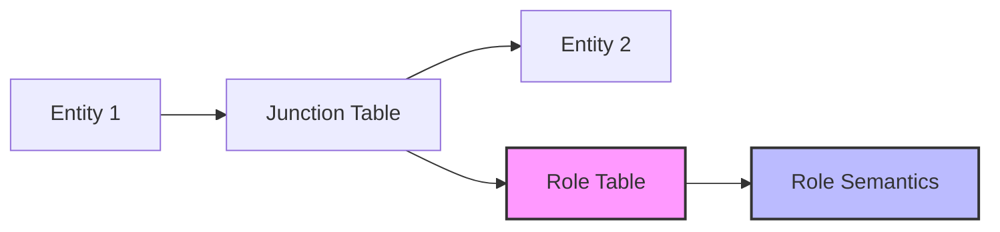
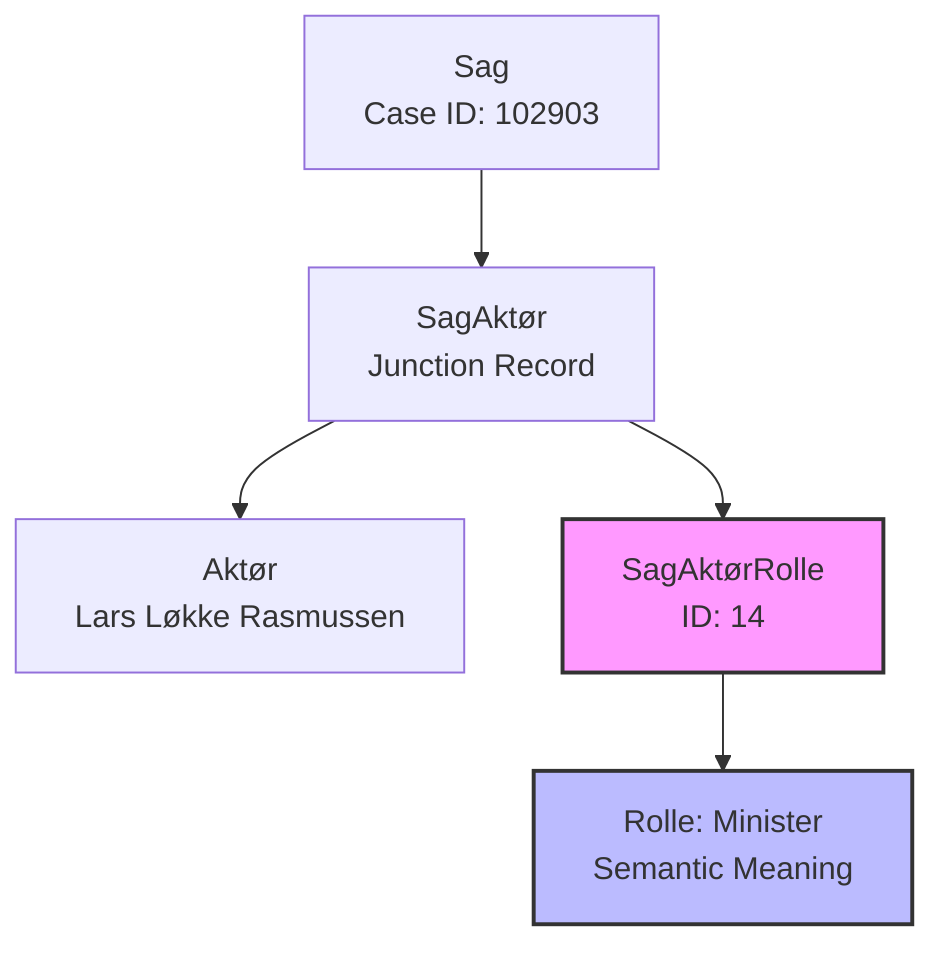

# Role Systems

The Danish Parliament API uses sophisticated role-based junction tables to model the complex relationships between entities. Rather than simple many-to-many relationships, these role systems provide semantic meaning to connections, enabling precise understanding of how different actors, documents, and cases interact.

## Overview

Role systems in the Danish Parliament API create a semantic layer on top of entity relationships. They transform simple connections into meaningful relationships that capture the nuanced ways parliamentary democracy functions.

**Key Characteristics:**
- **Semantic richness** - Roles provide meaning beyond simple links
- **Historical consistency** - Role semantics maintained across decades
- **Process modeling** - Roles reflect actual parliamentary procedures
- **Complete coverage** - All significant relationships have role context

## Primary Role Systems

### 1. Case-Actor Roles (SagAktørRolle)

**System:** 23 distinct role types defining how actors participate in cases  
**Junction Table:** SagAktør  
**Documentation:** [Complete SagAktørRolle Reference](case-actor-roles.md)

**Key Role Categories:**
- **Legislative Roles**: Forslagsstiller, Ordfører, Taler
- **Government Roles**: Minister, Ministerområde  
- **Process Roles**: Henvist til, Spørger, Besvaret af
- **Administrative Roles**: Udsteder, Optaget af, Stedfortræder

**Most Common Roles:**
1. **Minister** (ID 14) - Government minister responsible
2. **Forslagsstiller (reg.)** (ID 19) - Regular proposer
3. **Spørger** (ID 10) - Questioner
4. **Henvist til** (ID 11) - Referred to

### 2. Document-Actor Roles (DokumentAktørRolle)

**System:** 25 distinct role types defining how actors interact with documents  
**Junction Table:** DokumentAktør  
**Documentation:** [Complete DokumentAktørRolle Reference](document-actor-roles.md)

**Key Role Categories:**
- **Communication Roles**: Afsender, Til, Modtager, Kopi til
- **Response Roles**: Spørger, Besvaret af, Medspørger
- **Administrative Roles**: Minister, Ministerområde, Kontakt
- **Process Roles**: Stiller, Forslagsstiller, Ordfører

**Most Common Roles:**
1. **Afsender** (ID 1) - Document sender
2. **Til** (ID 8) - Primary recipient  
3. **Minister** (ID 5) - Government minister
4. **Kopi til** (ID 2) - Copy recipient
5. **Besvaret af** (ID 4) - Who provided the answer

## Supporting Role Systems

### 3. Case-Document Roles (SagDokumentRolle)

**Purpose:** Defines how documents function within cases  
**Junction Table:** SagDokument  
**Context:** Document types and purposes within legislative process

### 4. Case Step-Actor Roles (SagstrinAktørRolle)

**Purpose:** Defines actor participation in specific case steps  
**Junction Table:** SagstrinAktør  
**Context:** Step-by-step actor involvement in parliamentary process

### 5. Actor-Actor Roles (AktørAktørRolle)

**Purpose:** Defines relationships between actors  
**Junction Table:** AktørAktør  
**Context:** Professional, organizational, and procedural relationships

**Examples:**
- Deputy relationships (Stedfortræder)
- Committee membership
- Ministry hierarchies
- Professional associations

## Role System Architecture

### Role Assignment Pattern



### Example: Case-Actor Relationship



## Query Patterns for Role Systems

### 1. Find Entities by Role Type

```bash
# Find all ministers in case relationships
curl "https://oda.ft.dk/api/SagAktør?%24filter=rolleid%20eq%2014&%24expand=Sag,Aktør"

# Find all document senders  
curl "https://oda.ft.dk/api/DokumentAktør?%24filter=rolleid%20eq%201&%24expand=Dokument,Aktør"
```

### 2. Analyze Actor Role Patterns

```bash
# Find all roles for a specific actor
curl "https://oda.ft.dk/api/SagAktør?%24filter=aktørid%20eq%2012345&%24expand=SagAktørRolle,Sag"

# Find all document interactions for an actor
curl "https://oda.ft.dk/api/DokumentAktør?%24filter=aktørid%20eq%2012345&%24expand=DokumentAktørRolle,Dokument"
```

### 3. Process Flow Analysis

```bash
# Track question-answer processes
curl "https://oda.ft.dk/api/SagAktør?%24filter=rolleid%20in%20(10,4)&%24expand=Aktør,SagAktørRolle"

# Monitor committee referral patterns
curl "https://oda.ft.dk/api/SagAktør?%24filter=rolleid%20eq%2011&%24expand=Aktør,Sag"
```

## Role System Benefits

### 1. Semantic Precision

Traditional approach: "Actor X is connected to Case Y"  
Role-based approach: "Actor X is the **Minister** responsible for Case Y"

### 2. Process Understanding

Roles reveal the actual mechanics of parliamentary democracy:
- **Forslagsstiller** - Who proposes legislation
- **Ordfører** - Who speaks for a group  
- **Henvist til** - Committee jurisdiction
- **Besvaret af** - Government accountability

### 3. Network Analysis

Role systems enable sophisticated relationship analysis:
- **Collaboration patterns** - Who works together in what capacity
- **Communication flows** - How information moves through parliament
- **Power structures** - Who has what authority in different contexts
- **Accountability chains** - How responsibility flows through the system

### 4. Historical Research

Consistent role semantics across decades enable:
- **Longitudinal studies** of parliamentary behavior
- **Institutional change analysis** over time
- **Individual career tracking** through different roles
- **Process evolution** understanding

## Data Quality in Role Systems

### Consistency Standards

- **Role semantics** maintained across different parliamentary periods
- **Complete coverage** - All significant relationships have role context  
- **Real-time updates** - New role assignments created as parliamentary work progresses
- **Historical preservation** - Role relationships maintained even when entities change

### Validation Patterns

- **Referential integrity** - All role IDs link to valid role definitions
- **Semantic consistency** - Roles used appropriately for relationship types
- **Process alignment** - Role assignments follow parliamentary procedures

## Advanced Role Analysis

### Cross-Role Analysis

```bash
# Find actors who frequently switch between roles
curl "https://oda.ft.dk/api/SagAktør?%24filter=aktørid%20eq%20[ID]&%24expand=SagAktørRolle" 

# Analyze role co-occurrence patterns
curl "https://oda.ft.dk/api/SagAktør?%24filter=sagid%20eq%20[ID]&%24expand=Aktør,SagAktørRolle"
```

### Temporal Role Evolution

```bash
# Track role changes over time
curl "https://oda.ft.dk/api/SagAktør?%24filter=opdateringsdato%20gt%20datetime'2025-01-01'&%24expand=SagAktørRolle"

# Monitor new relationship creation
curl "https://oda.ft.dk/api/DokumentAktør?%24filter=opdateringsdato%20gt%20datetime'2025-09-01'&%24expand=DokumentAktørRolle"
```

## Implementation Best Practices

### Query Optimization

1. **Filter by role** - Role-based filtering is well-optimized
2. **Use specific role IDs** - More efficient than string matching
3. **Combine role filters** - Use `in` operator for multiple roles
4. **Limit expansions** - Only expand needed related entities

### Analysis Strategies

1. **Start with roles** - Begin analysis with role-based queries
2. **Combine role systems** - Cross-reference case and document roles
3. **Use temporal filters** - Add date ranges for focused analysis
4. **Aggregate by role** - Group results by role type for patterns

## Conclusion

The role systems in the Danish Parliament API represent one of the most sophisticated relationship modeling approaches in any government API. By providing semantic context to entity relationships, these systems enable:

- **Precise understanding** of parliamentary processes
- **Rich analytical capabilities** for democratic research
- **Historical consistency** for longitudinal studies  
- **Network analysis** of political relationships
- **Accountability tracking** through government processes

The 23 case-actor roles and 25 document-actor roles, combined with supporting role systems, create a comprehensive semantic layer that transforms raw data connections into meaningful insights about how parliamentary democracy actually functions in practice.