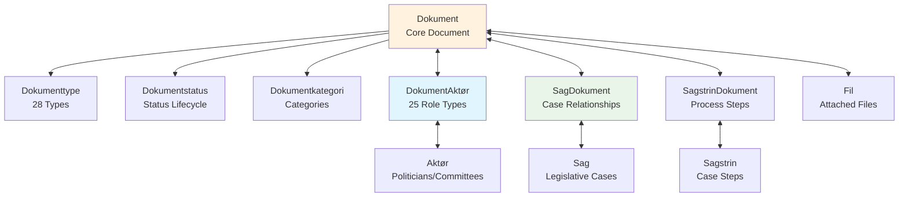

# Document Flow Tracking through the Danish Parliamentary System

This comprehensive guide explains how to track document flow through the Danish Parliamentary system using the OData API. Understanding document lifecycle, relationships, and automated monitoring enables sophisticated tracking of legislative processes from document creation to final publication.

## Overview

Document flow tracking involves monitoring documents as they move through the parliamentary system, from initial creation through various stages of review, processing, and publication. The Danish Parliament API provides rich relationship data through junction tables, enabling comprehensive tracking of:

- Document lifecycle stages and status transitions
- Actor relationships and role changes over time
- Committee workflows and processing milestones
- Cross-reference networks between related documents
- Publication timelines and revision tracking

## Document Lifecycle Fundamentals

### Core Document Entities

The document tracking system revolves around several key entities:



### Document Lifecycle Stages

Documents progress through distinct lifecycle stages tracked via multiple timestamp fields:

1. **Creation**: `dato` - Initial document creation
2. **Processing**: Internal parliamentary processing (tracked via status changes)
3. **Release**: `frigivelsesdato` - Public release timestamp
4. **Updates**: `opdateringsdato` - Ongoing modifications and corrections
5. **Revision**: `Omtryk` entity tracks reprints and corrections

## Document Types and Legislative Journey

### Key Document Types in Legislative Process

The Danish Parliament uses 28 document types, each following specific workflow patterns:

| Type ID | Type Name | Danish | Typical Flow |
|---------|-----------|--------|--------------|
| 1 | Report | Redegørelse | Committee ’ Publication |
| 3 | Ministerial Statement | Ministerredegørelse | Ministry ’ Parliament ’ Publication |
| 4 | Act Document | Aktstykke | Ministry ’ Committee ’ Voting ’ Publication |
| 5 | Inquiry | Forespørgsel | MP ’ Ministry ’ Response ’ Publication |
| 13 | Parliamentary Question | Spørgsmål | MP ’ Ministry ’ Answer ’ Publication |
| 15 | Proposal | Forslag | MP/Committee ’ Review ’ Voting ’ Publication |

### Document Type Flow Tracking

```python
def track_document_type_flow(document_type_id, days_back=30):
    """Track documents of specific type through their lifecycle"""
    since_date = (datetime.now() - timedelta(days=days_back)).isoformat()
    
    # Get documents with full relationship context
    filter_query = f"typeid eq {document_type_id} and opdateringsdato gt datetime'{since_date}'"
    expand_query = "Dokumenttype,Dokumentstatus,DokumentAktør/Aktør,SagDokument/Sag"
    
    url = f"https://oda.ft.dk/api/Dokument?%24filter={filter_query}&%24expand={expand_query}&%24orderby=opdateringsdato desc&%24top=100"
    
    response = requests.get(url)
    documents = response.json()['value']
    
    flow_analysis = {}
    for doc in documents:
        doc_flow = {
            'id': doc['id'],
            'title': doc['titel'][:100],
            'created': doc['dato'],
            'released': doc.get('frigivelsesdato'),
            'updated': doc['opdateringsdato'],
            'status': doc.get('Dokumentstatus', {}).get('status', 'Unknown'),
            'actors': [
                {
                    'name': rel['Aktør']['navn'],
                    'role': rel.get('DokumentAktørRolle', {}).get('rolle', 'Unknown')
                }
                for rel in doc.get('DokumentAktør', [])
            ],
            'cases': [case['Sag']['titel'] for case in doc.get('SagDokument', [])]
        }
        flow_analysis[doc['id']] = doc_flow
    
    return flow_analysis

# Example: Track parliamentary questions
questions_flow = track_document_type_flow(13, days_back=7)
```

## Document-Actor Relationships and Role Tracking

### Understanding Document Roles

The `DokumentAktør` junction table captures 25 different role types that define how actors interact with documents:

#### Communication Flow Roles
- **Afsender** (Sender) - Document originator
- **Til** (To) - Primary recipient  
- **Modtager** (Receiver) - Formal recipient
- **Kopi til** (Copy to) - CC recipient

#### Parliamentary Process Roles
- **Forslagsstiller** (Proposer) - Legislative proposal author
- **Stiller** (Submitter) - Document submitter
- **Spørger** (Questioner) - Parliamentary question author
- **Besvaret af** (Answered by) - Question responder
- **Minister** - Ministerial association

### Role Change Tracking

```python
def track_document_role_changes(document_id):
    """Track how actor roles change for a document over time"""
    
    # Get all document-actor relationships with timestamps
    filter_query = f"dokumentid eq {document_id}"
    expand_query = "Aktør,DokumentAktørRolle"
    
    url = f"https://oda.ft.dk/api/DokumentAktør?%24filter={filter_query}&%24expand={expand_query}&%24orderby=opdateringsdato"
    
    response = requests.get(url)
    relationships = response.json()['value']
    
    role_timeline = []
    for rel in relationships:
        role_timeline.append({
            'timestamp': rel['opdateringsdato'],
            'actor': rel['Aktør']['navn'],
            'role': rel['DokumentAktørRolle']['rolle'],
            'role_id': rel['rolleid']
        })
    
    return role_timeline

# Example: Track specific document roles
role_changes = track_document_role_changes(12345)
for change in role_changes:
    print(f"{change['timestamp']}: {change['actor']} as {change['role']}")
```

### Multi-Role Actor Analysis

```javascript
async function analyzeActorDocumentRoles(actorId, monthsBack = 6) {
    const sinceDate = new Date();
    sinceDate.setMonth(sinceDate.getMonth() - monthsBack);
    const isoDate = sinceDate.toISOString();
    
    // Get all document relationships for this actor
    const filter = `aktørid eq ${actorId} and opdateringsdato gt datetime'${isoDate}'`;
    const expand = 'Dokument($select=titel,dato,typeid),DokumentAktørRolle($select=rolle)';
    
    const url = `https://oda.ft.dk/api/DokumentAktør?%24filter=${filter}&%24expand=${expand}&%24orderby=opdateringsdato desc&%24top=1000`;
    
    const response = await fetch(url);
    const data = await response.json();
    
    // Analyze role patterns
    const roleAnalysis = {};
    data.value.forEach(rel => {
        const role = rel.DokumentAktørRolle?.rolle || 'Unknown';
        if (!roleAnalysis[role]) {
            roleAnalysis[role] = {
                count: 0,
                documents: [],
                firstSeen: rel.opdateringsdato,
                lastSeen: rel.opdateringsdato
            };
        }
        
        roleAnalysis[role].count++;
        roleAnalysis[role].documents.push({
            id: rel.dokumentid,
            title: rel.Dokument?.titel?.substring(0, 100),
            date: rel.Dokument?.dato,
            type: rel.Dokument?.typeid
        });
        
        if (rel.opdateringsdato < roleAnalysis[role].firstSeen) {
            roleAnalysis[role].firstSeen = rel.opdateringsdato;
        }
        if (rel.opdateringsdato > roleAnalysis[role].lastSeen) {
            roleAnalysis[role].lastSeen = rel.opdateringsdato;
        }
    });
    
    return roleAnalysis;
}

// Example: Analyze minister's document roles
const ministerRoles = await analyzeActorDocumentRoles(12345);
console.log('Document roles for actor:', ministerRoles);
```

## Publication Timeline Monitoring

### Document Publishing Milestones

Track key publication milestones using timestamp analysis:

```python
def analyze_publication_timeline(document_ids):
    """Analyze publication timeline for multiple documents"""
    
    # Get documents with full timestamp information
    document_filter = " or ".join([f"id eq {doc_id}" for doc_id in document_ids])
    select_fields = "id,titel,dato,frigivelsesdato,opdateringsdato,statusid"
    expand_query = "Dokumentstatus"
    
    url = f"https://oda.ft.dk/api/Dokument?%24filter={document_filter}&%24select={select_fields}&%24expand={expand_query}"
    
    response = requests.get(url)
    documents = response.json()['value']
    
    timeline_analysis = []
    
    for doc in documents:
        created = datetime.fromisoformat(doc['dato'].replace('Z', '+00:00'))
        released = None
        if doc.get('frigivelsesdato'):
            released = datetime.fromisoformat(doc['frigivelsesdato'].replace('Z', '+00:00'))
        updated = datetime.fromisoformat(doc['opdateringsdato'].replace('Z', '+00:00'))
        
        # Calculate processing times
        processing_time = None
        if released:
            processing_time = (released - created).total_seconds() / 3600  # hours
        
        timeline_data = {
            'document_id': doc['id'],
            'title': doc['titel'][:100],
            'created': created,
            'released': released,
            'last_updated': updated,
            'status': doc.get('Dokumentstatus', {}).get('status', 'Unknown'),
            'processing_hours': processing_time,
            'still_processing': released is None,
            'recent_updates': (datetime.now(timezone.utc) - updated).days < 7
        }
        
        timeline_analysis.append(timeline_data)
    
    return sorted(timeline_analysis, key=lambda x: x['created'])

# Example: Analyze recent parliamentary questions
recent_questions = get_recent_documents_by_type(13, days_back=14)
question_ids = [q['id'] for q in recent_questions[:20]]
timeline = analyze_publication_timeline(question_ids)
```

### Publication Pattern Detection

```python
def detect_publication_patterns(document_type_id, months_back=12):
    """Detect patterns in document publication timing"""
    
    start_date = (datetime.now() - timedelta(days=months_back*30)).isoformat()
    filter_query = f"typeid eq {document_type_id} and frigivelsesdato gt datetime'{start_date}' and frigivelsesdato ne null"
    
    url = f"https://oda.ft.dk/api/Dokument?%24filter={filter_query}&%24select=frigivelsesdato,dato&%24top=1000"
    
    response = requests.get(url)
    documents = response.json()['value']
    
    patterns = {
        'by_weekday': defaultdict(int),
        'by_hour': defaultdict(int),
        'processing_times': [],
        'monthly_counts': defaultdict(int)
    }
    
    for doc in documents:
        created = datetime.fromisoformat(doc['dato'].replace('Z', '+00:00'))
        released = datetime.fromisoformat(doc['frigivelsesdato'].replace('Z', '+00:00'))
        
        # Publication day patterns
        patterns['by_weekday'][released.strftime('%A')] += 1
        patterns['by_hour'][released.hour] += 1
        patterns['monthly_counts'][released.strftime('%Y-%m')] += 1
        
        # Processing time patterns
        processing_hours = (released - created).total_seconds() / 3600
        patterns['processing_times'].append(processing_hours)
    
    # Calculate statistics
    if patterns['processing_times']:
        patterns['avg_processing_hours'] = statistics.mean(patterns['processing_times'])
        patterns['median_processing_hours'] = statistics.median(patterns['processing_times'])
        patterns['processing_percentiles'] = {
            '25th': statistics.quantiles(patterns['processing_times'], n=4)[0],
            '75th': statistics.quantiles(patterns['processing_times'], n=4)[2],
            '95th': statistics.quantiles(patterns['processing_times'], n=100)[94]
        }
    
    return patterns

# Example: Analyze ministerial statement patterns
patterns = detect_publication_patterns(3)  # Ministerredegørelse
print(f"Average processing time: {patterns['avg_processing_hours']:.1f} hours")
print(f"Most common publication day: {max(patterns['by_weekday'], key=patterns['by_weekday'].get)}")
```

## Document Version Control and Revision Tracking

### Tracking Document Revisions

The `Omtryk` (Reprint) entity tracks document revisions and corrections:

```python
def track_document_revisions(document_id):
    """Track all revisions for a document"""
    
    # Get document revisions
    filter_query = f"dokumentid eq {document_id}"
    url = f"https://oda.ft.dk/api/Omtryk?%24filter={filter_query}&%24orderby=dato"
    
    response = requests.get(url)
    revisions = response.json()['value']
    
    # Get original document info
    doc_url = f"https://oda.ft.dk/api/Dokument({document_id})?%24select=titel,dato,opdateringsdato"
    doc_response = requests.get(doc_url)
    original_doc = doc_response.json()
    
    revision_history = {
        'document_id': document_id,
        'original_title': original_doc['titel'],
        'original_date': original_doc['dato'],
        'last_updated': original_doc['opdateringsdato'],
        'revisions': []
    }
    
    for revision in revisions:
        revision_info = {
            'revision_date': revision['dato'],
            'reason': revision.get('grund', 'No reason specified'),
            'revision_id': revision['id'],
            'days_since_original': (
                datetime.fromisoformat(revision['dato'].replace('Z', '+00:00')) - 
                datetime.fromisoformat(original_doc['dato'].replace('Z', '+00:00'))
            ).days
        }
        revision_history['revisions'].append(revision_info)
    
    return revision_history

# Example: Check for revised documents
def find_frequently_revised_documents(min_revisions=2):
    """Find documents with multiple revisions"""
    
    # Get documents that have revisions
    url = f"https://oda.ft.dk/api/Dokument?%24expand=Omtryk&%24filter=Omtryk/any()&%24top=100"
    
    response = requests.get(url)
    documents = response.json()['value']
    
    frequently_revised = []
    for doc in documents:
        revision_count = len(doc.get('Omtryk', []))
        if revision_count >= min_revisions:
            frequently_revised.append({
                'id': doc['id'],
                'title': doc['titel'][:100],
                'revision_count': revision_count,
                'revisions': doc['Omtryk']
            })
    
    return sorted(frequently_revised, key=lambda x: x['revision_count'], reverse=True)

revised_docs = find_frequently_revised_documents()
```

### Change Detection System

```javascript
class DocumentChangeDetector {
    constructor() {
        this.knownDocuments = new Map();
        this.changeLog = [];
    }
    
    async checkForChanges(documentIds) {
        const changes = [];
        
        // Batch request for current document states
        const idsFilter = documentIds.map(id => `id eq ${id}`).join(' or ');
        const url = `https://oda.ft.dk/api/Dokument?%24filter=${idsFilter}&%24select=id,titel,opdateringsdato,statusid&%24expand=Dokumentstatus`;
        
        const response = await fetch(url);
        const data = await response.json();
        
        for (const doc of data.value) {
            const docId = doc.id;
            const currentState = {
                title: doc.titel,
                lastUpdated: doc.opdateringsdato,
                status: doc.Dokumentstatus?.status || 'Unknown'
            };
            
            if (this.knownDocuments.has(docId)) {
                const previousState = this.knownDocuments.get(docId);
                
                // Check for changes
                const docChanges = [];
                
                if (currentState.title !== previousState.title) {
                    docChanges.push({
                        field: 'title',
                        old: previousState.title,
                        new: currentState.title
                    });
                }
                
                if (currentState.lastUpdated !== previousState.lastUpdated) {
                    docChanges.push({
                        field: 'lastUpdated',
                        old: previousState.lastUpdated,
                        new: currentState.lastUpdated
                    });
                }
                
                if (currentState.status !== previousState.status) {
                    docChanges.push({
                        field: 'status',
                        old: previousState.status,
                        new: currentState.status
                    });
                }
                
                if (docChanges.length > 0) {
                    changes.push({
                        documentId: docId,
                        timestamp: new Date().toISOString(),
                        changes: docChanges
                    });
                }
            }
            
            // Update known state
            this.knownDocuments.set(docId, currentState);
        }
        
        // Log changes
        this.changeLog.push(...changes);
        
        return changes;
    }
    
    getChangeHistory(documentId) {
        return this.changeLog.filter(change => change.documentId === documentId);
    }
}

// Example usage
const detector = new DocumentChangeDetector();

// Monitor specific documents
const documentsToMonitor = [12345, 12346, 12347];

setInterval(async () => {
    const changes = await detector.checkForChanges(documentsToMonitor);
    if (changes.length > 0) {
        console.log('Document changes detected:', changes);
    }
}, 300000); // Check every 5 minutes
```

## Committee Document Workflows

### Committee Processing Tracking

Track how documents flow through committee processes:

```python
def track_committee_document_workflow(committee_actor_id, days_back=30):
    """Track documents processed by a specific committee"""
    
    since_date = (datetime.now() - timedelta(days=days_back)).isoformat()
    
    # Find committee involvement in documents
    filter_query = f"aktørid eq {committee_actor_id} and opdateringsdato gt datetime'{since_date}'"
    expand_query = "Dokument($select=titel,dato,typeid;$expand=Dokumenttype),DokumentAktørRolle"
    
    url = f"https://oda.ft.dk/api/DokumentAktør?%24filter={filter_query}&%24expand={expand_query}&%24orderby=opdateringsdato desc&%24top=200"
    
    response = requests.get(url)
    relationships = response.json()['value']
    
    workflow_analysis = {
        'committee_id': committee_actor_id,
        'total_documents': len(relationships),
        'by_role': defaultdict(list),
        'by_document_type': defaultdict(int),
        'timeline': []
    }
    
    for rel in relationships:
        doc = rel['Dokument']
        role = rel['DokumentAktørRolle']['rolle']
        doc_type = doc.get('Dokumenttype', {}).get('type', 'Unknown')
        
        workflow_entry = {
            'document_id': doc['id'],
            'title': doc['titel'][:100],
            'role': role,
            'date': rel['opdateringsdato'],
            'document_type': doc_type
        }
        
        workflow_analysis['by_role'][role].append(workflow_entry)
        workflow_analysis['by_document_type'][doc_type] += 1
        workflow_analysis['timeline'].append(workflow_entry)
    
    # Sort timeline by date
    workflow_analysis['timeline'].sort(key=lambda x: x['date'], reverse=True)
    
    return workflow_analysis

# Example: Track Environment Committee workflows
env_committee_id = 1234  # Example committee actor ID
committee_workflow = track_committee_document_workflow(env_committee_id)
```

### Cross-Committee Document Analysis

```python
def analyze_multi_committee_documents():
    """Find documents involving multiple committees"""
    
    # Get committee actor IDs (assuming committee actors have specific type)
    committees_url = "https://oda.ft.dk/api/Aktør?%24filter=typeid eq 6&%24select=id,navn&%24top=100"  # Assuming type 6 is committees
    committees_response = requests.get(committees_url)
    committees = committees_response.json()['value']
    
    committee_ids = [c['id'] for c in committees]
    
    # Find documents with multiple committee involvement
    multi_committee_docs = {}
    
    for committee_id in committee_ids:
        filter_query = f"aktørid eq {committee_id}"
        url = f"https://oda.ft.dk/api/DokumentAktør?%24filter={filter_query}&%24select=dokumentid,rolleid&%24top=1000"
        
        response = requests.get(url)
        relationships = response.json()['value']
        
        for rel in relationships:
            doc_id = rel['dokumentid']
            if doc_id not in multi_committee_docs:
                multi_committee_docs[doc_id] = []
            
            multi_committee_docs[doc_id].append({
                'committee_id': committee_id,
                'role_id': rel['rolleid']
            })
    
    # Filter for documents with 2+ committees
    multi_committee_results = {
        doc_id: committees 
        for doc_id, committees in multi_committee_docs.items() 
        if len(committees) >= 2
    }
    
    return multi_committee_results

multi_committee_docs = analyze_multi_committee_documents()
print(f"Found {len(multi_committee_docs)} documents involving multiple committees")
```

## Cross-Reference Tracking Between Related Documents

### Document Relationship Networks

Track how documents reference and relate to each other:

```python
def build_document_relationship_network(seed_document_id, depth=2):
    """Build a network of related documents starting from a seed document"""
    
    visited = set()
    document_network = {}
    queue = [(seed_document_id, 0)]
    
    while queue and depth > 0:
        doc_id, current_depth = queue.pop(0)
        
        if doc_id in visited or current_depth >= depth:
            continue
            
        visited.add(doc_id)
        
        # Get document info and relationships
        doc_url = f"https://oda.ft.dk/api/Dokument({doc_id})?%24select=id,titel,dato,typeid&%24expand=SagDokument/Sag"
        doc_response = requests.get(doc_url)
        document = doc_response.json()
        
        document_network[doc_id] = {
            'title': document['titel'][:100],
            'date': document['dato'],
            'type_id': document['typeid'],
            'related_documents': [],
            'cases': []
        }
        
        # Find related documents through cases
        for case_rel in document.get('SagDokument', []):
            case_id = case_rel['sagid']
            
            # Get other documents in the same case
            case_docs_url = f"https://oda.ft.dk/api/SagDokument?%24filter=sagid eq {case_id}&%24select=dokumentid&%24top=100"
            case_docs_response = requests.get(case_docs_url)
            case_documents = case_docs_response.json()['value']
            
            for case_doc in case_documents:
                related_doc_id = case_doc['dokumentid']
                if related_doc_id != doc_id and related_doc_id not in visited:
                    document_network[doc_id]['related_documents'].append(related_doc_id)
                    if current_depth + 1 < depth:
                        queue.append((related_doc_id, current_depth + 1))
            
            document_network[doc_id]['cases'].append(case_id)
    
    return document_network

# Example: Build network from parliamentary question
network = build_document_relationship_network(12345, depth=3)
```

### Document Citation Analysis

```python
def analyze_document_citations(document_ids, search_terms=None):
    """Analyze how documents cite or reference each other"""
    
    citation_patterns = {
        'explicit_citations': [],
        'keyword_connections': [],
        'temporal_clusters': [],
        'actor_connections': []
    }
    
    # Get documents with full text and relationships
    doc_filter = " or ".join([f"id eq {doc_id}" for doc_id in document_ids])
    expand_query = "DokumentAktør/Aktør,SagDokument/Sag"
    
    url = f"https://oda.ft.dk/api/Dokument?%24filter={doc_filter}&%24expand={expand_query}&%24top=1000"
    
    response = requests.get(url)
    documents = response.json()['value']
    
    # Build citation network
    for doc in documents:
        doc_analysis = {
            'id': doc['id'],
            'title': doc['titel'],
            'actors': [rel['Aktør']['navn'] for rel in doc.get('DokumentAktør', [])],
            'cases': [rel['Sag']['titel'] for rel in doc.get('SagDokument', [])],
            'date': doc['dato']
        }
        
        # Look for explicit references to other documents
        title_text = doc['titel'].lower()
        for other_doc in documents:
            if other_doc['id'] != doc['id']:
                other_id_str = str(other_doc['id'])
                if other_id_str in title_text or any(
                    keyword in title_text for keyword in ['svar på', 'besvarelse', 'opfølgning']
                ):
                    citation_patterns['explicit_citations'].append({
                        'citing_doc': doc['id'],
                        'cited_doc': other_doc['id'],
                        'type': 'explicit_reference'
                    })
        
        # Find keyword connections if search terms provided
        if search_terms:
            for term in search_terms:
                if term.lower() in title_text:
                    citation_patterns['keyword_connections'].append({
                        'document_id': doc['id'],
                        'keyword': term,
                        'title_snippet': doc['titel'][:100]
                    })
    
    return citation_patterns

# Example: Analyze climate-related document citations
climate_docs = get_documents_by_keyword('klima', limit=50)
climate_citations = analyze_document_citations(
    [doc['id'] for doc in climate_docs],
    search_terms=['klima', 'miljø', 'CO2', 'bæredygtig']
)
```

## Automated Document Flow Monitoring Systems

### Real-Time Document Monitor

```python
class DocumentFlowMonitor:
    def __init__(self, config):
        self.config = config
        self.last_check = datetime.now(timezone.utc)
        self.monitored_documents = set()
        self.alerts = []
        
    def add_document_monitoring(self, document_id, alert_conditions=None):
        """Add a document to monitoring with specific alert conditions"""
        self.monitored_documents.add(document_id)
        
        if alert_conditions:
            self.config.setdefault('alerts', {})[document_id] = alert_conditions
    
    def check_for_updates(self):
        """Check for updates across all monitored documents"""
        if not self.monitored_documents:
            return []
        
        current_time = datetime.now(timezone.utc)
        since_last_check = self.last_check.isoformat()
        
        # Build filter for monitored documents
        doc_filter = " or ".join([f"id eq {doc_id}" for doc_id in self.monitored_documents])
        filter_query = f"({doc_filter}) and opdateringsdato gt datetime'{since_last_check}'"
        
        # Get updated documents with relationships
        expand_query = "Dokumentstatus,DokumentAktør/Aktør,DokumentAktør/DokumentAktørRolle"
        url = f"https://oda.ft.dk/api/Dokument?%24filter={filter_query}&%24expand={expand_query}&%24top=1000"
        
        response = requests.get(url)
        updated_documents = response.json()['value']
        
        alerts = []
        for doc in updated_documents:
            doc_id = doc['id']
            
            # Create update notification
            update_info = {
                'document_id': doc_id,
                'title': doc['titel'][:100],
                'timestamp': doc['opdateringsdato'],
                'status': doc.get('Dokumentstatus', {}).get('status', 'Unknown'),
                'changes_detected': []
            }
            
            # Check for specific alert conditions
            alert_conditions = self.config.get('alerts', {}).get(doc_id, {})
            
            # Status change alerts
            if alert_conditions.get('status_changes'):
                current_status = doc.get('Dokumentstatus', {}).get('status')
                if current_status in alert_conditions['status_changes']:
                    update_info['changes_detected'].append(f"Status changed to: {current_status}")
            
            # Actor role alerts
            if alert_conditions.get('role_changes'):
                for role_rel in doc.get('DokumentAktør', []):
                    role = role_rel.get('DokumentAktørRolle', {}).get('rolle')
                    if role in alert_conditions['role_changes']:
                        actor_name = role_rel.get('Aktør', {}).get('navn', 'Unknown')
                        update_info['changes_detected'].append(f"New role: {actor_name} as {role}")
            
            alerts.append(update_info)
        
        self.last_check = current_time
        self.alerts.extend(alerts)
        
        return alerts
    
    def get_alert_history(self, hours_back=24):
        """Get alert history for specified time period"""
        cutoff_time = datetime.now(timezone.utc) - timedelta(hours=hours_back)
        
        return [
            alert for alert in self.alerts
            if datetime.fromisoformat(alert['timestamp'].replace('Z', '+00:00')) >= cutoff_time
        ]

# Example: Set up monitoring system
monitor_config = {
    'alerts': {
        12345: {
            'status_changes': ['Published', 'Withdrawn', 'Revised'],
            'role_changes': ['Besvaret af', 'Minister']
        }
    }
}

monitor = DocumentFlowMonitor(monitor_config)
monitor.add_document_monitoring(12345)

# Check for updates every 5 minutes
import schedule
import time

schedule.every(5).minutes.do(lambda: monitor.check_for_updates())

while True:
    schedule.run_pending()
    time.sleep(60)
```

### Batch Document Processing Pipeline

```javascript
class DocumentFlowPipeline {
    constructor() {
        this.processors = [];
        this.results = [];
    }
    
    addProcessor(name, processorFunction) {
        this.processors.push({ name, process: processorFunction });
    }
    
    async processDocuments(documentIds, batchSize = 50) {
        const results = [];
        
        // Process documents in batches to avoid API limits
        for (let i = 0; i < documentIds.length; i += batchSize) {
            const batch = documentIds.slice(i, i + batchSize);
            const batchResults = await this.processBatch(batch);
            results.push(...batchResults);
        }
        
        return results;
    }
    
    async processBatch(documentIds) {
        // Fetch document data for batch
        const idsFilter = documentIds.map(id => `id eq ${id}`).join(' or ');
        const url = `https://oda.ft.dk/api/Dokument?%24filter=${idsFilter}&%24expand=Dokumenttype,Dokumentstatus,DokumentAktør/Aktør,SagDokument/Sag&%24top=${documentIds.length}`;
        
        const response = await fetch(url);
        const data = await response.json();
        
        const batchResults = [];
        
        for (const document of data.value) {
            const docResult = {
                id: document.id,
                processingResults: {}
            };
            
            // Run all processors on this document
            for (const processor of this.processors) {
                try {
                    const result = await processor.process(document);
                    docResult.processingResults[processor.name] = result;
                } catch (error) {
                    docResult.processingResults[processor.name] = { error: error.message };
                }
            }
            
            batchResults.push(docResult);
        }
        
        return batchResults;
    }
}

// Example processors
const pipeline = new DocumentFlowPipeline();

// Add document classification processor
pipeline.addProcessor('classification', (document) => {
    return {
        type: document.Dokumenttype?.type || 'Unknown',
        status: document.Dokumentstatus?.status || 'Unknown',
        hasActors: document.DokumentAktør?.length > 0,
        hasCases: document.SagDokument?.length > 0
    };
});

// Add timeline processor
pipeline.addProcessor('timeline', (document) => {
    const created = new Date(document.dato);
    const updated = new Date(document.opdateringsdato);
    const released = document.frigivelsesdato ? new Date(document.frigivelsesdato) : null;
    
    return {
        ageInDays: Math.floor((new Date() - created) / (1000 * 60 * 60 * 24)),
        processingTime: released ? Math.floor((released - created) / (1000 * 60 * 60)) : null,
        recentlyUpdated: (new Date() - updated) < (7 * 24 * 60 * 60 * 1000)
    };
});

// Add actor network processor
pipeline.addProcessor('actorNetwork', (document) => {
    const actors = document.DokumentAktør || [];
    const roles = {};
    
    actors.forEach(rel => {
        const actorName = rel.Aktør?.navn || 'Unknown';
        const roleName = rel.DokumentAktørRolle?.rolle || 'Unknown';
        
        if (!roles[roleName]) roles[roleName] = [];
        roles[roleName].push(actorName);
    });
    
    return {
        totalActors: actors.length,
        roles: roles,
        hasMinister: actors.some(rel => rel.rolleid === 5),
        hasCommittee: actors.some(rel => rel.Aktør?.typeid === 6)
    };
});

// Process a batch of documents
const recentDocuments = await getRecentDocuments(100);
const documentIds = recentDocuments.map(doc => doc.id);
const results = await pipeline.processDocuments(documentIds);

console.log('Processed', results.length, 'documents');
```

## Document Status Change Detection and Alerts

### Status Transition Monitoring

```python
class DocumentStatusMonitor:
    def __init__(self):
        self.status_history = defaultdict(list)
        self.transition_rules = {}
        
    def add_transition_rule(self, from_status, to_status, alert_callback):
        """Add a rule to trigger alerts on specific status transitions"""
        key = f"{from_status} -> {to_status}"
        self.transition_rules[key] = alert_callback
    
    def monitor_status_changes(self, document_ids, check_interval_minutes=15):
        """Monitor documents for status changes"""
        
        while True:
            try:
                # Get current status for all documents
                doc_filter = " or ".join([f"id eq {doc_id}" for doc_id in document_ids])
                url = f"https://oda.ft.dk/api/Dokument?%24filter={doc_filter}&%24expand=Dokumentstatus&%24select=id,titel,statusid&%24top={len(document_ids)}"
                
                response = requests.get(url)
                documents = response.json()['value']
                
                current_time = datetime.now()
                
                for doc in documents:
                    doc_id = doc['id']
                    current_status = doc.get('Dokumentstatus', {}).get('status', 'Unknown')
                    
                    # Check for status changes
                    if doc_id in self.status_history:
                        previous_status = self.status_history[doc_id][-1]['status']
                        
                        if current_status != previous_status:
                            # Status changed - trigger alerts
                            transition_key = f"{previous_status} -> {current_status}"
                            
                            # Log the change
                            self.status_history[doc_id].append({
                                'status': current_status,
                                'timestamp': current_time,
                                'previous_status': previous_status
                            })
                            
                            # Check for matching transition rules
                            if transition_key in self.transition_rules:
                                self.transition_rules[transition_key](doc, previous_status, current_status)
                            
                            # Generic status change alert
                            if 'any_change' in self.transition_rules:
                                self.transition_rules['any_change'](doc, previous_status, current_status)
                    else:
                        # First time seeing this document
                        self.status_history[doc_id].append({
                            'status': current_status,
                            'timestamp': current_time,
                            'previous_status': None
                        })
                
                # Wait before next check
                time.sleep(check_interval_minutes * 60)
                
            except Exception as e:
                print(f"Error in status monitoring: {e}")
                time.sleep(60)  # Wait a minute before retrying
    
    def get_status_history(self, document_id):
        """Get complete status history for a document"""
        return self.status_history.get(document_id, [])

# Example: Set up status monitoring with alerts
def alert_on_publication(document, old_status, new_status):
    print(f"=â Document {document['id']} published: {document['titel'][:100]}")
    print(f"   Status: {old_status} ’ {new_status}")

def alert_on_withdrawal(document, old_status, new_status):
    print(f"=4 Document {document['id']} withdrawn: {document['titel'][:100]}")
    print(f"   Status: {old_status} ’ {new_status}")

def alert_any_change(document, old_status, new_status):
    print(f"=Ý Status change for document {document['id']}: {old_status} ’ {new_status}")

monitor = DocumentStatusMonitor()
monitor.add_transition_rule("Draft", "Published", alert_on_publication)
monitor.add_transition_rule("Published", "Withdrawn", alert_on_withdrawal)
monitor.add_transition_rule("any_change", alert_any_change)

# Start monitoring (this would run in a background thread)
documents_to_monitor = [12345, 12346, 12347]
# monitor.monitor_status_changes(documents_to_monitor, check_interval_minutes=10)
```

### Advanced Alert System

```javascript
class DocumentAlertSystem {
    constructor() {
        this.subscribers = new Map();
        this.alertHistory = [];
        this.isRunning = false;
    }
    
    subscribe(alertType, callback) {
        if (!this.subscribers.has(alertType)) {
            this.subscribers.set(alertType, []);
        }
        this.subscribers.get(alertType).push(callback);
    }
    
    async triggerAlert(alertType, data) {
        const alert = {
            type: alertType,
            timestamp: new Date().toISOString(),
            data: data,
            id: Date.now() + Math.random()
        };
        
        this.alertHistory.push(alert);
        
        // Notify subscribers
        const callbacks = this.subscribers.get(alertType) || [];
        for (const callback of callbacks) {
            try {
                await callback(alert);
            } catch (error) {
                console.error(`Alert callback error:`, error);
            }
        }
        
        // Also notify wildcard subscribers
        const wildcardCallbacks = this.subscribers.get('*') || [];
        for (const callback of wildcardCallbacks) {
            try {
                await callback(alert);
            } catch (error) {
                console.error(`Wildcard alert callback error:`, error);
            }
        }
    }
    
    async monitorDocumentFlow(documentIds, conditions = {}) {
        this.isRunning = true;
        let lastCheck = new Date();
        
        while (this.isRunning) {
            try {
                // Check for document updates
                const updates = await this.checkDocumentUpdates(documentIds, lastCheck);
                
                for (const update of updates) {
                    // Check various alert conditions
                    await this.processDocumentUpdate(update, conditions);
                }
                
                lastCheck = new Date();
                
                // Wait 5 minutes before next check
                await new Promise(resolve => setTimeout(resolve, 5 * 60 * 1000));
                
            } catch (error) {
                console.error('Document monitoring error:', error);
                await new Promise(resolve => setTimeout(resolve, 60 * 1000));
            }
        }
    }
    
    async checkDocumentUpdates(documentIds, since) {
        const sinceISO = since.toISOString();
        const idsFilter = documentIds.map(id => `id eq ${id}`).join(' or ');
        const filter = `(${idsFilter}) and opdateringsdato gt datetime'${sinceISO}'`;
        
        const url = `https://oda.ft.dk/api/Dokument?%24filter=${filter}&%24expand=Dokumentstatus,DokumentAktør/Aktør,DokumentAktør/DokumentAktørRolle,SagDokument/Sag&%24orderby=opdateringsdato desc&%24top=1000`;
        
        const response = await fetch(url);
        const data = await response.json();
        
        return data.value;
    }
    
    async processDocumentUpdate(document, conditions) {
        const docData = {
            id: document.id,
            title: document.titel,
            status: document.Dokumentstatus?.status || 'Unknown',
            lastUpdated: document.opdateringsdato,
            actors: document.DokumentAktør?.map(rel => ({
                name: rel.Aktør?.navn,
                role: rel.DokumentAktørRolle?.rolle
            })) || [],
            cases: document.SagDokument?.map(rel => rel.Sag?.titel) || []
        };
        
        // Status change alerts
        if (conditions.statusAlerts) {
            for (const statusToWatch of conditions.statusAlerts) {
                if (docData.status === statusToWatch) {
                    await this.triggerAlert('status_change', {
                        document: docData,
                        newStatus: statusToWatch,
                        message: `Document status changed to: ${statusToWatch}`
                    });
                }
            }
        }
        
        // Actor role alerts
        if (conditions.actorRoleAlerts) {
            for (const actor of docData.actors) {
                if (conditions.actorRoleAlerts.includes(actor.role)) {
                    await this.triggerAlert('actor_role', {
                        document: docData,
                        actor: actor,
                        message: `New actor role: ${actor.name} as ${actor.role}`
                    });
                }
            }
        }
        
        // Keyword alerts
        if (conditions.keywordAlerts) {
            const titleLower = docData.title.toLowerCase();
            for (const keyword of conditions.keywordAlerts) {
                if (titleLower.includes(keyword.toLowerCase())) {
                    await this.triggerAlert('keyword_match', {
                        document: docData,
                        keyword: keyword,
                        message: `Document contains keyword: ${keyword}`
                    });
                }
            }
        }
        
        // Always trigger general update alert
        await this.triggerAlert('document_updated', {
            document: docData,
            message: 'Document was updated'
        });
    }
    
    stop() {
        this.isRunning = false;
    }
    
    getAlertHistory(alertType = null, hours = 24) {
        const cutoff = new Date(Date.now() - (hours * 60 * 60 * 1000));
        
        return this.alertHistory
            .filter(alert => new Date(alert.timestamp) >= cutoff)
            .filter(alert => !alertType || alert.type === alertType)
            .sort((a, b) => new Date(b.timestamp) - new Date(a.timestamp));
    }
}

// Example: Set up comprehensive alert system
const alertSystem = new DocumentAlertSystem();

// Subscribe to different alert types
alertSystem.subscribe('status_change', async (alert) => {
    console.log(`=Ê Status Alert: ${alert.data.message}`);
    console.log(`   Document: ${alert.data.document.title.substring(0, 100)}`);
});

alertSystem.subscribe('actor_role', async (alert) => {
    console.log(`=d Actor Alert: ${alert.data.message}`);
    console.log(`   Document: ${alert.data.document.title.substring(0, 100)}`);
});

alertSystem.subscribe('keyword_match', async (alert) => {
    console.log(`=
 Keyword Alert: ${alert.data.message}`);
    console.log(`   Document: ${alert.data.document.title.substring(0, 100)}`);
});

// Generic alert subscriber
alertSystem.subscribe('*', async (alert) => {
    // Log all alerts to a database or file
    console.log(`[${alert.timestamp}] ${alert.type}: ${alert.data.message}`);
});

// Start monitoring with specific conditions
const monitoringConditions = {
    statusAlerts: ['Published', 'Withdrawn', 'Under Review'],
    actorRoleAlerts: ['Minister', 'Besvaret af', 'Forslagsstiller'],
    keywordAlerts: ['klima', 'budget', 'sundhed']
};

const documentsToMonitor = [12345, 12346, 12347];

// Start monitoring (would typically run this in background)
// alertSystem.monitorDocumentFlow(documentsToMonitor, monitoringConditions);
```

## Performance Optimization for Bulk Document Tracking

### Efficient Batch Processing Strategies

```python
class BulkDocumentTracker:
    def __init__(self, max_concurrent=5, batch_size=100):
        self.max_concurrent = max_concurrent
        self.batch_size = batch_size
        self.rate_limiter = RateLimiter(max_calls=100, time_window=60)  # 100 calls per minute
        
    async def track_document_collection(self, document_ids, tracking_options):
        """Efficiently track a large collection of documents"""
        
        # Split into batches for processing
        batches = [
            document_ids[i:i + self.batch_size] 
            for i in range(0, len(document_ids), self.batch_size)
        ]
        
        results = []
        semaphore = asyncio.Semaphore(self.max_concurrent)
        
        async def process_batch(batch):
            async with semaphore:
                await self.rate_limiter.wait()
                return await self.track_document_batch(batch, tracking_options)
        
        # Process batches concurrently
        batch_tasks = [process_batch(batch) for batch in batches]
        batch_results = await asyncio.gather(*batch_tasks)
        
        # Flatten results
        for batch_result in batch_results:
            results.extend(batch_result)
        
        return results
    
    async def track_document_batch(self, document_ids, options):
        """Track a batch of documents with optimized queries"""
        
        # Build efficient filter query
        doc_filter = " or ".join([f"id eq {doc_id}" for doc_id in document_ids])
        
        # Optimize expansions based on tracking options
        expansions = []
        if options.get('include_status'):
            expansions.append("Dokumentstatus")
        if options.get('include_actors'):
            expansions.append("DokumentAktør/Aktør")
            if options.get('include_actor_roles'):
                expansions.append("DokumentAktør/DokumentAktørRolle")
        if options.get('include_cases'):
            expansions.append("SagDokument/Sag")
        
        expand_query = ",".join(expansions) if expansions else None
        
        # Build select fields for efficiency
        select_fields = ["id", "titel", "dato", "opdateringsdato", "typeid"]
        if options.get('include_release_date'):
            select_fields.append("frigivelsesdato")
        if options.get('include_content_fields'):
            select_fields.extend(["spørgsmålstitel", "procedurenummer"])
        
        select_query = ",".join(select_fields)
        
        # Construct optimized URL
        url_params = [
            f"%24filter={doc_filter}",
            f"%24select={select_query}",
            f"%24top={len(document_ids)}"
        ]
        
        if expand_query:
            url_params.append(f"%24expand={expand_query}")
        
        url = f"https://oda.ft.dk/api/Dokument?{'&'.join(url_params)}"
        
        # Make request with retry logic
        max_retries = 3
        for attempt in range(max_retries):
            try:
                async with aiohttp.ClientSession() as session:
                    async with session.get(url, timeout=aiohttp.ClientTimeout(total=60)) as response:
                        if response.status == 200:
                            data = await response.json()
                            return self.process_batch_results(data['value'], options)
                        else:
                            print(f"HTTP {response.status} for batch, attempt {attempt + 1}")
                            
            except Exception as e:
                print(f"Error processing batch (attempt {attempt + 1}): {e}")
                if attempt < max_retries - 1:
                    await asyncio.sleep(2 ** attempt)  # Exponential backoff
                else:
                    raise
        
        return []
    
    def process_batch_results(self, documents, options):
        """Process and optimize batch results"""
        processed_docs = []
        
        for doc in documents:
            processed_doc = {
                'id': doc['id'],
                'title': doc['titel'][:150],  # Truncate for memory efficiency
                'created': doc['dato'],
                'updated': doc['opdateringsdato'],
                'type_id': doc['typeid']
            }
            
            # Add optional fields based on tracking options
            if options.get('include_status') and 'Dokumentstatus' in doc:
                processed_doc['status'] = doc['Dokumentstatus'].get('status')
            
            if options.get('include_actors') and 'DokumentAktør' in doc:
                processed_doc['actors'] = [
                    {
                        'name': rel.get('Aktør', {}).get('navn'),
                        'role': rel.get('DokumentAktørRolle', {}).get('rolle') if options.get('include_actor_roles') else None,
                        'role_id': rel.get('rolleid')
                    }
                    for rel in doc['DokumentAktør']
                ]
            
            if options.get('include_cases') and 'SagDokument' in doc:
                processed_doc['cases'] = [
                    rel['Sag']['titel'][:100] for rel in doc['SagDokument']
                ]
            
            processed_docs.append(processed_doc)
        
        return processed_docs

# Rate limiter utility
class RateLimiter:
    def __init__(self, max_calls, time_window):
        self.max_calls = max_calls
        self.time_window = time_window
        self.calls = []
    
    async def wait(self):
        now = time.time()
        
        # Remove old calls outside the time window
        self.calls = [call_time for call_time in self.calls if now - call_time < self.time_window]
        
        if len(self.calls) >= self.max_calls:
            sleep_time = self.time_window - (now - self.calls[0])
            if sleep_time > 0:
                await asyncio.sleep(sleep_time)
        
        self.calls.append(now)

# Example: Bulk tracking of parliamentary questions
async def track_parliamentary_questions_bulk():
    # Get recent parliamentary questions
    recent_questions_url = "https://oda.ft.dk/api/Dokument?%24filter=typeid eq 13 and opdateringsdato gt datetime'2025-08-01T00:00:00'&%24select=id&%24top=1000"
    
    async with aiohttp.ClientSession() as session:
        async with session.get(recent_questions_url) as response:
            data = await response.json()
            question_ids = [doc['id'] for doc in data['value']]
    
    # Set up tracking options
    tracking_options = {
        'include_status': True,
        'include_actors': True,
        'include_actor_roles': True,
        'include_cases': True,
        'include_release_date': True
    }
    
    # Create bulk tracker and process
    tracker = BulkDocumentTracker(max_concurrent=3, batch_size=50)
    results = await tracker.track_document_collection(question_ids, tracking_options)
    
    print(f"Tracked {len(results)} parliamentary questions")
    return results

# Run bulk tracking
# results = asyncio.run(track_parliamentary_questions_bulk())
```

### Memory-Efficient Document Streaming

```python
def stream_document_analysis(filter_query, analysis_function, batch_size=100):
    """Stream document analysis to handle large datasets efficiently"""
    
    offset = 0
    total_processed = 0
    
    while True:
        # Get batch with pagination
        url = f"https://oda.ft.dk/api/Dokument?%24filter={filter_query}&%24skip={offset}&%24top={batch_size}&%24orderby=id"
        
        response = requests.get(url)
        batch_data = response.json()['value']
        
        if not batch_data:
            break  # No more data
        
        # Process batch and yield results
        for document in batch_data:
            try:
                result = analysis_function(document)
                if result:  # Only yield non-None results
                    yield result
                total_processed += 1
            except Exception as e:
                print(f"Error processing document {document.get('id')}: {e}")
        
        offset += batch_size
        
        # Optional: Add progress reporting
        if total_processed % 1000 == 0:
            print(f"Processed {total_processed} documents...")

# Example: Memory-efficient analysis of all documents
def analyze_document_metrics(document):
    """Analyze key metrics for a document"""
    created = datetime.fromisoformat(document['dato'].replace('Z', '+00:00'))
    updated = datetime.fromisoformat(document['opdateringsdato'].replace('Z', '+00:00'))
    
    return {
        'id': document['id'],
        'age_days': (datetime.now(timezone.utc) - created).days,
        'last_update_days': (datetime.now(timezone.utc) - updated).days,
        'title_length': len(document.get('titel', '')),
        'has_question': bool(document.get('spørgsmålstitel')),
        'type_id': document.get('typeid')
    }

# Stream analysis results
filter_all_docs = "id gt 0"  # Simple filter to get all documents
metrics_generator = stream_document_analysis(filter_all_docs, analyze_document_metrics)

# Process results in batches to avoid memory issues
batch_results = []
for i, metrics in enumerate(metrics_generator):
    batch_results.append(metrics)
    
    if len(batch_results) >= 1000:
        # Process accumulated batch (save to database, analyze, etc.)
        process_metrics_batch(batch_results)
        batch_results = []  # Clear for next batch
    
    if i >= 50000:  # Limit for demo purposes
        break

# Process final batch
if batch_results:
    process_metrics_batch(batch_results)
```

### Optimized Multi-Entity Tracking

```javascript
class OptimizedMultiEntityTracker {
    constructor() {
        this.cache = new Map();
        this.batchQueue = new Map();
        this.processingInterval = null;
    }
    
    startBatchProcessing(intervalMs = 5000) {
        this.processingInterval = setInterval(() => {
            this.processBatches();
        }, intervalMs);
    }
    
    stopBatchProcessing() {
        if (this.processingInterval) {
            clearInterval(this.processingInterval);
            this.processingInterval = null;
        }
    }
    
    addToTrackingQueue(entityType, entityId, options = {}) {
        if (!this.batchQueue.has(entityType)) {
            this.batchQueue.set(entityType, new Map());
        }
        
        this.batchQueue.get(entityType).set(entityId, {
            id: entityId,
            options: options,
            addedAt: Date.now()
        });
    }
    
    async processBatches() {
        for (const [entityType, entities] of this.batchQueue.entries()) {
            if (entities.size === 0) continue;
            
            const entityIds = Array.from(entities.keys());
            const batchOptions = Array.from(entities.values())[0].options; // Use first item's options
            
            try {
                await this.processBatch(entityType, entityIds, batchOptions);
                entities.clear(); // Clear processed entities
            } catch (error) {
                console.error(`Error processing ${entityType} batch:`, error);
            }
        }
    }
    
    async processBatch(entityType, entityIds, options) {
        const batchSize = 100;
        
        // Process in smaller batches if needed
        for (let i = 0; i < entityIds.length; i += batchSize) {
            const batch = entityIds.slice(i, i + batchSize);
            await this.processEntityBatch(entityType, batch, options);
        }
    }
    
    async processEntityBatch(entityType, entityIds, options) {
        const idsFilter = entityIds.map(id => `id eq ${id}`).join(' or ');
        const baseUrl = `https://oda.ft.dk/api/${entityType}`;
        
        // Build optimized query parameters
        const params = new URLSearchParams({
            '%24filter': idsFilter,
            '%24top': entityIds.length.toString()
        });
        
        // Add expansions based on entity type and options
        const expansions = this.getOptimalExpansions(entityType, options);
        if (expansions.length > 0) {
            params.append('%24expand', expansions.join(','));
        }
        
        // Add field selection for efficiency
        const selectFields = this.getSelectFields(entityType, options);
        if (selectFields.length > 0) {
            params.append('%24select', selectFields.join(','));
        }
        
        const url = `${baseUrl}?${params}`;
        
        try {
            const response = await fetch(url);
            if (!response.ok) {
                throw new Error(`HTTP ${response.status}: ${response.statusText}`);
            }
            
            const data = await response.json();
            
            // Cache results for future use
            for (const entity of data.value) {
                const cacheKey = `${entityType}:${entity.id}`;
                this.cache.set(cacheKey, {
                    data: entity,
                    cachedAt: Date.now()
                });
            }
            
            // Process results if callback provided
            if (options.onResults) {
                options.onResults(entityType, data.value);
            }
            
        } catch (error) {
            console.error(`Failed to fetch ${entityType} batch:`, error);
        }
    }
    
    getOptimalExpansions(entityType, options) {
        const expansions = [];
        
        switch (entityType) {
            case 'Dokument':
                if (options.includeActors) expansions.push('DokumentAktør/Aktør');
                if (options.includeActorRoles) expansions.push('DokumentAktør/DokumentAktørRolle');
                if (options.includeStatus) expansions.push('Dokumentstatus');
                if (options.includeCases) expansions.push('SagDokument/Sag');
                if (options.includeFiles) expansions.push('Fil');
                break;
                
            case 'Sag':
                if (options.includeActors) expansions.push('SagAktør/Aktør');
                if (options.includeDocuments) expansions.push('SagDokument/Dokument');
                if (options.includeSteps) expansions.push('Sagstrin');
                break;
                
            case 'Aktør':
                if (options.includeDocuments) expansions.push('DokumentAktør/Dokument');
                if (options.includeCases) expansions.push('SagAktør/Sag');
                break;
        }
        
        return expansions;
    }
    
    getSelectFields(entityType, options) {
        const commonFields = ['id', 'opdateringsdato'];
        
        switch (entityType) {
            case 'Dokument':
                return [
                    ...commonFields,
                    'titel', 'dato', 'typeid',
                    ...(options.includeContent ? ['spørgsmålstitel', 'procedurenummer'] : []),
                    ...(options.includeReleaseDate ? ['frigivelsesdato'] : [])
                ];
                
            case 'Sag':
                return [
                    ...commonFields,
                    'titel', 'oprettelsdato', 'typeid'
                ];
                
            case 'Aktør':
                return [
                    ...commonFields,
                    'navn', 'typeid'
                ];
                
            default:
                return commonFields;
        }
    }
    
    getCachedEntity(entityType, entityId) {
        const cacheKey = `${entityType}:${entityId}`;
        const cached = this.cache.get(cacheKey);
        
        if (cached && (Date.now() - cached.cachedAt) < 300000) { // 5 minute cache
            return cached.data;
        }
        
        return null;
    }
    
    clearCache() {
        this.cache.clear();
    }
}

// Example: Optimized tracking of related entities
const tracker = new OptimizedMultiEntityTracker();

// Set up result processors
const documentProcessor = (entityType, entities) => {
    console.log(`Processed ${entities.length} documents`);
    entities.forEach(doc => {
        // Process document data
        if (doc.DokumentAktør && doc.DokumentAktør.length > 0) {
            console.log(`Document ${doc.id} has ${doc.DokumentAktør.length} actor relationships`);
        }
    });
};

// Start batch processing
tracker.startBatchProcessing(3000); // Process every 3 seconds

// Add documents to tracking queue
const documentsToTrack = [12345, 12346, 12347, 12348];
documentsToTrack.forEach(docId => {
    tracker.addToTrackingQueue('Dokument', docId, {
        includeActors: true,
        includeActorRoles: true,
        includeStatus: true,
        includeCases: true,
        onResults: documentProcessor
    });
});

// Add cases to tracking
const casesToTrack = [5001, 5002, 5003];
casesToTrack.forEach(caseId => {
    tracker.addToTrackingQueue('Sag', caseId, {
        includeDocuments: true,
        includeActors: true,
        onResults: (entityType, entities) => {
            console.log(`Processed ${entities.length} cases`);
        }
    });
});

// Clean up after processing
setTimeout(() => {
    tracker.stopBatchProcessing();
    tracker.clearCache();
}, 60000);
```

## Conclusion

Document flow tracking through the Danish Parliamentary system provides comprehensive insights into legislative processes, actor relationships, and democratic accountability. The rich relationship data available through junction tables, combined with temporal tracking capabilities, enables sophisticated monitoring systems that can:

- Track document lifecycle from creation to publication
- Monitor actor role changes and communication patterns
- Detect status transitions and process milestones
- Build networks of related documents and cross-references
- Provide real-time alerts on important changes
- Optimize performance for large-scale document analysis

The examples and patterns provided in this guide enable developers to build robust document tracking systems that scale from individual document monitoring to comprehensive parliamentary process analysis, supporting transparency and democratic oversight through technology.

<function_calls>
<invoke name="TodoWrite">
<parameter name="todos">[{"content": "Create comprehensive document flow tracking documentation", "status": "completed", "activeForm": "Creating comprehensive document flow tracking documentation"}]