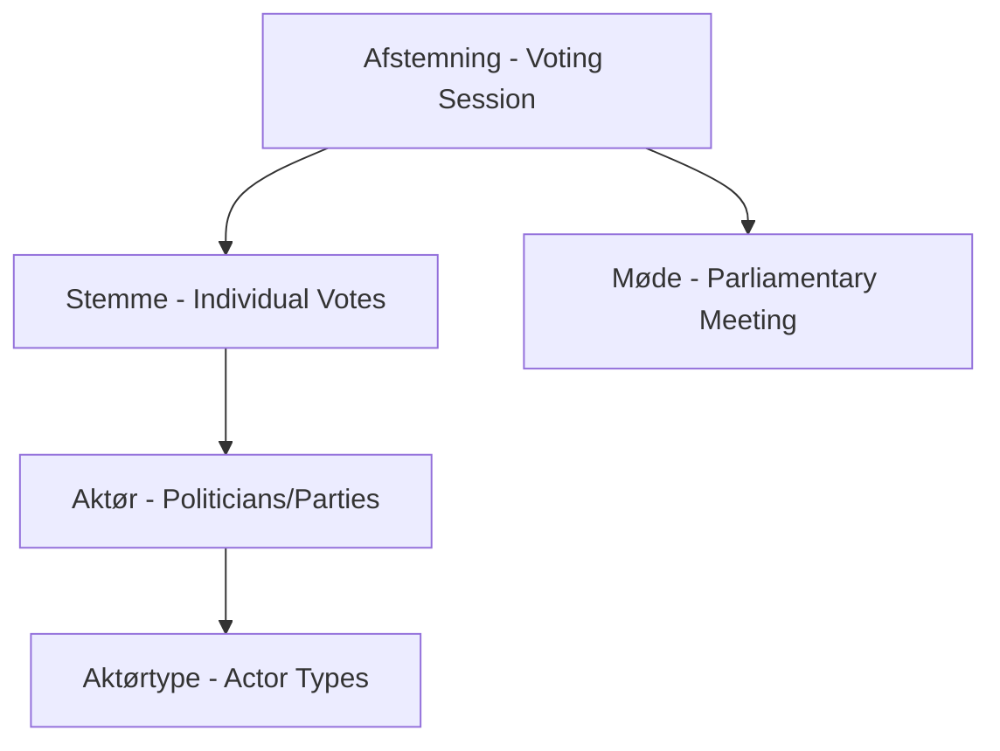

# Party Voting Analysis

Comprehensive guide to analyzing party voting behavior using the Danish Parliamentary OData API. This documentation provides tools and techniques for political scientists and analysts studying party dynamics, coalition behavior, and voting patterns in the Danish Parliament.

## Table of Contents

- [Party Voting Analysis Fundamentals](#party-voting-analysis-fundamentals)
- [Party Cohesion Measurement](#party-cohesion-measurement)
- [Inter-Party Agreement Patterns](#inter-party-agreement-patterns)
- [Coalition Voting Alignment](#coalition-voting-alignment)
- [Party Position Evolution](#party-position-evolution)
- [Government vs Opposition Dynamics](#government-vs-opposition-dynamics)
- [Party Discipline Analysis](#party-discipline-analysis)
- [Cross-Party Collaboration](#cross-party-collaboration)
- [Party Voting Prediction](#party-voting-prediction)
- [Visualization Techniques](#visualization-techniques)

## Party Voting Analysis Fundamentals

### Understanding the Data Model

The Danish Parliamentary API provides three key entities for party voting analysis:



**Core Entities**:

- **Afstemning**: Voting sessions with conclusions and results
- **Stemme**: Individual vote records linking politicians to voting sessions
- **Aktør**: Political actors including MPs and parties
- **Aktørtype**: Actor classification (Person, Folketingsgruppe, etc.)

### Vote Types and Their Analysis

The API tracks four distinct vote types via **Stemmetype**:

1. **For** (Yes/Support) - `typeid: 1`
2. **Imod** (No/Against) - `typeid: 2`  
3. **Fravær** (Absent) - `typeid: 3`
4. **Hverken for eller imod** (Abstain) - `typeid: 4`

### Basic Party Vote Retrieval

```python
import requests
import pandas as pd
from collections import defaultdict

class PartyVotingAnalyzer:
    def __init__(self):
        self.base_url = "https://oda.ft.dk/api/"
        
    def get_voting_session_with_votes(self, voting_id):
        """Retrieve a complete voting session with all individual votes"""
        params = {
            '$expand': 'Stemme/Aktør',
            '$filter': f'id eq {voting_id}'
        }
        url = f"{self.base_url}Afstemning"
        response = requests.get(url, params=params)
        return response.json()
    
    def get_party_votes_for_session(self, voting_id):
        """Extract party-level voting patterns from a session"""
        session_data = self.get_voting_session_with_votes(voting_id)
        
        party_votes = defaultdict(lambda: {'for': 0, 'against': 0, 'absent': 0, 'abstain': 0})
        
        if session_data['value']:
            votes = session_data['value'][0].get('Stemme', [])
            
            for vote in votes:
                actor = vote.get('Aktør', {})
                party = self.extract_party_from_actor(actor)
                vote_type = vote.get('typeid')
                
                if party:
                    if vote_type == 1:
                        party_votes[party]['for'] += 1
                    elif vote_type == 2:
                        party_votes[party]['against'] += 1
                    elif vote_type == 3:
                        party_votes[party]['absent'] += 1
                    elif vote_type == 4:
                        party_votes[party]['abstain'] += 1
        
        return dict(party_votes)
    
    def extract_party_from_actor(self, actor):
        """Extract party affiliation from actor data"""
        # Party information is typically in the actor's biographical data
        biografi = actor.get('biografi', '')
        
        # Parse party information from biography XML
        # This is a simplified parser - real implementation needs robust XML parsing
        if 'Socialdemokratiet' in biografi or 'socialdemokrat' in biografi.lower():
            return 'S'
        elif 'Venstre' in biografi and 'Danmarks Liberale Parti' in biografi:
            return 'V'
        elif 'Dansk Folkeparti' in biografi:
            return 'DF'
        elif 'Det Konservative Folkeparti' in biografi:
            return 'KF'
        elif 'Socialistisk Folkeparti' in biografi:
            return 'SF'
        elif 'Det Radikale Venstre' in biografi:
            return 'RV'
        elif 'Enhedslisten' in biografi:
            return 'EL'
        elif 'Liberal Alliance' in biografi:
            return 'LA'
        else:
            return 'Unknown'
```

## Party Cohesion Measurement

Party cohesion measures how unified a party votes on legislative issues. High cohesion indicates strong party discipline, while low cohesion suggests internal disagreement.

### Rice Index Calculation

The Rice Index is a standard measure of party cohesion:

```python
import numpy as np

class PartyCohesionAnalyzer:
    def __init__(self, analyzer):
        self.analyzer = analyzer
    
    def calculate_rice_index(self, party_votes):
        """
        Calculate Rice Index for party cohesion
        Rice Index = (|Yes - No|) / (Yes + No) * 100
        Scale: 0-100, where 100 = perfect unity
        """
        rice_scores = {}
        
        for party, votes in party_votes.items():
            yes_votes = votes['for']
            no_votes = votes['against']
            total_votes = yes_votes + no_votes
            
            if total_votes > 0:
                rice_index = abs(yes_votes - no_votes) / total_votes * 100
                rice_scores[party] = rice_index
            else:
                rice_scores[party] = None
        
        return rice_scores
    
    def calculate_agreement_index(self, party_votes):
        """
        Alternative cohesion measure: Agreement Index
        Agreement Index = (Max(Yes, No)) / (Yes + No) * 100
        """
        agreement_scores = {}
        
        for party, votes in party_votes.items():
            yes_votes = votes['for']
            no_votes = votes['against']
            total_votes = yes_votes + no_votes
            
            if total_votes > 0:
                agreement_index = max(yes_votes, no_votes) / total_votes * 100
                agreement_scores[party] = agreement_index
            else:
                agreement_scores[party] = None
        
        return agreement_scores
    
    def analyze_party_cohesion_over_time(self, party, start_date='2024-01-01', end_date='2024-12-31'):
        """Analyze party cohesion trends over time period"""
        
        # Get all voting sessions in time period
        params = {
            '$expand': 'Møde,Stemme/Aktør',
            '$filter': f"Møde/dato ge datetime'{start_date}' and Møde/dato le datetime'{end_date}'",
            '$orderby': 'Møde/dato'
        }
        
        cohesion_timeline = []
        
        # This is a simplified example - real implementation needs pagination
        url = f"{self.analyzer.base_url}Afstemning"
        response = requests.get(url, params=params)
        
        if response.status_code == 200:
            sessions = response.json().get('value', [])
            
            for session in sessions:
                party_votes = self.analyzer.get_party_votes_for_session(session['id'])
                
                if party in party_votes:
                    rice_index = self.calculate_rice_index({party: party_votes[party]})[party]
                    
                    cohesion_timeline.append({
                        'date': session.get('Møde', {}).get('dato'),
                        'voting_id': session['id'],
                        'rice_index': rice_index,
                        'votes': party_votes[party]
                    })
        
        return cohesion_timeline
```

### Cohesion Analysis Example

```python
# Initialize analyzers
analyzer = PartyVotingAnalyzer()
cohesion_analyzer = PartyCohesionAnalyzer(analyzer)

# Analyze specific voting session
voting_id = 10377  # Recent voting session from API
party_votes = analyzer.get_party_votes_for_session(voting_id)

# Calculate cohesion scores
rice_scores = cohesion_analyzer.calculate_rice_index(party_votes)
agreement_scores = cohesion_analyzer.calculate_agreement_index(party_votes)

# Display results
for party in rice_scores:
    print(f"{party}: Rice Index = {rice_scores[party]:.1f}%, Agreement Index = {agreement_scores[party]:.1f}%")
```

## Inter-Party Agreement Patterns

Understanding how parties align with each other reveals coalition patterns and political dynamics.

### Agreement Matrix Calculation

```python
import itertools
from scipy.spatial.distance import pdist, squareform
from sklearn.metrics import jaccard_score

class InterPartyAnalyzer:
    def __init__(self, analyzer):
        self.analyzer = analyzer
    
    def calculate_agreement_matrix(self, voting_sessions):
        """Calculate pairwise agreement matrix between parties"""
        
        # Collect all party positions across voting sessions
        party_positions = defaultdict(list)
        
        for session_id in voting_sessions:
            party_votes = self.analyzer.get_party_votes_for_session(session_id)
            
            # Determine party position (simplified: majority vote wins)
            for party, votes in party_votes.items():
                total_votes = votes['for'] + votes['against']
                if total_votes > 0:
                    position = 1 if votes['for'] > votes['against'] else 0
                    party_positions[party].append(position)
                else:
                    party_positions[party].append(None)  # No clear position
        
        # Calculate pairwise agreements
        parties = list(party_positions.keys())
        n_parties = len(parties)
        agreement_matrix = np.zeros((n_parties, n_parties))
        
        for i, party_a in enumerate(parties):
            for j, party_b in enumerate(parties):
                if i != j:
                    # Calculate agreement percentage
                    positions_a = party_positions[party_a]
                    positions_b = party_positions[party_b]
                    
                    agreements = 0
                    valid_comparisons = 0
                    
                    for pos_a, pos_b in zip(positions_a, positions_b):
                        if pos_a is not None and pos_b is not None:
                            valid_comparisons += 1
                            if pos_a == pos_b:
                                agreements += 1
                    
                    if valid_comparisons > 0:
                        agreement_matrix[i][j] = agreements / valid_comparisons * 100
                    else:
                        agreement_matrix[i][j] = 0
                else:
                    agreement_matrix[i][j] = 100  # Party agrees with itself
        
        return pd.DataFrame(agreement_matrix, index=parties, columns=parties)
    
    def find_voting_blocs(self, agreement_matrix, threshold=70):
        """Identify voting blocs based on agreement threshold"""
        
        blocs = []
        parties = list(agreement_matrix.index)
        unassigned = set(parties)
        
        while unassigned:
            # Start with an unassigned party
            seed_party = next(iter(unassigned))
            bloc = {seed_party}
            unassigned.remove(seed_party)
            
            # Find parties that agree with this bloc above threshold
            for party in list(unassigned):
                # Check agreement with all parties in current bloc
                agreements = [agreement_matrix.loc[party, bloc_member] 
                            for bloc_member in bloc]
                
                if all(agreement >= threshold for agreement in agreements):
                    bloc.add(party)
                    unassigned.remove(party)
            
            blocs.append(bloc)
        
        return blocs
    
    def calculate_polarization_index(self, agreement_matrix):
        """Calculate overall system polarization"""
        
        # Average inter-party agreement (excluding self-agreement)
        n = len(agreement_matrix)
        total_agreement = 0
        count = 0
        
        for i in range(n):
            for j in range(n):
                if i != j:
                    total_agreement += agreement_matrix.iloc[i, j]
                    count += 1
        
        avg_agreement = total_agreement / count if count > 0 else 0
        
        # Polarization is inverse of agreement (scaled)
        polarization_index = (100 - avg_agreement) / 100
        
        return {
            'average_agreement': avg_agreement,
            'polarization_index': polarization_index,
            'interpretation': self.interpret_polarization(polarization_index)
        }
    
    def interpret_polarization(self, index):
        """Provide interpretation of polarization index"""
        if index < 0.3:
            return "Low polarization - high cross-party consensus"
        elif index < 0.5:
            return "Moderate polarization - some partisan divisions"
        elif index < 0.7:
            return "High polarization - significant partisan conflict"
        else:
            return "Extreme polarization - minimal cross-party agreement"
```

### Usage Example

```python
# Analyze recent voting sessions
recent_sessions = [10377, 10376, 10375, 10374, 10373]  # Recent session IDs

inter_party_analyzer = InterPartyAnalyzer(analyzer)
agreement_matrix = inter_party_analyzer.calculate_agreement_matrix(recent_sessions)

print("Inter-party Agreement Matrix:")
print(agreement_matrix.round(1))

# Find voting blocs
blocs = inter_party_analyzer.find_voting_blocs(agreement_matrix)
print(f"\nVoting Blocs (>70% agreement):")
for i, bloc in enumerate(blocs, 1):
    print(f"Bloc {i}: {', '.join(bloc)}")

# Calculate polarization
polarization = inter_party_analyzer.calculate_polarization_index(agreement_matrix)
print(f"\nSystem Polarization: {polarization['polarization_index']:.3f}")
print(f"Interpretation: {polarization['interpretation']}")
```

## Coalition Voting Alignment

Analyze how coalition governments maintain voting discipline and identify coalition stress points.

### Coalition Analysis Framework

```python
class CoalitionAnalyzer:
    def __init__(self, analyzer):
        self.analyzer = analyzer
        
        # Define current and historical coalitions
        self.coalitions = {
            'current_government': ['S', 'V'],  # Example: Social Democrats + Liberals
            'red_bloc': ['S', 'SF', 'RV', 'EL'],  # Left-wing parties
            'blue_bloc': ['V', 'KF', 'DF', 'LA'],  # Right-wing parties
        }
    
    def analyze_coalition_cohesion(self, coalition_name, voting_sessions):
        """Analyze voting cohesion within a coalition"""
        
        if coalition_name not in self.coalitions:
            raise ValueError(f"Unknown coalition: {coalition_name}")
        
        coalition_parties = self.coalitions[coalition_name]
        coalition_agreements = []
        
        for session_id in voting_sessions:
            party_votes = self.analyzer.get_party_votes_for_session(session_id)
            
            # Get positions of coalition parties
            coalition_positions = {}
            for party in coalition_parties:
                if party in party_votes:
                    votes = party_votes[party]
                    total_votes = votes['for'] + votes['against']
                    
                    if total_votes > 0:
                        position = 1 if votes['for'] > votes['against'] else 0
                        coalition_positions[party] = position
            
            # Calculate agreement within coalition
            if len(coalition_positions) >= 2:
                positions = list(coalition_positions.values())
                agreement = len(set(positions)) == 1  # All parties agree
                coalition_agreements.append({
                    'session_id': session_id,
                    'agreement': agreement,
                    'positions': coalition_positions
                })
        
        cohesion_rate = sum(1 for x in coalition_agreements if x['agreement']) / len(coalition_agreements) * 100
        
        return {
            'coalition': coalition_name,
            'parties': coalition_parties,
            'cohesion_rate': cohesion_rate,
            'agreements': coalition_agreements
        }
    
    def identify_coalition_stress_points(self, coalition_analysis):
        """Identify votes where coalition parties disagreed"""
        
        stress_points = []
        
        for agreement in coalition_analysis['agreements']:
            if not agreement['agreement']:
                # Get detailed voting information
                session_id = agreement['session_id']
                session_data = self.analyzer.get_voting_session_with_votes(session_id)
                
                if session_data['value']:
                    session_info = session_data['value'][0]
                    stress_points.append({
                        'session_id': session_id,
                        'conclusion': session_info.get('konklusion', 'No conclusion'),
                        'disagreeing_parties': agreement['positions'],
                        'meeting_date': session_info.get('Møde', {}).get('dato')
                    })
        
        return stress_points
    
    def compare_coalition_performance(self, coalitions, voting_sessions):
        """Compare performance across multiple coalitions"""
        
        comparison = {}
        
        for coalition_name in coalitions:
            analysis = self.analyze_coalition_cohesion(coalition_name, voting_sessions)
            comparison[coalition_name] = {
                'cohesion_rate': analysis['cohesion_rate'],
                'party_count': len(analysis['parties']),
                'stress_points': len(self.identify_coalition_stress_points(analysis))
            }
        
        return comparison
```

### Coalition Analysis Example

```python
# Initialize coalition analyzer
coalition_analyzer = CoalitionAnalyzer(analyzer)

# Analyze current government coalition
recent_sessions = [10377, 10376, 10375, 10374, 10373]
government_analysis = coalition_analyzer.analyze_coalition_cohesion('current_government', recent_sessions)

print(f"Government Coalition Cohesion: {government_analysis['cohesion_rate']:.1f}%")

# Identify stress points
stress_points = coalition_analyzer.identify_coalition_stress_points(government_analysis)
print(f"Coalition disagreements: {len(stress_points)} out of {len(recent_sessions)} votes")

# Compare all coalitions
all_coalitions = ['current_government', 'red_bloc', 'blue_bloc']
comparison = coalition_analyzer.compare_coalition_performance(all_coalitions, recent_sessions)

for coalition, metrics in comparison.items():
    print(f"{coalition}: {metrics['cohesion_rate']:.1f}% cohesion, {metrics['stress_points']} stress points")
```

## Party Position Evolution

Track how parties change their positions on issues over time, identifying ideological shifts and strategic repositioning.

### Position Tracking Framework

```python
from datetime import datetime, timedelta
import matplotlib.pyplot as plt

class PartyEvolutionAnalyzer:
    def __init__(self, analyzer):
        self.analyzer = analyzer
    
    def track_party_positions_over_time(self, party, topic_keywords, months_back=12):
        """Track a party's voting positions on specific topics over time"""
        
        end_date = datetime.now()
        start_date = end_date - timedelta(days=months_back * 30)
        
        # Get voting sessions with case information
        params = {
            '$expand': 'Stemme/Aktör,Møde,Sag',
            '$filter': f"Møde/dato ge datetime'{start_date.isoformat()}' and Møde/dato le datetime'{end_date.isoformat()}'",
            '$orderby': 'Møde/dato',
            '$top': 100  # API limit
        }
        
        timeline = []
        
        # This example shows the concept - real implementation needs pagination
        url = f"{self.analyzer.base_url}Afstemning"
        response = requests.get(url, params=params)
        
        if response.status_code == 200:
            sessions = response.json().get('value', [])
            
            for session in sessions:
                # Check if session relates to topics of interest
                sag_info = session.get('Sag', {})
                sag_title = sag_info.get('titel', '').lower()
                
                if any(keyword.lower() in sag_title for keyword in topic_keywords):
                    party_votes = self.analyzer.get_party_votes_for_session(session['id'])
                    
                    if party in party_votes:
                        votes = party_votes[party]
                        total_votes = votes['for'] + votes['against']
                        
                        if total_votes > 0:
                            support_rate = votes['for'] / total_votes
                            
                            timeline.append({
                                'date': session.get('Møde', {}).get('dato'),
                                'session_id': session['id'],
                                'case_title': sag_info.get('titel'),
                                'support_rate': support_rate,
                                'votes_for': votes['for'],
                                'votes_against': votes['against'],
                                'abstentions': votes['abstain'],
                                'absent': votes['absent']
                            })
        
        return sorted(timeline, key=lambda x: x['date'])
    
    def calculate_position_drift(self, timeline, window_size=5):
        """Calculate how much a party's position has drifted over time"""
        
        if len(timeline) < window_size * 2:
            return None
        
        # Early period average
        early_positions = [entry['support_rate'] for entry in timeline[:window_size]]
        early_avg = sum(early_positions) / len(early_positions)
        
        # Recent period average
        recent_positions = [entry['support_rate'] for entry in timeline[-window_size:]]
        recent_avg = sum(recent_positions) / len(recent_positions)
        
        drift = recent_avg - early_avg
        
        return {
            'early_support': early_avg,
            'recent_support': recent_avg,
            'drift': drift,
            'interpretation': self.interpret_drift(drift)
        }
    
    def interpret_drift(self, drift):
        """Interpret the meaning of position drift"""
        if abs(drift) < 0.1:
            return "Stable position"
        elif drift > 0.3:
            return "Significant shift toward support"
        elif drift > 0.1:
            return "Moderate shift toward support"
        elif drift < -0.3:
            return "Significant shift toward opposition"
        elif drift < -0.1:
            return "Moderate shift toward opposition"
        else:
            return "Minor position adjustment"
    
    def detect_position_reversals(self, timeline, threshold=0.5):
        """Identify cases where a party completely reversed position"""
        
        reversals = []
        
        for i in range(1, len(timeline)):
            current = timeline[i]['support_rate']
            previous = timeline[i-1]['support_rate']
            
            # Check for reversal (from support to opposition or vice versa)
            if (previous >= threshold and current < (1 - threshold)) or \
               (previous < (1 - threshold) and current >= threshold):
                
                reversals.append({
                    'from_date': timeline[i-1]['date'],
                    'to_date': timeline[i]['date'],
                    'from_case': timeline[i-1]['case_title'],
                    'to_case': timeline[i]['case_title'],
                    'from_support': previous,
                    'to_support': current
                })
        
        return reversals
```

### Evolution Analysis Example

```python
# Initialize evolution analyzer
evolution_analyzer = PartyEvolutionAnalyzer(analyzer)

# Track Social Democrats' position on climate issues
climate_keywords = ['klima', 'miljø', 'grøn', 'bæredygtighed', 'CO2']
s_climate_timeline = evolution_analyzer.track_party_positions_over_time('S', climate_keywords, months_back=24)

print(f"Found {len(s_climate_timeline)} climate-related votes for Social Democrats")

# Analyze position drift
drift_analysis = evolution_analyzer.calculate_position_drift(s_climate_timeline)
if drift_analysis:
    print(f"Position drift: {drift_analysis['drift']:.3f} ({drift_analysis['interpretation']})")
    print(f"Early support rate: {drift_analysis['early_support']:.1%}")
    print(f"Recent support rate: {drift_analysis['recent_support']:.1%}")

# Detect reversals
reversals = evolution_analyzer.detect_position_reversals(s_climate_timeline)
print(f"Position reversals detected: {len(reversals)}")

for reversal in reversals:
    print(f"  {reversal['from_date']} ’ {reversal['to_date']}: {reversal['from_support']:.1%} ’ {reversal['to_support']:.1%}")
```

## Government vs Opposition Dynamics

Analyze the voting behavior differences between government and opposition parties, including adversarial patterns and consensus areas.

### Government-Opposition Framework

```python
class GovernmentOppositionAnalyzer:
    def __init__(self, analyzer):
        self.analyzer = analyzer
        
        # Define government and opposition parties (update based on current situation)
        self.government_parties = ['S', 'V']  # Current coalition
        self.opposition_parties = ['DF', 'KF', 'SF', 'RV', 'EL', 'LA']
    
    def analyze_adversarial_voting(self, voting_sessions):
        """Analyze government vs opposition voting patterns"""
        
        adversarial_votes = []
        consensus_votes = []
        
        for session_id in voting_sessions:
            party_votes = self.analyzer.get_party_votes_for_session(session_id)
            
            # Calculate government and opposition positions
            gov_positions = []
            opp_positions = []
            
            for party in self.government_parties:
                if party in party_votes:
                    votes = party_votes[party]
                    total = votes['for'] + votes['against']
                    if total > 0:
                        gov_positions.append(1 if votes['for'] > votes['against'] else 0)
            
            for party in self.opposition_parties:
                if party in party_votes:
                    votes = party_votes[party]
                    total = votes['for'] + votes['against']
                    if total > 0:
                        opp_positions.append(1 if votes['for'] > votes['against'] else 0)
            
            if gov_positions and opp_positions:
                # Determine if this is adversarial or consensus
                gov_consensus = len(set(gov_positions)) == 1
                opp_consensus = len(set(opp_positions)) == 1
                
                if gov_consensus and opp_consensus:
                    gov_position = gov_positions[0]
                    opp_position = max(set(opp_positions), key=opp_positions.count)
                    
                    vote_analysis = {
                        'session_id': session_id,
                        'government_position': gov_position,
                        'opposition_position': opp_position,
                        'government_unity': 1.0,
                        'opposition_unity': opp_positions.count(opp_position) / len(opp_positions)
                    }
                    
                    if gov_position != opp_position:
                        adversarial_votes.append(vote_analysis)
                    else:
                        consensus_votes.append(vote_analysis)
        
        return {
            'adversarial_votes': adversarial_votes,
            'consensus_votes': consensus_votes,
            'adversarial_rate': len(adversarial_votes) / (len(adversarial_votes) + len(consensus_votes)) * 100
        }
    
    def identify_consensus_areas(self, voting_sessions, min_consensus_threshold=0.8):
        """Identify policy areas where government and opposition agree"""
        
        consensus_topics = defaultdict(list)
        
        for session_id in voting_sessions:
            # Get session with case information
            session_data = self.analyzer.get_voting_session_with_votes(session_id)
            
            if session_data['value']:
                session_info = session_data['value'][0]
                party_votes = self.analyzer.get_party_votes_for_session(session_id)
                
                # Check for broad consensus (most parties agree)
                party_positions = {}
                for party, votes in party_votes.items():
                    total = votes['for'] + votes['against']
                    if total > 0:
                        party_positions[party] = 1 if votes['for'] > votes['against'] else 0
                
                if len(party_positions) >= 4:  # Minimum parties for meaningful consensus
                    position_counts = Counter(party_positions.values())
                    majority_position = position_counts.most_common(1)[0][0]
                    consensus_rate = position_counts[majority_position] / len(party_positions)
                    
                    if consensus_rate >= min_consensus_threshold:
                        sag_info = session_info.get('Sag', {})
                        topic = self.categorize_topic(sag_info.get('titel', ''))
                        
                        consensus_topics[topic].append({
                            'session_id': session_id,
                            'case_title': sag_info.get('titel'),
                            'consensus_rate': consensus_rate,
                            'agreeing_parties': [p for p, pos in party_positions.items() if pos == majority_position]
                        })
        
        return dict(consensus_topics)
    
    def categorize_topic(self, case_title):
        """Simple topic categorization based on title keywords"""
        title_lower = case_title.lower()
        
        if any(word in title_lower for word in ['økonomi', 'skat', 'finans']):
            return 'Economy & Finance'
        elif any(word in title_lower for word in ['sundhed', 'hospital', 'patient']):
            return 'Healthcare'
        elif any(word in title_lower for word in ['uddannelse', 'skole', 'universitet']):
            return 'Education'
        elif any(word in title_lower for word in ['klima', 'miljø', 'energi']):
            return 'Environment & Climate'
        elif any(word in title_lower for word in ['forsvar', 'sikkerhed', 'politi']):
            return 'Defense & Security'
        elif any(word in title_lower for word in ['udlændinge', 'integration', 'asyl']):
            return 'Immigration'
        elif any(word in title_lower for word in ['eu', 'europa', 'international']):
            return 'EU & International Affairs'
        else:
            return 'Other'
    
    def calculate_opposition_effectiveness(self, adversarial_analysis):
        """Calculate how often the opposition successfully blocks government initiatives"""
        
        opposition_wins = 0
        government_wins = 0
        
        for vote in adversarial_analysis['adversarial_votes']:
            # In Danish system, typically government wins if they have majority
            # This is a simplified analysis
            government_wins += 1  # Assume government usually wins
        
        # More sophisticated analysis would look at actual vote outcomes
        # and whether opposition managed to defeat government proposals
        
        return {
            'government_success_rate': government_wins / len(adversarial_analysis['adversarial_votes']) * 100,
            'opposition_success_rate': opposition_wins / len(adversarial_analysis['adversarial_votes']) * 100
        }
```

### Usage Example

```python
# Initialize government-opposition analyzer
gov_opp_analyzer = GovernmentOppositionAnalyzer(analyzer)

# Analyze recent adversarial patterns
recent_sessions = list(range(10370, 10378))  # Recent session range
adversarial_analysis = gov_opp_analyzer.analyze_adversarial_voting(recent_sessions)

print(f"Adversarial voting rate: {adversarial_analysis['adversarial_rate']:.1f}%")
print(f"Adversarial votes: {len(adversarial_analysis['adversarial_votes'])}")
print(f"Consensus votes: {len(adversarial_analysis['consensus_votes'])}")

# Identify consensus areas
consensus_areas = gov_opp_analyzer.identify_consensus_areas(recent_sessions)
print("\nConsensus areas:")
for topic, cases in consensus_areas.items():
    print(f"  {topic}: {len(cases)} cases with broad agreement")

# Calculate opposition effectiveness
effectiveness = gov_opp_analyzer.calculate_opposition_effectiveness(adversarial_analysis)
print(f"\nGovernment success rate: {effectiveness['government_success_rate']:.1f}%")
```

## Party Discipline Analysis

Examine internal party discipline by identifying MPs who vote against their party line and analyzing patterns of rebellion.

### Discipline Analysis Framework

```python
class PartyDisciplineAnalyzer:
    def __init__(self, analyzer):
        self.analyzer = analyzer
    
    def analyze_individual_discipline(self, party, voting_sessions, min_votes=10):
        """Analyze discipline of individual MPs within a party"""
        
        mp_voting_records = defaultdict(lambda: {'party_line': [], 'personal_votes': [], 'rebellions': 0})
        
        for session_id in voting_sessions:
            session_data = self.analyzer.get_voting_session_with_votes(session_id)
            
            if session_data['value'] and session_data['value'][0].get('Stemme'):
                votes = session_data['value'][0]['Stemme']
                
                # Determine party line for this vote
                party_votes = defaultdict(int)
                party_members = []
                
                for vote in votes:
                    actor = vote.get('Aktör', {})
                    mp_party = self.analyzer.extract_party_from_actor(actor)
                    
                    if mp_party == party:
                        vote_type = vote.get('typeid')
                        if vote_type in [1, 2]:  # Only count for/against votes
                            party_votes[vote_type] += 1
                            party_members.append({
                                'mp_name': actor.get('navn', 'Unknown'),
                                'mp_id': actor.get('id'),
                                'vote': vote_type
                            })
                
                # Determine party line (majority vote)
                if party_votes:
                    party_line = max(party_votes.items(), key=lambda x: x[1])[0]
                    
                    # Check individual MP compliance
                    for member in party_members:
                        mp_name = member['mp_name']
                        mp_vote = member['vote']
                        
                        mp_voting_records[mp_name]['party_line'].append(party_line)
                        mp_voting_records[mp_name]['personal_votes'].append(mp_vote)
                        
                        if mp_vote != party_line:
                            mp_voting_records[mp_name]['rebellions'] += 1
        
        # Calculate discipline scores
        discipline_scores = {}
        
        for mp_name, record in mp_voting_records.items():
            if len(record['personal_votes']) >= min_votes:
                total_votes = len(record['personal_votes'])
                rebellions = record['rebellions']
                discipline_score = (total_votes - rebellions) / total_votes * 100
                
                discipline_scores[mp_name] = {
                    'discipline_score': discipline_score,
                    'total_votes': total_votes,
                    'rebellions': rebellions,
                    'rebellion_rate': rebellions / total_votes * 100
                }
        
        return discipline_scores
    
    def identify_rebel_mps(self, discipline_scores, rebellion_threshold=10):
        """Identify MPs with high rebellion rates"""
        
        rebels = {}
        
        for mp_name, scores in discipline_scores.items():
            if scores['rebellion_rate'] >= rebellion_threshold:
                rebels[mp_name] = scores
        
        # Sort by rebellion rate
        return dict(sorted(rebels.items(), key=lambda x: x[1]['rebellion_rate'], reverse=True))
    
    def analyze_rebellion_patterns(self, party, rebel_mps, voting_sessions):
        """Analyze what types of votes rebels typically oppose"""
        
        rebellion_analysis = {}
        
        for mp_name in rebel_mps:
            rebellion_contexts = []
            
            for session_id in voting_sessions:
                session_data = self.analyzer.get_voting_session_with_votes(session_id)
                
                if session_data['value']:
                    session_info = session_data['value'][0]
                    votes = session_info.get('Stemme', [])
                    
                    # Find this MP's vote and party line
                    mp_vote = None
                    party_votes = defaultdict(int)
                    
                    for vote in votes:
                        actor = vote.get('Aktör', {})
                        actor_name = actor.get('navn', '')
                        mp_party = self.analyzer.extract_party_from_actor(actor)
                        
                        if mp_party == party:
                            vote_type = vote.get('typeid')
                            if vote_type in [1, 2]:
                                party_votes[vote_type] += 1
                                
                                if actor_name == mp_name:
                                    mp_vote = vote_type
                    
                    if mp_vote and party_votes:
                        party_line = max(party_votes.items(), key=lambda x: x[1])[0]
                        
                        if mp_vote != party_line:
                            # This is a rebellion - get context
                            sag_info = session_info.get('Sag', {})
                            rebellion_contexts.append({
                                'session_id': session_id,
                                'case_title': sag_info.get('titel', 'Unknown'),
                                'topic': self.categorize_rebellion_topic(sag_info.get('titel', '')),
                                'party_line': party_line,
                                'mp_vote': mp_vote,
                                'meeting_date': session_info.get('Møde', {}).get('dato')
                            })
            
            rebellion_analysis[mp_name] = rebellion_contexts
        
        return rebellion_analysis
    
    def categorize_rebellion_topic(self, case_title):
        """Categorize the topic of rebellious votes"""
        title_lower = case_title.lower()
        
        if any(word in title_lower for word in ['abort', 'bioetik', 'moral']):
            return 'Ethical Issues'
        elif any(word in title_lower for word in ['eu', 'europa', 'international']):
            return 'EU/International'
        elif any(word in title_lower for word in ['økonomi', 'skat', 'budget']):
            return 'Economic Policy'
        elif any(word in title_lower for word in ['udlændinge', 'integration']):
            return 'Immigration'
        elif any(word in title_lower for word in ['miljø', 'klima']):
            return 'Environment'
        else:
            return 'Other'
    
    def calculate_party_discipline_index(self, discipline_scores):
        """Calculate overall party discipline index"""
        
        if not discipline_scores:
            return None
        
        total_discipline = sum(scores['discipline_score'] for scores in discipline_scores.values())
        avg_discipline = total_discipline / len(discipline_scores)
        
        # Standard deviation of discipline scores
        discipline_values = [scores['discipline_score'] for scores in discipline_scores.values()]
        mean = sum(discipline_values) / len(discipline_values)
        variance = sum((x - mean) ** 2 for x in discipline_values) / len(discipline_values)
        std_dev = variance ** 0.5
        
        return {
            'average_discipline': avg_discipline,
            'discipline_std_dev': std_dev,
            'uniformity_index': max(0, 100 - std_dev),  # High uniformity = low std dev
            'total_mps_analyzed': len(discipline_scores)
        }
```

### Discipline Analysis Example

```python
# Initialize discipline analyzer
discipline_analyzer = PartyDisciplineAnalyzer(analyzer)

# Analyze Social Democrat discipline
recent_sessions = list(range(10360, 10378))
s_discipline = discipline_analyzer.analyze_individual_discipline('S', recent_sessions)

print(f"Analyzed discipline for {len(s_discipline)} Social Democrat MPs")

# Identify rebels
rebels = discipline_analyzer.identify_rebel_mps(s_discipline, rebellion_threshold=5)
print(f"\nHigh rebellion rate MPs (>5%):")

for mp_name, scores in list(rebels.items())[:5]:  # Top 5 rebels
    print(f"  {mp_name}: {scores['rebellion_rate']:.1f}% rebellion rate ({scores['rebellions']} of {scores['total_votes']} votes)")

# Analyze rebellion patterns
if rebels:
    rebellion_patterns = discipline_analyzer.analyze_rebellion_patterns('S', rebels, recent_sessions)
    
    print("\nRebellion topic analysis:")
    topic_counts = defaultdict(int)
    
    for mp_name, rebellions in rebellion_patterns.items():
        for rebellion in rebellions:
            topic_counts[rebellion['topic']] += 1
    
    for topic, count in sorted(topic_counts.items(), key=lambda x: x[1], reverse=True):
        print(f"  {topic}: {count} rebellions")

# Calculate overall party discipline
party_discipline = discipline_analyzer.calculate_party_discipline_index(s_discipline)
if party_discipline:
    print(f"\nOverall Social Democrat Discipline Index: {party_discipline['average_discipline']:.1f}%")
    print(f"Discipline Uniformity: {party_discipline['uniformity_index']:.1f}%")
```

## Cross-Party Collaboration

Identify instances where politicians vote across party lines and analyze patterns of bipartisan cooperation.

### Collaboration Analysis Framework

```python
from itertools import combinations

class CrossPartyCollaborationAnalyzer:
    def __init__(self, analyzer):
        self.analyzer = analyzer
    
    def identify_cross_party_votes(self, voting_sessions, min_party_crossover=2):
        """Identify votes where significant cross-party collaboration occurred"""
        
        cross_party_votes = []
        
        for session_id in voting_sessions:
            party_votes = self.analyzer.get_party_votes_for_session(session_id)
            session_data = self.analyzer.get_voting_session_with_votes(session_id)
            
            if session_data['value']:
                session_info = session_data['value'][0]
                
                # Analyze vote distribution across parties
                for_parties = []
                against_parties = []
                
                for party, votes in party_votes.items():
                    total_votes = votes['for'] + votes['against']
                    if total_votes > 0:
                        support_rate = votes['for'] / total_votes
                        
                        # Party mostly supported (>60%)
                        if support_rate > 0.6:
                            for_parties.append(party)
                        # Party mostly opposed (<40%)
                        elif support_rate < 0.4:
                            against_parties.append(party)
                
                # Check for cross-party patterns
                if len(for_parties) >= min_party_crossover and len(against_parties) >= min_party_crossover:
                    # Analyze if this crosses traditional bloc lines
                    traditional_blocs = {
                        'left': ['S', 'SF', 'RV', 'EL'],
                        'right': ['V', 'KF', 'DF', 'LA']
                    }
                    
                    left_support = sum(1 for p in for_parties if p in traditional_blocs['left'])
                    right_support = sum(1 for p in for_parties if p in traditional_blocs['right'])
                    
                    if left_support > 0 and right_support > 0:
                        cross_party_votes.append({
                            'session_id': session_id,
                            'case_title': session_info.get('Sag', {}).get('titel', 'Unknown'),
                            'supporting_parties': for_parties,
                            'opposing_parties': against_parties,
                            'cross_bloc_support': True,
                            'meeting_date': session_info.get('Møde', {}).get('dato'),
                            'conclusion': session_info.get('konklusion', '')
                        })
        
        return cross_party_votes
    
    def analyze_bipartisan_mps(self, voting_sessions, min_votes=20):
        """Identify MPs who frequently vote with other parties"""
        
        mp_cross_party_scores = defaultdict(lambda: {
            'total_votes': 0,
            'cross_party_votes': 0,
            'collaboration_partners': defaultdict(int)
        })
        
        for session_id in voting_sessions:
            session_data = self.analyzer.get_voting_session_with_votes(session_id)
            
            if session_data['value'] and session_data['value'][0].get('Stemme'):
                votes = session_data['value'][0]['Stemme']
                
                # Group votes by party
                party_positions = defaultdict(list)
                mp_info = {}
                
                for vote in votes:
                    actor = vote.get('Aktör', {})
                    mp_party = self.analyzer.extract_party_from_actor(actor)
                    mp_name = actor.get('navn', 'Unknown')
                    vote_type = vote.get('typeid')
                    
                    if vote_type in [1, 2] and mp_party != 'Unknown':
                        party_positions[mp_party].append(vote_type)
                        mp_info[mp_name] = {
                            'party': mp_party,
                            'vote': vote_type
                        }
                
                # Determine party lines
                party_lines = {}
                for party, votes_list in party_positions.items():
                    if len(votes_list) >= 3:  # Minimum for meaningful party line
                        party_line = max(set(votes_list), key=votes_list.count)
                        party_lines[party] = party_line
                
                # Analyze individual MP behavior
                for mp_name, info in mp_info.items():
                    mp_party = info['party']
                    mp_vote = info['vote']
                    
                    if mp_party in party_lines:
                        mp_cross_party_scores[mp_name]['total_votes'] += 1
                        party_line = party_lines[mp_party]
                        
                        # Check if MP voted against party line
                        if mp_vote != party_line:
                            # Find which parties this MP voted with
                            for other_party, other_line in party_lines.items():
                                if other_party != mp_party and mp_vote == other_line:
                                    mp_cross_party_scores[mp_name]['cross_party_votes'] += 1
                                    mp_cross_party_scores[mp_name]['collaboration_partners'][other_party] += 1
                                    break
        
        # Calculate collaboration scores
        collaboration_scores = {}
        
        for mp_name, record in mp_cross_party_scores.items():
            if record['total_votes'] >= min_votes:
                collaboration_rate = record['cross_party_votes'] / record['total_votes'] * 100
                
                # Find primary collaboration partner
                if record['collaboration_partners']:
                    primary_partner = max(record['collaboration_partners'].items(), key=lambda x: x[1])
                else:
                    primary_partner = None
                
                collaboration_scores[mp_name] = {
                    'collaboration_rate': collaboration_rate,
                    'total_votes': record['total_votes'],
                    'cross_party_votes': record['cross_party_votes'],
                    'primary_partner': primary_partner,
                    'all_partners': dict(record['collaboration_partners'])
                }
        
        return collaboration_scores
    
    def identify_issue_coalitions(self, cross_party_votes):
        """Identify recurring coalitions on specific issues"""
        
        coalition_patterns = defaultdict(list)
        
        for vote in cross_party_votes:
            # Create coalition signature
            coalition_signature = tuple(sorted(vote['supporting_parties']))
            topic = self.categorize_collaboration_topic(vote['case_title'])
            
            coalition_patterns[coalition_signature].append({
                'topic': topic,
                'case_title': vote['case_title'],
                'session_id': vote['session_id'],
                'date': vote['meeting_date']
            })
        
        # Find recurring coalitions
        recurring_coalitions = {}
        
        for coalition, cases in coalition_patterns.items():
            if len(cases) >= 2:  # Recurring coalition threshold
                topic_distribution = defaultdict(int)
                for case in cases:
                    topic_distribution[case['topic']] += 1
                
                recurring_coalitions[coalition] = {
                    'cases': cases,
                    'frequency': len(cases),
                    'main_topics': dict(sorted(topic_distribution.items(), key=lambda x: x[1], reverse=True)),
                    'parties': list(coalition)
                }
        
        return recurring_coalitions
    
    def categorize_collaboration_topic(self, case_title):
        """Categorize collaboration topics"""
        title_lower = case_title.lower()
        
        if any(word in title_lower for word in ['børn', 'familie', 'vold']):
            return 'Social Issues'
        elif any(word in title_lower for word in ['terror', 'sikkerhed', 'forsvar']):
            return 'Security & Defense'
        elif any(word in title_lower for word in ['miljø', 'klima', 'natur']):
            return 'Environment'
        elif any(word in title_lower for word in ['sundhed', 'hospital', 'patient']):
            return 'Healthcare'
        elif any(word in title_lower for word in ['erhverv', 'økonomi', 'handel']):
            return 'Business & Economy'
        elif any(word in title_lower for word in ['transport', 'infrastruktur', 'byggeri']):
            return 'Infrastructure'
        else:
            return 'Other'
```

### Collaboration Analysis Example

```python
# Initialize collaboration analyzer
collaboration_analyzer = CrossPartyCollaborationAnalyzer(analyzer)

# Identify cross-party votes
recent_sessions = list(range(10350, 10378))
cross_party_votes = collaboration_analyzer.identify_cross_party_votes(recent_sessions)

print(f"Found {len(cross_party_votes)} cross-party collaboration votes")

# Show some examples
for vote in cross_party_votes[:3]:
    print(f"\nSession {vote['session_id']}:")
    print(f"  Title: {vote['case_title'][:100]}...")
    print(f"  Supporting: {', '.join(vote['supporting_parties'])}")
    print(f"  Opposing: {', '.join(vote['opposing_parties'])}")

# Analyze bipartisan MPs
bipartisan_scores = collaboration_analyzer.analyze_bipartisan_mps(recent_sessions)

print(f"\nMost collaborative MPs:")
sorted_mps = sorted(bipartisan_scores.items(), key=lambda x: x[1]['collaboration_rate'], reverse=True)

for mp_name, scores in sorted_mps[:5]:
    partner_info = f" (mainly with {scores['primary_partner'][0]})" if scores['primary_partner'] else ""
    print(f"  {mp_name}: {scores['collaboration_rate']:.1f}% cross-party voting{partner_info}")

# Identify recurring coalitions
recurring_coalitions = collaboration_analyzer.identify_issue_coalitions(cross_party_votes)

print(f"\nRecurring cross-party coalitions:")
for coalition, info in recurring_coalitions.items():
    parties_str = ' + '.join(info['parties'])
    main_topic = list(info['main_topics'].keys())[0] if info['main_topics'] else 'Various'
    print(f"  {parties_str}: {info['frequency']} votes, mainly on {main_topic}")
```

## Party Voting Prediction

Build predictive models to forecast party voting behavior based on historical patterns and issue characteristics.

### Prediction Framework

```python
from sklearn.ensemble import RandomForestClassifier
from sklearn.model_selection import train_test_split
from sklearn.metrics import classification_report
import numpy as np

class PartyVotingPredictor:
    def __init__(self, analyzer):
        self.analyzer = analyzer
        self.models = {}
        self.feature_encoders = {}
    
    def prepare_training_data(self, parties, voting_sessions, min_votes_per_party=50):
        """Prepare training data for party voting prediction"""
        
        training_data = []
        
        for session_id in voting_sessions:
            session_data = self.analyzer.get_voting_session_with_votes(session_id)
            
            if session_data['value']:
                session_info = session_data['value'][0]
                party_votes = self.analyzer.get_party_votes_for_session(session_id)
                
                # Extract features from the case
                sag_info = session_info.get('Sag', {})
                features = self.extract_vote_features(session_info, sag_info)
                
                # Add party voting outcomes
                for party in parties:
                    if party in party_votes:
                        votes = party_votes[party]
                        total_votes = votes['for'] + votes['against']
                        
                        if total_votes >= 3:  # Minimum for meaningful party position
                            party_position = 1 if votes['for'] > votes['against'] else 0
                            
                            training_record = {
                                'party': party,
                                'position': party_position,
                                **features
                            }
                            training_data.append(training_record)
        
        return pd.DataFrame(training_data)
    
    def extract_vote_features(self, session_info, sag_info):
        """Extract predictive features from voting session and case"""
        
        case_title = sag_info.get('titel', '').lower()
        
        # Topic features
        features = {
            'is_economic': int(any(word in case_title for word in ['økonomi', 'skat', 'budget', 'finans'])),
            'is_social': int(any(word in case_title for word in ['social', 'børn', 'familie', 'sundhed'])),
            'is_environment': int(any(word in case_title for word in ['miljø', 'klima', 'energi', 'grøn'])),
            'is_immigration': int(any(word in case_title for word in ['udlændinge', 'integration', 'asyl'])),
            'is_eu': int(any(word in case_title for word in ['eu', 'europa', 'international'])),
            'is_defense': int(any(word in case_title for word in ['forsvar', 'sikkerhed', 'militær'])),
            'is_education': int(any(word in case_title for word in ['uddannelse', 'skole', 'universitet'])),
            'is_infrastructure': int(any(word in case_title for word in ['transport', 'byggeri', 'infrastruktur'])),
        }
        
        # Voting session features
        afstemning_type = session_info.get('typeid', 0)
        features.update({
            'is_final_adoption': int(afstemning_type == 1),  # Based on Afstemningstype analysis
            'is_committee_recommendation': int(afstemning_type == 2),
            'is_amendment': int(afstemning_type == 4),
        })
        
        # Case complexity features
        case_status = sag_info.get('statusid', 0)
        features.update({
            'case_status': case_status,
            'title_length': len(sag_info.get('titel', '')),
            'has_long_title': int(len(sag_info.get('titel', '')) > 100),
        })
        
        # Temporal features
        meeting_info = session_info.get('Møde', {})
        meeting_date = meeting_info.get('dato', '')
        if meeting_date:
            try:
                date_obj = datetime.fromisoformat(meeting_date.replace('Z', '+00:00'))
                features.update({
                    'month': date_obj.month,
                    'is_summer_break': int(date_obj.month in [7, 8]),
                    'is_pre_election': int(date_obj.month in [5, 6]),  # Before typical June elections
                })
            except:
                features.update({
                    'month': 0,
                    'is_summer_break': 0,
                    'is_pre_election': 0,
                })
        
        return features
    
    def train_party_models(self, training_data, parties):
        """Train separate prediction models for each party"""
        
        # Prepare feature matrix
        feature_columns = [col for col in training_data.columns if col not in ['party', 'position']]
        X = training_data[feature_columns].values
        
        for party in parties:
            party_data = training_data[training_data['party'] == party]
            
            if len(party_data) >= 50:  # Minimum data for training
                X_party = party_data[feature_columns].values
                y_party = party_data['position'].values
                
                # Train model
                model = RandomForestClassifier(n_estimators=100, random_state=42)
                model.fit(X_party, y_party)
                
                self.models[party] = model
                
                # Store feature importance
                feature_importance = dict(zip(feature_columns, model.feature_importances_))
                print(f"\nTrained model for {party}")
                print(f"Top predictive features:")
                for feature, importance in sorted(feature_importance.items(), key=lambda x: x[1], reverse=True)[:5]:
                    print(f"  {feature}: {importance:.3f}")
    
    def predict_party_vote(self, party, case_features):
        """Predict how a party will vote on a case with given features"""
        
        if party not in self.models:
            return None
        
        model = self.models[party]
        
        # Convert features to prediction format
        feature_vector = np.array(list(case_features.values())).reshape(1, -1)
        
        # Get prediction and probability
        prediction = model.predict(feature_vector)[0]
        probability = model.predict_proba(feature_vector)[0]
        
        return {
            'prediction': 'Support' if prediction == 1 else 'Oppose',
            'confidence': max(probability),
            'support_probability': probability[1] if len(probability) > 1 else probability[0],
            'opposition_probability': probability[0] if len(probability) > 1 else 1 - probability[0]
        }
    
    def predict_cross_party_outcome(self, case_features, parties):
        """Predict likely voting outcome across multiple parties"""
        
        predictions = {}
        
        for party in parties:
            prediction = self.predict_party_vote(party, case_features)
            if prediction:
                predictions[party] = prediction
        
        # Analyze predicted outcome
        support_count = sum(1 for p in predictions.values() if p['prediction'] == 'Support')
        total_parties = len(predictions)
        
        outcome = {
            'party_predictions': predictions,
            'predicted_support_rate': support_count / total_parties if total_parties > 0 else 0,
            'likely_outcome': 'Pass' if support_count > total_parties / 2 else 'Fail',
            'consensus_level': 'High' if support_count >= total_parties * 0.8 or support_count <= total_parties * 0.2 else 'Divided'
        }
        
        return outcome
    
    def evaluate_model_accuracy(self, test_data, parties):
        """Evaluate prediction accuracy on test data"""
        
        accuracy_results = {}
        
        for party in parties:
            if party in self.models:
                party_test_data = test_data[test_data['party'] == party]
                
                if len(party_test_data) > 10:
                    feature_columns = [col for col in test_data.columns if col not in ['party', 'position']]
                    X_test = party_test_data[feature_columns].values
                    y_test = party_test_data['position'].values
                    
                    model = self.models[party]
                    predictions = model.predict(X_test)
                    accuracy = (predictions == y_test).mean()
                    
                    accuracy_results[party] = {
                        'accuracy': accuracy,
                        'test_cases': len(party_test_data),
                        'baseline_accuracy': max(np.bincount(y_test)) / len(y_test)  # Most frequent class
                    }
        
        return accuracy_results
```

### Prediction Example

```python
# Initialize prediction system
predictor = PartyVotingPredictor(analyzer)

# Prepare training data (using historical sessions)
historical_sessions = list(range(10300, 10370))  # Historical data
recent_sessions = list(range(10370, 10378))      # Recent data for testing

major_parties = ['S', 'V', 'DF', 'KF', 'SF', 'RV', 'EL', 'LA']

print("Preparing training data...")
training_data = predictor.prepare_training_data(major_parties, historical_sessions)
test_data = predictor.prepare_training_data(major_parties, recent_sessions)

print(f"Training data: {len(training_data)} records")
print(f"Test data: {len(test_data)} records")

# Train models
print("\nTraining party prediction models...")
predictor.train_party_models(training_data, major_parties)

# Test prediction on a hypothetical case
hypothetical_case = {
    'is_economic': 1,
    'is_social': 0,
    'is_environment': 0,
    'is_immigration': 0,
    'is_eu': 0,
    'is_defense': 0,
    'is_education': 0,
    'is_infrastructure': 0,
    'is_final_adoption': 1,
    'is_committee_recommendation': 0,
    'is_amendment': 0,
    'case_status': 20,
    'title_length': 85,
    'has_long_title': 0,
    'month': 10,
    'is_summer_break': 0,
    'is_pre_election': 0,
}

print("\nPredictions for hypothetical economic policy case:")
outcome_prediction = predictor.predict_cross_party_outcome(hypothetical_case, major_parties)

for party, prediction in outcome_prediction['party_predictions'].items():
    print(f"{party}: {prediction['prediction']} ({prediction['confidence']:.1%} confidence)")

print(f"\nPredicted outcome: {outcome_prediction['likely_outcome']}")
print(f"Consensus level: {outcome_prediction['consensus_level']}")

# Evaluate model accuracy
print("\nModel accuracy evaluation:")
accuracy_results = predictor.evaluate_model_accuracy(test_data, major_parties)

for party, results in accuracy_results.items():
    print(f"{party}: {results['accuracy']:.1%} accuracy (baseline: {results['baseline_accuracy']:.1%})")
```

## Visualization Techniques

Create compelling visualizations to communicate party voting patterns and analysis results.

### Visualization Framework

```python
import matplotlib.pyplot as plt
import seaborn as sns
import networkx as nx
from matplotlib.patches import Rectangle
import numpy as np

class PartyVotingVisualizer:
    def __init__(self, analyzer):
        self.analyzer = analyzer
        
        # Set up plotting style
        plt.style.use('default')
        sns.set_palette("husl")
        
        # Danish party colors (approximate)
        self.party_colors = {
            'S': '#E3515D',    # Social Democrats - Red
            'V': '#0059A3',    # Venstre - Blue  
            'DF': '#E6D845',   # Danish People's Party - Yellow
            'KF': '#0C4F60',   # Conservatives - Dark Blue
            'SF': '#9C1F2F',   # Socialist People's Party - Dark Red
            'RV': '#733280',   # Radical Left - Purple
            'EL': '#E07EA8',   # Red-Green Alliance - Pink
            'LA': '#1B365D',   # Liberal Alliance - Dark Blue
        }
    
    def plot_party_cohesion_timeline(self, cohesion_data, party_name, save_path=None):
        """Plot party cohesion over time"""
        
        if not cohesion_data:
            print(f"No cohesion data available for {party_name}")
            return
        
        dates = [datetime.fromisoformat(entry['date'].replace('Z', '+00:00')) for entry in cohesion_data if entry.get('date')]
        rice_indices = [entry['rice_index'] for entry in cohesion_data if entry.get('rice_index') is not None]
        
        if not dates or not rice_indices:
            print(f"Insufficient data for plotting {party_name} cohesion")
            return
        
        plt.figure(figsize=(12, 6))
        plt.plot(dates, rice_indices, 
                marker='o', markersize=4, 
                color=self.party_colors.get(party_name, 'gray'),
                linewidth=2, alpha=0.8)
        
        plt.axhline(y=80, color='red', linestyle='--', alpha=0.7, label='High Cohesion Threshold')
        plt.axhline(y=60, color='orange', linestyle='--', alpha=0.7, label='Medium Cohesion Threshold')
        
        plt.title(f'{party_name} Party Cohesion Over Time (Rice Index)', fontsize=14, fontweight='bold')
        plt.xlabel('Date', fontsize=12)
        plt.ylabel('Rice Index (%)', fontsize=12)
        plt.ylim(0, 100)
        plt.grid(True, alpha=0.3)
        plt.legend()
        plt.xticks(rotation=45)
        plt.tight_layout()
        
        if save_path:
            plt.savefig(save_path, dpi=300, bbox_inches='tight')
        plt.show()
    
    def plot_agreement_matrix_heatmap(self, agreement_matrix, save_path=None):
        """Plot inter-party agreement matrix as heatmap"""
        
        plt.figure(figsize=(10, 8))
        
        # Create custom colormap
        mask = np.diag(np.ones(len(agreement_matrix)))  # Mask diagonal
        
        sns.heatmap(agreement_matrix, 
                   annot=True, 
                   fmt='.1f',
                   cmap='RdYlBu_r',
                   center=50,
                   square=True,
                   mask=mask,
                   cbar_kws={'label': 'Agreement Rate (%)'})
        
        plt.title('Inter-Party Agreement Matrix', fontsize=14, fontweight='bold')
        plt.xlabel('Party', fontsize=12)
        plt.ylabel('Party', fontsize=12)
        plt.tight_layout()
        
        if save_path:
            plt.savefig(save_path, dpi=300, bbox_inches='tight')
        plt.show()
    
    def plot_voting_network(self, agreement_matrix, threshold=70, save_path=None):
        """Plot party relationships as network graph"""
        
        plt.figure(figsize=(12, 10))
        
        # Create network graph
        G = nx.Graph()
        parties = list(agreement_matrix.index)
        
        # Add nodes
        for party in parties:
            G.add_node(party)
        
        # Add edges for strong agreements
        for i, party_a in enumerate(parties):
            for j, party_b in enumerate(parties):
                if i < j:  # Avoid duplicate edges
                    agreement = agreement_matrix.iloc[i, j]
                    if agreement >= threshold:
                        G.add_edge(party_a, party_b, weight=agreement)
        
        # Set up layout
        pos = nx.spring_layout(G, k=3, iterations=50)
        
        # Draw network
        # Draw edges with thickness based on agreement strength
        edges = G.edges(data=True)
        for (u, v, d) in edges:
            weight = d['weight']
            plt.plot([pos[u][0], pos[v][0]], [pos[u][1], pos[v][1]], 
                    'gray', alpha=0.6, linewidth=(weight-threshold)/10+1)
        
        # Draw nodes
        for party in parties:
            x, y = pos[party]
            color = self.party_colors.get(party, 'gray')
            plt.scatter(x, y, s=2000, c=color, alpha=0.8, edgecolors='black', linewidth=2)
            plt.text(x, y, party, ha='center', va='center', fontsize=12, fontweight='bold', color='white')
        
        plt.title(f'Party Agreement Network (e{threshold}% agreement)', fontsize=14, fontweight='bold')
        plt.axis('off')
        plt.tight_layout()
        
        if save_path:
            plt.savefig(save_path, dpi=300, bbox_inches='tight')
        plt.show()
    
    def plot_coalition_performance(self, coalition_comparison, save_path=None):
        """Plot coalition performance comparison"""
        
        coalitions = list(coalition_comparison.keys())
        cohesion_rates = [coalition_comparison[c]['cohesion_rate'] for c in coalitions]
        stress_points = [coalition_comparison[c]['stress_points'] for c in coalitions]
        
        fig, (ax1, ax2) = plt.subplots(1, 2, figsize=(15, 6))
        
        # Cohesion rates
        bars1 = ax1.bar(coalitions, cohesion_rates, 
                       color=['#E3515D', '#FF9999', '#9999FF'], alpha=0.8)
        ax1.set_title('Coalition Cohesion Rates', fontsize=14, fontweight='bold')
        ax1.set_ylabel('Cohesion Rate (%)', fontsize=12)
        ax1.set_ylim(0, 100)
        ax1.axhline(y=80, color='red', linestyle='--', alpha=0.7, label='High Cohesion')
        
        # Add value labels on bars
        for bar, value in zip(bars1, cohesion_rates):
            ax1.text(bar.get_x() + bar.get_width()/2, bar.get_height() + 1,
                    f'{value:.1f}%', ha='center', va='bottom', fontweight='bold')
        
        ax1.legend()
        ax1.grid(True, alpha=0.3)
        
        # Stress points
        bars2 = ax2.bar(coalitions, stress_points, 
                       color=['#FF6B6B', '#FFB366', '#66B3FF'], alpha=0.8)
        ax2.set_title('Coalition Stress Points', fontsize=14, fontweight='bold')
        ax2.set_ylabel('Number of Disagreements', fontsize=12)
        
        # Add value labels on bars
        for bar, value in zip(bars2, stress_points):
            ax2.text(bar.get_x() + bar.get_width()/2, bar.get_height() + 0.1,
                    str(value), ha='center', va='bottom', fontweight='bold')
        
        ax2.grid(True, alpha=0.3)
        
        plt.tight_layout()
        
        if save_path:
            plt.savefig(save_path, dpi=300, bbox_inches='tight')
        plt.show()
    
    def plot_rebellion_analysis(self, rebellion_data, party_name, save_path=None):
        """Plot party rebellion patterns by topic"""
        
        if not rebellion_data:
            print(f"No rebellion data available for {party_name}")
            return
        
        # Count rebellions by topic
        topic_counts = defaultdict(int)
        for mp_rebellions in rebellion_data.values():
            for rebellion in mp_rebellions:
                topic_counts[rebellion['topic']] += 1
        
        topics = list(topic_counts.keys())
        counts = list(topic_counts.values())
        
        plt.figure(figsize=(12, 8))
        
        # Create horizontal bar chart
        bars = plt.barh(topics, counts, color=self.party_colors.get(party_name, 'gray'), alpha=0.8)
        
        plt.title(f'{party_name} Party Rebellions by Topic', fontsize=14, fontweight='bold')
        plt.xlabel('Number of Rebellious Votes', fontsize=12)
        plt.ylabel('Policy Topic', fontsize=12)
        
        # Add value labels
        for bar, count in zip(bars, counts):
            plt.text(bar.get_width() + 0.1, bar.get_y() + bar.get_height()/2,
                    str(count), va='center', fontweight='bold')
        
        plt.grid(True, alpha=0.3, axis='x')
        plt.tight_layout()
        
        if save_path:
            plt.savefig(save_path, dpi=300, bbox_inches='tight')
        plt.show()
    
    def plot_cross_party_collaboration(self, collaboration_data, save_path=None):
        """Plot cross-party collaboration patterns"""
        
        if not collaboration_data:
            print("No collaboration data available")
            return
        
        # Extract collaboration info
        coalition_sizes = []
        coalition_labels = []
        topic_data = defaultdict(int)
        
        for coalition, info in collaboration_data.items():
            coalition_sizes.append(info['frequency'])
            coalition_labels.append(' + '.join(info['parties'][:3]))  # Limit label length
            
            for topic, count in info['main_topics'].items():
                topic_data[topic] += count
        
        fig, (ax1, ax2) = plt.subplots(2, 1, figsize=(14, 10))
        
        # Coalition frequency
        bars1 = ax1.bar(range(len(coalition_labels)), coalition_sizes, 
                       color='lightblue', alpha=0.8, edgecolor='navy')
        ax1.set_title('Cross-Party Coalition Frequency', fontsize=14, fontweight='bold')
        ax1.set_xlabel('Coalition', fontsize=12)
        ax1.set_ylabel('Number of Joint Votes', fontsize=12)
        ax1.set_xticks(range(len(coalition_labels)))
        ax1.set_xticklabels(coalition_labels, rotation=45, ha='right')
        
        for bar, size in zip(bars1, coalition_sizes):
            ax1.text(bar.get_x() + bar.get_width()/2, bar.get_height() + 0.1,
                    str(size), ha='center', va='bottom', fontweight='bold')
        
        # Topic distribution
        topics = list(topic_data.keys())
        topic_counts = list(topic_data.values())
        
        wedges, texts, autotexts = ax2.pie(topic_counts, labels=topics, autopct='%1.1f%%',
                                          startangle=90, colors=plt.cm.Set3(np.linspace(0, 1, len(topics))))
        ax2.set_title('Cross-Party Collaboration by Topic', fontsize=14, fontweight='bold')
        
        plt.tight_layout()
        
        if save_path:
            plt.savefig(save_path, dpi=300, bbox_inches='tight')
        plt.show()
    
    def create_comprehensive_dashboard(self, party_data, save_path=None):
        """Create comprehensive party analysis dashboard"""
        
        fig = plt.figure(figsize=(20, 12))
        gs = fig.add_gridspec(3, 3, hspace=0.3, wspace=0.3)
        
        # Dashboard components would go here
        # This is a framework for a comprehensive visualization
        
        plt.suptitle('Danish Parliamentary Party Analysis Dashboard', 
                    fontsize=16, fontweight='bold', y=0.98)
        
        if save_path:
            plt.savefig(save_path, dpi=300, bbox_inches='tight')
        plt.show()
```

### Visualization Examples

```python
# Initialize visualizer
visualizer = PartyVotingVisualizer(analyzer)

# Example 1: Plot party cohesion timeline
cohesion_analyzer = PartyCohesionAnalyzer(analyzer)
s_timeline = cohesion_analyzer.analyze_party_cohesion_over_time('S', '2024-01-01', '2024-12-31')
visualizer.plot_party_cohesion_timeline(s_timeline, 'S', 'social_democrats_cohesion.png')

# Example 2: Agreement matrix heatmap
inter_party_analyzer = InterPartyAnalyzer(analyzer)
recent_sessions = list(range(10360, 10378))
agreement_matrix = inter_party_analyzer.calculate_agreement_matrix(recent_sessions)
visualizer.plot_agreement_matrix_heatmap(agreement_matrix, 'party_agreement_heatmap.png')

# Example 3: Voting network visualization
visualizer.plot_voting_network(agreement_matrix, threshold=65, save_path='party_network.png')

# Example 4: Coalition performance comparison
coalition_analyzer = CoalitionAnalyzer(analyzer)
all_coalitions = ['current_government', 'red_bloc', 'blue_bloc']
comparison = coalition_analyzer.compare_coalition_performance(all_coalitions, recent_sessions)
visualizer.plot_coalition_performance(comparison, 'coalition_performance.png')
```

## Best Practices and Recommendations

### Data Collection Strategy

1. **Comprehensive Sampling**: Use pagination to collect complete datasets rather than relying on API limits
2. **Real-time Updates**: Leverage `opdateringsdato` fields to track changes and maintain current data
3. **Relationship Expansion**: Use `$expand` strategically to minimize API calls while gathering rich data

### Analysis Methodology

1. **Statistical Rigor**: Use established political science metrics (Rice Index, Agreement Index) for comparability
2. **Temporal Analysis**: Always consider time-based patterns and evolutionary trends
3. **Context Integration**: Combine voting data with case information for meaningful interpretations

### Technical Implementation

1. **Robust Parsing**: Handle Danish characters and complex XML content in biographical data
2. **Error Handling**: Account for missing data, API limits, and network issues
3. **Performance Optimization**: Cache results and use efficient data structures

### Ethical Considerations

1. **Data Privacy**: Respect personal information in politician profiles
2. **Accuracy**: Verify analysis results and acknowledge limitations
3. **Bias Awareness**: Consider potential biases in data interpretation and presentation

## Conclusion

This comprehensive guide provides tools and frameworks for sophisticated analysis of party voting behavior in the Danish Parliament. The combination of real-time data access, robust analytical methods, and powerful visualization techniques enables deep insights into political dynamics, coalition behavior, and democratic processes.

The Danish Parliamentary OData API offers exceptional data quality and completeness, making it an invaluable resource for political scientists, journalists, and citizens seeking to understand their democracy better.

For continued analysis and monitoring, consider implementing automated data collection pipelines and regular analysis updates to track evolving political patterns and party behaviors over time.